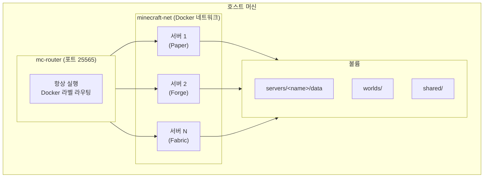
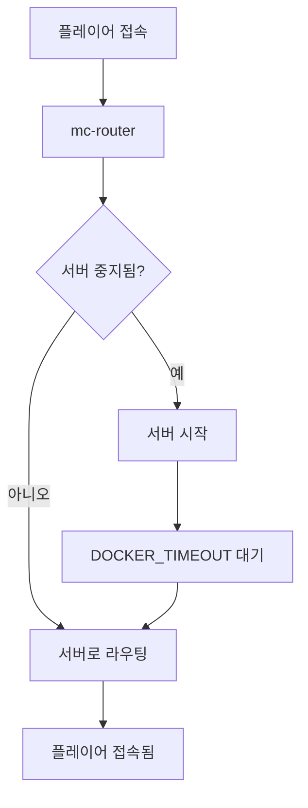
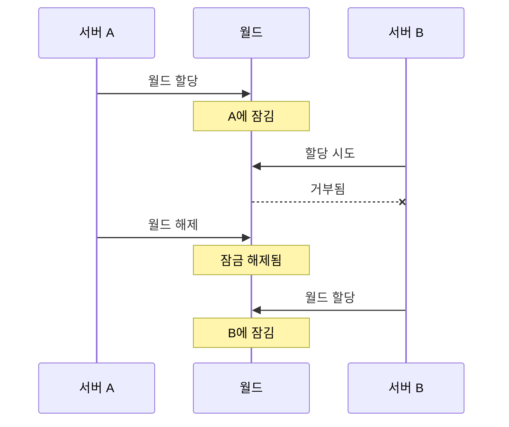

# 고급 기능

이 섹션에서는 Docker Minecraft Server 플랫폼의 고급 설정 및 기능을 다룹니다.

## 개요

플랫폼은 프로덕션 배포 및 복잡한 설정을 위한 여러 고급 기능을 제공합니다:

- **네트워킹** - nip.io magic DNS, mDNS, mc-router 설정
- **외부 접속** - 포트 포워딩 없이 playit.gg 터널링으로 인터넷 접속 가능
- **백업** - 월드 데이터 자동 GitHub 백업
- **RCON** - 서버 관리를 위한 원격 콘솔 프로토콜
- **월드 관리** - 잠금 기능이 있는 멀티 서버 월드 공유
- **자동 스케일링** - 플레이어 활동에 따른 서버 자동 시작/중지

## 기능 가이드

<div class="grid cards" markdown>

-   :material-network:{ .lg .middle } **네트워킹**

    ---

    nip.io, mDNS, mc-router로 호스트네임 라우팅 설정

    [:octicons-arrow-right-24: 네트워킹 가이드](networking.ko.md)

-   :material-earth:{ .lg .middle } **외부 접속 (playit.gg)**

    ---

    포트 포워딩 없이 playit.gg 터널링으로 외부 플레이어 접속 허용

    [:octicons-arrow-right-24: 외부 접속 가이드](external-access.ko.md)

-   :material-backup-restore:{ .lg .middle } **백업**

    ---

    월드 데이터 자동 GitHub 백업 설정

    [:octicons-arrow-right-24: 백업 가이드](backup.ko.md)

-   :material-console:{ .lg .middle } **RCON**

    ---

    서버 관리를 위한 원격 콘솔 프로토콜

    [:octicons-arrow-right-24: RCON 스펙](rcon.ko.md)

</div>

## 아키텍처 심층 분석

### 플랫폼 구성요소



### 요청 흐름

1. **클라이언트가 접속**합니다 `myserver.192.168.1.100.nip.io:25565`
2. **nip.io가 호스트네임을 해석**합니다 → `192.168.1.100`
3. **mc-router가 연결을 수신**합니다 (포트 25565)
4. **mc-router가 호스트네임을 기반으로 라우팅**합니다 → `mc-myserver` 컨테이너
5. **서버가 중지된 경우**, mc-router가 시작합니다 (auto-scale-up)
6. **서버가 연결을 수락**합니다 (시작 후)

### 자동 스케일링 동작



### 월드 잠금

월드 잠금은 서버 간 월드 공유 시 데이터 손상을 방지합니다:



**mcctl로 월드 잠금 관리:**

```bash
# 모든 월드와 잠금 상태 목록
mcctl world list

# 월드를 서버에 할당 (잠금)
mcctl world assign survival mc-myserver

# 월드 잠금 해제
mcctl world release survival
```

## 성능 튜닝

### JVM 최적화

최적의 성능을 위해 Aikar의 플래그를 사용합니다:

```bash
mcctl config myserver USE_AIKAR_FLAGS true
mcctl stop myserver && mcctl start myserver
```

대규모 서버의 경우 G1GC 파라미터를 조정합니다 (config.env 직접 편집):

```bash
# config.env에서
JVM_OPTS="-XX:+UseG1GC -XX:MaxGCPauseMillis=100 -XX:G1NewSizePercent=40"
```

### 네트워크 최적화

많은 플레이어 수의 서버:

```bash
mcctl config myserver NETWORK_COMPRESSION_THRESHOLD 256
mcctl config myserver VIEW_DISTANCE 8
mcctl config myserver SIMULATION_DISTANCE 6
```

### 컨테이너 리소스

Docker 리소스 제한은 서버의 docker-compose.yml을 직접 편집합니다:

```yaml
services:
  mc-myserver:
    deploy:
      resources:
        limits:
          cpus: '4'
          memory: 8G
        reservations:
          cpus: '2'
          memory: 4G
```

그런 다음 재시작합니다:

```bash
mcctl stop myserver && mcctl start myserver
```

## 보안 고려사항

### RCON 비밀번호

`.env`에서 기본 RCON 비밀번호를 변경합니다:

```bash
RCON_PASSWORD=매우-안전한-비밀번호-여기에
```

그런 다음 모든 서비스를 재시작합니다:

```bash
mcctl down && mcctl up
```

### 화이트리스트

프라이빗 서버에서는 화이트리스트를 활성화합니다:

```bash
mcctl whitelist myserver on
mcctl whitelist myserver add Steve
mcctl whitelist myserver add Alex
mcctl whitelist myserver status
```

### 온라인 모드

오프라인이 특별히 필요하지 않다면 온라인 모드를 유지합니다:

```bash
mcctl config myserver ONLINE_MODE true
```

## 모니터링

### 서버 상태

```bash
# 기본 상태
mcctl status

# 리소스 포함 상세 상태
mcctl status --detail

# 실시간 모니터링
mcctl status --watch

# 스크립팅용 JSON 출력
mcctl status --json
```

### 서버 로그

```bash
# 최근 로그 보기
mcctl logs myserver

# 실시간으로 로그 추적
mcctl logs myserver -f

# 마지막 N줄 보기
mcctl logs myserver -n 100
```

### 리소스 사용량

```bash
# 특정 서버 확인
mcctl status myserver

# 출력 포함:
#   Resources: 3.1 GB / 8.0 GB (38.8%) | CPU: 15.2%
#   Players:   2/20 - Steve, Alex
```

### 온라인 플레이어

```bash
# 단일 서버
mcctl player online myserver

# 모든 서버
mcctl player online --all
```

## 문제 해결

### 빠른 진단

```bash
# 전체 상태 확인
mcctl status --detail

# 라우터 상태 확인
mcctl status router

# 특정 서버 로그 확인
mcctl logs myserver -n 100

# RCON 연결 테스트
mcctl console myserver
```

### 일반적인 문제

| 문제 | 진단 | 해결책 |
|------|------|--------|
| 서버가 시작되지 않음 | `mcctl logs myserver` | Java 버전, 메모리 확인 |
| 연결할 수 없음 | `mcctl status router` | mc-router 실행 확인 |
| 느린 성능 | `mcctl status --detail` | 메모리 확인, Aikar 플래그 활성화 |
| 월드 손상 | `mcctl world list` | 잠금 상태 확인 |

자세한 내용은 [문제 해결 가이드](../troubleshooting/index.ko.md)를 참조하세요.

## 다음 단계

- **[네트워킹 가이드](networking.ko.md)** - 호스트네임 라우팅 설정
- **[백업 가이드](backup.ko.md)** - 자동 백업 설정
- **[RCON 스펙](rcon.ko.md)** - 원격 콘솔 프로토콜 상세
