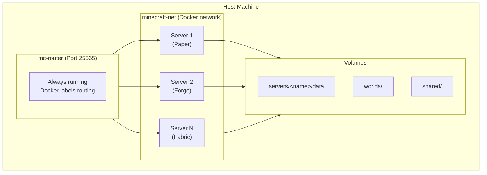
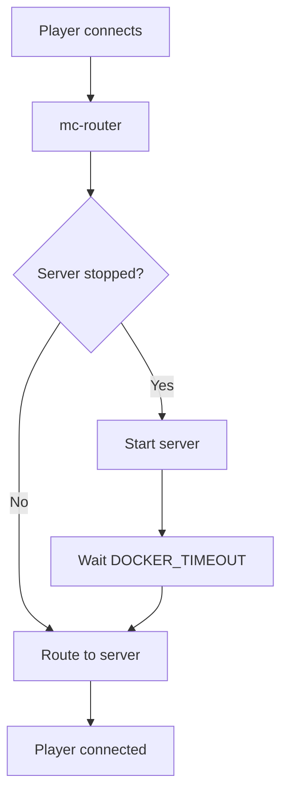
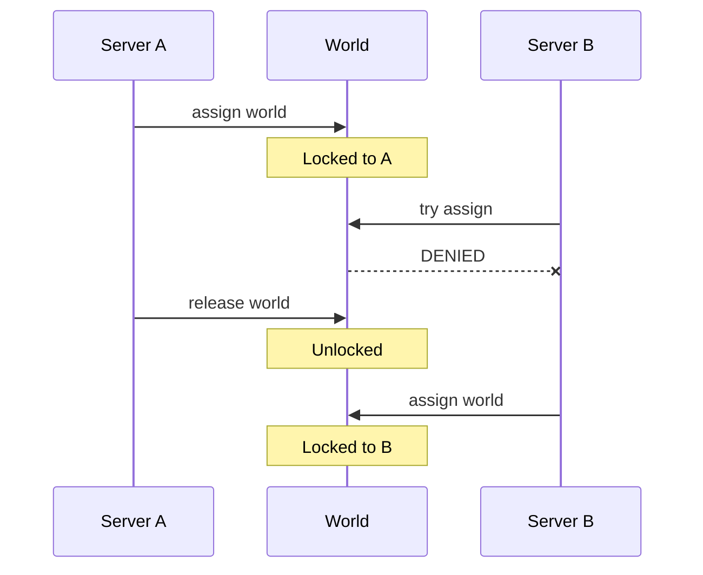

# Advanced Features

This section covers advanced configuration and features for the Docker Minecraft Server platform.

## Overview

The platform provides several advanced features for production deployments and complex setups:

- **Networking** - nip.io magic DNS, mDNS, mc-router configuration
- **Backup** - Automatic GitHub backup for world data
- **RCON** - Remote console protocol for server administration
- **World Management** - Multi-server world sharing with locking
- **Auto-scaling** - Automatic server start/stop based on player activity

## Feature Guides

<div class="grid cards" markdown>

-   :material-network:{ .lg .middle } **Networking**

    ---

    Configure hostname routing with nip.io, mDNS, and mc-router

    [:octicons-arrow-right-24: Networking Guide](networking.md)

-   :material-backup-restore:{ .lg .middle } **Backup**

    ---

    Set up automatic GitHub backup for world data

    [:octicons-arrow-right-24: Backup Guide](backup.md)

-   :material-console:{ .lg .middle } **RCON**

    ---

    Remote console protocol for server administration

    [:octicons-arrow-right-24: RCON Specification](rcon.md)

</div>

## Architecture Deep Dive

### Platform Components



### Request Flow

1. **Client connects** to `myserver.192.168.1.100.nip.io:25565`
2. **nip.io resolves** hostname to `192.168.1.100`
3. **mc-router receives** connection on port 25565
4. **mc-router routes** based on hostname to `mc-myserver` container
5. **If server stopped**, mc-router starts it (auto-scale-up)
6. **Server accepts** connection after startup

### Auto-scaling Behavior



### World Locking

World locking prevents data corruption when sharing worlds between servers:



**Manage world locks with mcctl:**

```bash
# List all worlds with lock status
mcctl world list

# Assign a world to a server (locks it)
mcctl world assign survival mc-myserver

# Release a world lock
mcctl world release survival
```

## Performance Tuning

### JVM Optimization

Use Aikar's flags for optimal performance:

```bash
mcctl config myserver USE_AIKAR_FLAGS true
mcctl stop myserver && mcctl start myserver
```

For large servers, adjust G1GC parameters (edit config.env directly):

```bash
# In config.env
JVM_OPTS="-XX:+UseG1GC -XX:MaxGCPauseMillis=100 -XX:G1NewSizePercent=40"
```

### Network Optimization

For high-player-count servers:

```bash
mcctl config myserver NETWORK_COMPRESSION_THRESHOLD 256
mcctl config myserver VIEW_DISTANCE 8
mcctl config myserver SIMULATION_DISTANCE 6
```

### Container Resources

For Docker resource limits, edit the server's docker-compose.yml directly:

```yaml
services:
  mc-myserver:
    deploy:
      resources:
        limits:
          cpus: '4'
          memory: 8G
        reservations:
          cpus: '2'
          memory: 4G
```

Then restart:

```bash
mcctl stop myserver && mcctl start myserver
```

## Security Considerations

### RCON Password

Change the default RCON password in `.env`:

```bash
RCON_PASSWORD=your-very-secure-password-here
```

Then restart all services:

```bash
mcctl down && mcctl up
```

### Whitelist

Enable whitelist for private servers:

```bash
mcctl whitelist myserver on
mcctl whitelist myserver add Steve
mcctl whitelist myserver add Alex
mcctl whitelist myserver status
```

### Online Mode

Keep online mode enabled unless you specifically need offline:

```bash
mcctl config myserver ONLINE_MODE true
```

## Monitoring

### Server Status

```bash
# Basic status
mcctl status

# Detailed status with resources
mcctl status --detail

# Real-time monitoring
mcctl status --watch

# JSON output for scripting
mcctl status --json
```

### Server Logs

```bash
# View recent logs
mcctl logs myserver

# Follow logs in real-time
mcctl logs myserver -f

# View last N lines
mcctl logs myserver -n 100
```

### Resource Usage

```bash
# Check specific server
mcctl status myserver

# Output includes:
#   Resources: 3.1 GB / 8.0 GB (38.8%) | CPU: 15.2%
#   Players:   2/20 - Steve, Alex
```

### Online Players

```bash
# Single server
mcctl player online myserver

# All servers
mcctl player online --all
```

## Troubleshooting

### Quick Diagnostics

```bash
# Check overall status
mcctl status --detail

# Check router health
mcctl status router

# Check specific server logs
mcctl logs myserver -n 100

# Test RCON connection
mcctl console myserver
```

### Common Issues

| Issue | Diagnosis | Solution |
|-------|-----------|----------|
| Server won't start | `mcctl logs myserver` | Check Java version, memory |
| Can't connect | `mcctl status router` | Verify mc-router is running |
| Slow performance | `mcctl status --detail` | Check memory, enable Aikar flags |
| World corruption | `mcctl world list` | Check lock status |

See the [Troubleshooting Guide](../troubleshooting/index.md) for more details.

## Next Steps

- **[Networking Guide](networking.md)** - Configure hostname routing
- **[Backup Guide](backup.md)** - Set up automatic backups
- **[RCON Specification](rcon.md)** - Remote console protocol details
