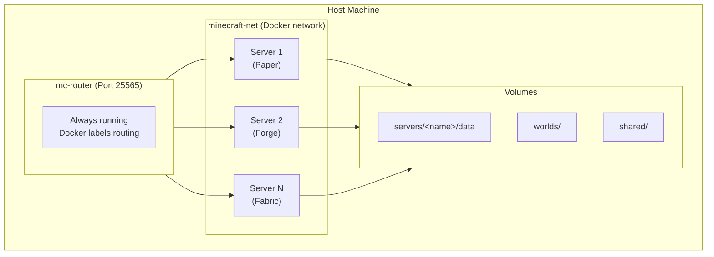
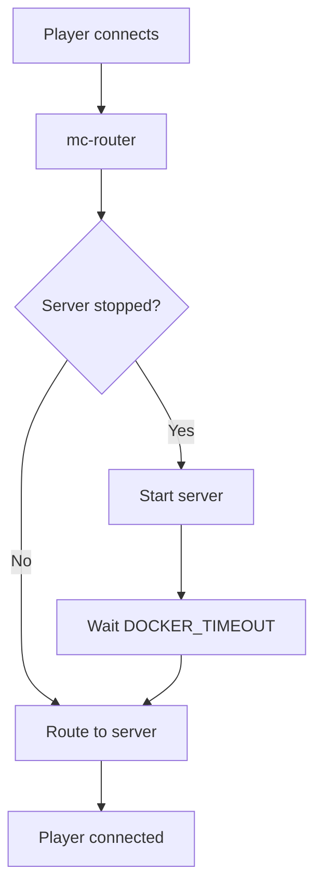
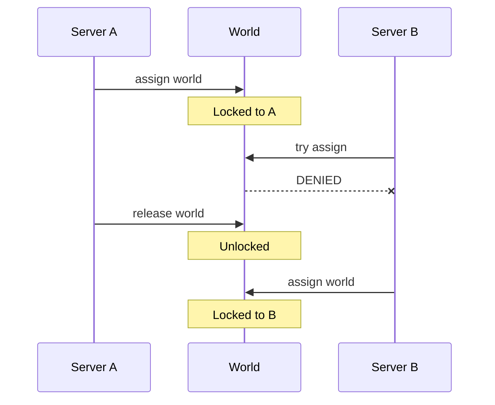

# Advanced Features

This section covers advanced configuration and features for the Docker Minecraft Server platform.

## Overview

The platform provides several advanced features for production deployments and complex setups:

- **Networking** - nip.io magic DNS, mDNS, mc-router configuration
- **Backup** - Automatic GitHub backup for world data
- **RCON** - Remote console protocol for server administration
- **World Management** - Multi-server world sharing with locking
- **Auto-scaling** - Automatic server start/stop based on player activity

## Feature Guides

<div class="grid cards" markdown>

-   :material-network:{ .lg .middle } **Networking**

    ---

    Configure hostname routing with nip.io, mDNS, and mc-router

    [:octicons-arrow-right-24: Networking Guide](networking.md)

-   :material-backup-restore:{ .lg .middle } **Backup**

    ---

    Set up automatic GitHub backup for world data

    [:octicons-arrow-right-24: Backup Guide](backup.md)

-   :material-console:{ .lg .middle } **RCON**

    ---

    Remote console protocol for server administration

    [:octicons-arrow-right-24: RCON Specification](rcon.md)

</div>

## Architecture Deep Dive

### Platform Components



### Request Flow

1. **Client connects** to `myserver.192.168.1.100.nip.io:25565`
2. **nip.io resolves** hostname to `192.168.1.100`
3. **mc-router receives** connection on port 25565
4. **mc-router routes** based on hostname to `mc-myserver` container
5. **If server stopped**, mc-router starts it (auto-scale-up)
6. **Server accepts** connection after startup

### Auto-scaling Behavior



### World Locking

World locking prevents data corruption when sharing worlds between servers:



## Performance Tuning

### JVM Optimization

Use Aikar's flags for optimal performance:

```bash
# config.env
USE_AIKAR_FLAGS=true
MEMORY=8G
```

For large servers, adjust G1GC parameters:

```bash
JVM_OPTS="-XX:+UseG1GC -XX:MaxGCPauseMillis=100 -XX:G1NewSizePercent=40"
```

### Network Optimization

For high-player-count servers:

```bash
# config.env
NETWORK_COMPRESSION_THRESHOLD=256
VIEW_DISTANCE=8
SIMULATION_DISTANCE=6
```

### Container Resources

Limit container resources in docker-compose.yml:

```yaml
services:
  mc-myserver:
    deploy:
      resources:
        limits:
          cpus: '4'
          memory: 8G
        reservations:
          cpus: '2'
          memory: 4G
```

## Security Considerations

### RCON Password

Always change the default RCON password:

```bash
# .env
RCON_PASSWORD=your-very-secure-password-here
```

### Whitelist

Enable whitelist for private servers:

```bash
# config.env
ENABLE_WHITELIST=true
WHITELIST=Steve,Alex,Player3
```

### Online Mode

Keep online mode enabled unless you specifically need offline:

```bash
# config.env
ONLINE_MODE=true  # Default, validates with Mojang
```

## Monitoring

### Docker Stats

```bash
# View resource usage
docker stats mc-myserver

# All Minecraft containers
docker stats $(docker ps --filter name=mc- -q)
```

### Server Logs

```bash
# Real-time logs
mcctl logs myserver -f

# Search for errors
docker logs mc-myserver 2>&1 | grep -i error
```

### Health Checks

mc-router provides health information via mc-router.host label lookup.

## Troubleshooting

See the [Troubleshooting Guide](../getting-started/quickstart.md#troubleshooting) for common issues.

## Next Steps

- **[Networking Guide](networking.md)** - Configure hostname routing
- **[Backup Guide](backup.md)** - Set up automatic backups
- **[RCON Specification](rcon.md)** - Remote console protocol details
