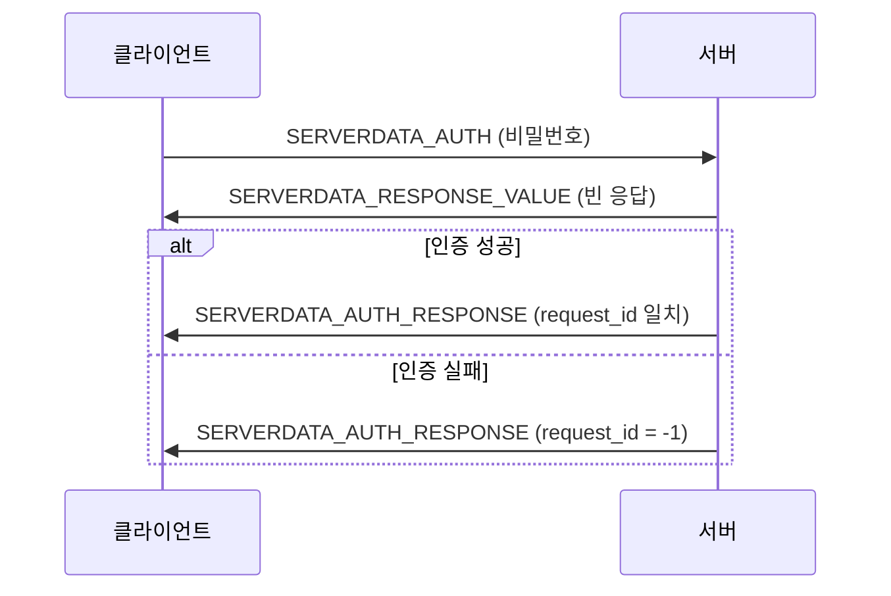
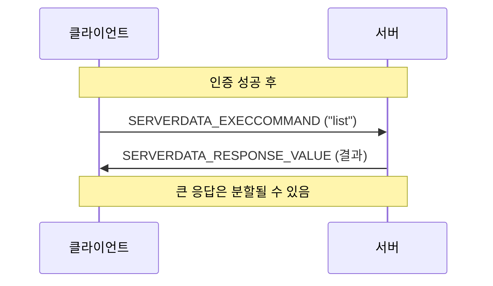

# RCON 프로토콜 스펙

RCON(Remote Console)은 원격 서버 관리를 위한 TCP/IP 기반 프로토콜입니다. Valve가 Source 엔진 게임용으로 개발했으며, Minecraft 서버에서도 채택하여 사용합니다.

## 개요

RCON은 직접 콘솔 접근 없이 원격으로 서버 명령을 실행할 수 있게 해줍니다. `mcctl`과 같은 CLI 도구의 자동화된 서버 관리에 필수적입니다.

!!! warning "보안 경고"
    RCON은 데이터를 **암호화하지 않고** 전송합니다. RCON 포트를 인터넷에 직접 노출하지 마세요. 신뢰할 수 있는 네트워크 내에서만 사용하거나 보안 터널을 통해 사용하세요.

## 프로토콜 스펙

### 패킷 구조

모든 정수는 **리틀 엔디안**(Little-Endian)입니다. (빅 엔디안을 사용하는 Minecraft 메인 프로토콜과 다릅니다)

```
┌────────────┬────────────┬────────────┬─────────────────┬──────┐
│   Length   │ Request ID │    Type    │     Payload     │ Pad  │
│  (4 bytes) │ (4 bytes)  │ (4 bytes)  │   (가변 길이)    │ (2)  │
│  int32 LE  │  int32 LE  │  int32 LE  │ null 종료 문자열 │ 0x00 │
└────────────┴────────────┴────────────┴─────────────────┴──────┘
```

| 필드 | 크기 | 타입 | 설명 |
|------|------|------|------|
| **Length** | 4 bytes | int32 | 패킷의 나머지 부분 길이 (이 필드 제외) |
| **Request ID** | 4 bytes | int32 | 응답 매칭을 위한 클라이언트 생성 ID |
| **Type** | 4 bytes | int32 | 패킷 타입 (아래 참조) |
| **Payload** | 가변 | ASCII 문자열 | NULL 종료 명령어 또는 응답 |
| **Padding** | 2 bytes | byte[2] | 두 개의 NULL 바이트 (0x00 0x00) |

### 패킷 타입

| 타입 | 값 | 방향 | 설명 |
|------|-----|------|------|
| **SERVERDATA_AUTH** | 3 | 클라이언트 → 서버 | 인증 요청 (비밀번호) |
| **SERVERDATA_AUTH_RESPONSE** | 2 | 서버 → 클라이언트 | 인증 응답 |
| **SERVERDATA_EXECCOMMAND** | 2 | 클라이언트 → 서버 | 명령 실행 요청 |
| **SERVERDATA_RESPONSE_VALUE** | 0 | 서버 → 클라이언트 | 명령 실행 응답 |

!!! note "타입 값 중복"
    `SERVERDATA_AUTH_RESPONSE`와 `SERVERDATA_EXECCOMMAND`는 같은 값(2)을 공유합니다. 패킷의 방향에 따라 의미가 결정됩니다.

### 크기 제한

| 방향 | 최대 페이로드 | 최대 전체 패킷 |
|------|---------------|----------------|
| 클라이언트 → 서버 | 1446 bytes | 1460 bytes |
| 서버 → 클라이언트 | 4096 bytes | 4110 bytes |

## 통신 흐름

### 인증



**인증 요청:**
```
Length:     14 + password_length
Request ID: 클라이언트_생성_id
Type:       3 (SERVERDATA_AUTH)
Payload:    "your_password\0"
Padding:    0x00 0x00
```

**인증 응답 (성공):**
```
Length:     10
Request ID: 요청과_동일 (클라이언트 ID와 일치)
Type:       2 (SERVERDATA_AUTH_RESPONSE)
Payload:    "\0"
Padding:    0x00 0x00
```

**인증 응답 (실패):**
```
Length:     10
Request ID: -1 (실패를 나타냄)
Type:       2 (SERVERDATA_AUTH_RESPONSE)
Payload:    "\0"
Padding:    0x00 0x00
```

### 명령 실행



**명령 요청:**
```
Length:     14 + command_length
Request ID: 클라이언트_생성_id
Type:       2 (SERVERDATA_EXECCOMMAND)
Payload:    "list\0"
Padding:    0x00 0x00
```

**명령 응답:**
```
Length:     10 + response_length
Request ID: 요청과_동일
Type:       0 (SERVERDATA_RESPONSE_VALUE)
Payload:    "There are 2 of a max 20 players online: Steve, Alex\0"
Padding:    0x00 0x00
```

### 응답 분할

큰 응답(>4096 bytes)은 여러 패킷으로 분할됩니다. 멀티 패킷 응답의 끝을 감지하는 것은 까다롭습니다:

1. **페이로드 크기 확인**: 페이로드가 4096 bytes 미만이면 마지막 패킷일 가능성이 높음
2. **타임아웃**: 새 데이터가 없는 일정 시간 대기
3. **더미 패킷**: 더미 명령을 보내고 그 응답을 기다림

## 서버 설정

### server.properties

```properties
# RCON 활성화
enable-rcon=true

# RCON 포트 (기본값: 25575)
rcon.port=25575

# RCON 비밀번호 (필수)
rcon.password=your_secure_password

# RCON 명령을 운영자에게 브로드캐스트 (선택)
broadcast-rcon-to-ops=false
```

### Docker 설정 (이 프로젝트)

```bash
# platform/servers/<server>/config.env
ENABLE_RCON=true
RCON_PASSWORD=your_secure_password
RCON_PORT=25575
```

`itzg/minecraft-server` 이미지에는 내장 RCON 클라이언트인 `rcon-cli`가 포함되어 있습니다.

## 주요 RCON 명령어

| 명령어 | 설명 | 응답 예시 |
|--------|------|-----------|
| `list` | 온라인 플레이어 | `There are 2 of a max 20 players online: Steve, Alex` |
| `say <message>` | 메시지 브로드캐스트 | (빈 응답) |
| `tell <player> <msg>` | 귓속말 | (빈 응답) |
| `kick <player> [reason]` | 플레이어 추방 | `Kicked Steve: reason` |
| `ban <player> [reason]` | 플레이어 밴 | `Banned player Steve` |
| `pardon <player>` | 밴 해제 | `Unbanned player Steve` |
| `op <player>` | 운영자 권한 부여 | `Made Steve a server operator` |
| `deop <player>` | 운영자 권한 해제 | `Made Steve no longer a server operator` |
| `whitelist list` | 화이트리스트 목록 | `There are 3 whitelisted players: ...` |
| `whitelist add <player>` | 화이트리스트 추가 | `Added Steve to the whitelist` |
| `whitelist remove <player>` | 화이트리스트 제거 | `Removed Steve from the whitelist` |
| `save-all` | 월드 저장 | `Saving the game (this may take a moment!)` |
| `stop` | 서버 종료 | 서버 종료됨 |
| `time set <value>` | 월드 시간 설정 | `Set the time to <value>` |
| `weather <type>` | 날씨 설정 | `Set the weather to <type>` |
| `gamemode <mode> <player>` | 게임 모드 변경 | `Set Steve's game mode to Creative Mode` |
| `give <player> <item> [count]` | 아이템 지급 | `Gave 64 [Diamond] to Steve` |

## 이 프로젝트에서의 사용

### mcctl CLI 사용

```bash
# 단일 명령 실행
mcctl exec myserver list
mcctl exec myserver say "5분 후 서버가 재시작됩니다!"

# 대화형 RCON 콘솔
mcctl console myserver

# 플레이어 관리 (내부적으로 RCON 사용)
mcctl whitelist myserver add Steve
mcctl op myserver add Steve
mcctl kick myserver Steve "장시간 자리 비움"
mcctl ban myserver Griefer "그리핑"
```

### Docker 직접 사용

```bash
# 단일 명령
docker exec mc-myserver rcon-cli list

# 대화형 모드
docker exec -it mc-myserver rcon-cli

# 명시적 비밀번호 지정
docker exec mc-myserver rcon-cli --password mypassword list
```

### rcon-cli 옵션 사용

```bash
# 기본 사용법
rcon-cli <command>

# 호스트와 포트 지정 (원격 연결용)
rcon-cli --host localhost --port 25575 --password mypassword list

# 환경 변수 사용
RCON_HOST=localhost RCON_PORT=25575 RCON_PASSWORD=mypassword rcon-cli list
```

## 구현 참고사항

### 문자 인코딩

일부 서버(CraftBukkit/Spigot 등)는 바이트 `0xA7`(섹션 기호)을 사용하여 색상 코드를 전송합니다. 더 나은 호환성을 위해:

- US-ASCII 대신 **ISO-8859-1** (ISO-LATIN-1) 문자셋 사용
- 응답에서 색상 코드(`§`) 처리

### Request ID 처리

- 각 명령에 대해 고유한 request ID 생성
- request ID로 응답 매칭
- request ID `-1`은 인증 실패로 처리

### 연결 관리

- 여러 명령을 위해 연결 유지
- 응답 없는 서버에 대한 타임아웃 구현
- 연결 끊김을 우아하게 처리

## 보안 모범 사례

### 네트워크 보안

1. **RCON을 인터넷에 노출하지 않음** - localhost 또는 신뢰할 수 있는 네트워크에서만 사용
2. **강력한 비밀번호 사용** - 최소 16자, 무작위
3. **방화벽 규칙** - RCON 포트에 대한 외부 접근 차단

```bash
# UFW (Ubuntu)
sudo ufw deny 25575/tcp

# iptables
sudo iptables -A INPUT -p tcp --dport 25575 -j DROP
```

### Docker 보안

Docker 환경에서 RCON은 `docker exec`를 통해 접근하며, 이는:

- 네트워크 노출이 필요 없음
- Docker의 인증 사용
- Docker 소켓을 통해 작동

```yaml
# 포트 노출 불필요
services:
  mc-myserver:
    # ports:
    #   - "25575:25575"  # RCON 포트 노출하지 않음
```

### 보안 대안

인터넷을 통한 원격 관리의 경우:

1. **SSH 터널**: SSH를 통해 RCON 접근
   ```bash
   ssh -L 25575:localhost:25575 user@server
   rcon-cli --host localhost --port 25575
   ```

2. **VPN**: VPN을 통해 서버 네트워크 접근

3. **웹 패널**: HTTPS를 사용하는 웹 기반 관리 패널 사용

## 문제 해결

### 연결 거부

```bash
# RCON 활성화 확인
docker exec mc-myserver cat /data/server.properties | grep rcon

# 컨테이너 실행 확인
docker ps | grep mc-myserver
```

### 인증 실패

```bash
# 설정에서 비밀번호 확인
cat platform/servers/myserver/config.env | grep RCON_PASSWORD

# server.properties 확인
docker exec mc-myserver cat /data/server.properties | grep rcon.password
```

### 빈 응답

일부 명령은 빈 응답을 반환합니다. 다음 명령에서는 정상입니다:

- `say` - 브로드캐스트만 하고 응답 없음
- `tell` - 귓속말 전송됨
- `whitelist add` - 플레이어 추가됨 (일부 서버는 빈 응답 반환)

### 타임아웃 문제

```bash
# rcon-cli에서 타임아웃 증가
rcon-cli --timeout 30 <command>

# 서버 응답 확인
docker logs mc-myserver --tail 50
```

## 참고 자료

- [Minecraft Wiki - RCON](https://minecraft.wiki/w/RCON)
- [Source RCON Protocol (Valve)](https://developer.valvesoftware.com/wiki/Source_RCON_Protocol)
- [itzg/minecraft-server - RCON](https://docker-minecraft-server.readthedocs.io/en/latest/commands/)
- [rcon-cli GitHub](https://github.com/itzg/rcon-cli)

## 관련 문서

- **[네트워킹 가이드](networking.ko.md)** - 네트워크 설정
- **[CLI 명령어](../cli/commands.ko.md)** - 전체 CLI 레퍼런스
- **[환경 변수](../configuration/environment.ko.md)** - 서버 설정
