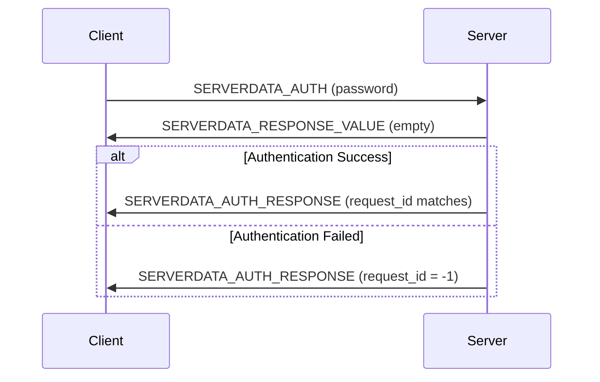
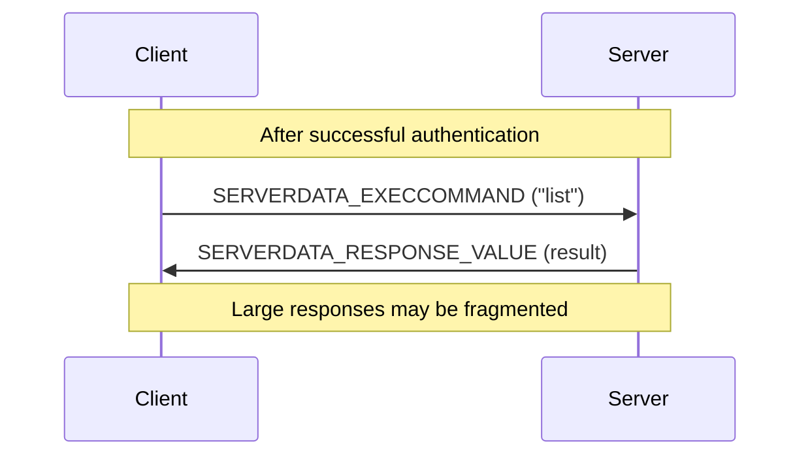

# RCON Protocol Specification

Remote Console (RCON) is a TCP/IP-based protocol for remote server administration. Originally developed by Valve for Source engine games, it's also used by Minecraft servers.

## Overview

RCON allows administrators to execute server commands remotely without direct console access. This is essential for automated server management and CLI tools like `mcctl`.

!!! warning "Security Notice"
    RCON transmits data **unencrypted**. Never expose RCON ports directly to the internet. Use RCON only within trusted networks or through secure tunnels.

## Protocol Specification

### Packet Structure

All integers are **little-endian** (unlike Minecraft's main protocol which uses big-endian).

```
┌────────────┬────────────┬────────────┬─────────────────┬──────┐
│   Length   │ Request ID │    Type    │     Payload     │ Pad  │
│  (4 bytes) │ (4 bytes)  │ (4 bytes)  │   (variable)    │ (2)  │
│  int32 LE  │  int32 LE  │  int32 LE  │ null-terminated │ 0x00 │
└────────────┴────────────┴────────────┴─────────────────┴──────┘
```

| Field | Size | Type | Description |
|-------|------|------|-------------|
| **Length** | 4 bytes | int32 | Length of remainder of packet (excludes this field) |
| **Request ID** | 4 bytes | int32 | Client-generated ID for matching responses |
| **Type** | 4 bytes | int32 | Packet type (see below) |
| **Payload** | Variable | ASCII string | NULL-terminated command or response |
| **Padding** | 2 bytes | byte[2] | Two NULL bytes (0x00 0x00) |

### Packet Types

| Type | Value | Direction | Description |
|------|-------|-----------|-------------|
| **SERVERDATA_AUTH** | 3 | Client → Server | Authentication request (password) |
| **SERVERDATA_AUTH_RESPONSE** | 2 | Server → Client | Authentication response |
| **SERVERDATA_EXECCOMMAND** | 2 | Client → Server | Command execution request |
| **SERVERDATA_RESPONSE_VALUE** | 0 | Server → Client | Command execution response |

!!! note "Type Value Overlap"
    Note that `SERVERDATA_AUTH_RESPONSE` and `SERVERDATA_EXECCOMMAND` share the same value (2). The direction of the packet determines the meaning.

### Size Limits

| Direction | Max Payload | Max Total Packet |
|-----------|-------------|------------------|
| Client → Server | 1446 bytes | 1460 bytes |
| Server → Client | 4096 bytes | 4110 bytes |

## Communication Flow

### Authentication



**Authentication Request:**
```
Length:     14 + password_length
Request ID: client_generated_id
Type:       3 (SERVERDATA_AUTH)
Payload:    "your_password\0"
Padding:    0x00 0x00
```

**Authentication Response (Success):**
```
Length:     10
Request ID: same_as_request (matches client ID)
Type:       2 (SERVERDATA_AUTH_RESPONSE)
Payload:    "\0"
Padding:    0x00 0x00
```

**Authentication Response (Failure):**
```
Length:     10
Request ID: -1 (indicates failure)
Type:       2 (SERVERDATA_AUTH_RESPONSE)
Payload:    "\0"
Padding:    0x00 0x00
```

### Command Execution



**Command Request:**
```
Length:     14 + command_length
Request ID: client_generated_id
Type:       2 (SERVERDATA_EXECCOMMAND)
Payload:    "list\0"
Padding:    0x00 0x00
```

**Command Response:**
```
Length:     10 + response_length
Request ID: same_as_request
Type:       0 (SERVERDATA_RESPONSE_VALUE)
Payload:    "There are 2 of a max 20 players online: Steve, Alex\0"
Padding:    0x00 0x00
```

### Response Fragmentation

Large responses (>4096 bytes) are split across multiple packets. Detecting the end of a multi-packet response is challenging:

1. **Payload Size Check**: If payload < 4096 bytes, it's likely the last packet
2. **Timeout**: Wait for a period with no new data
3. **Dummy Packet**: Send a dummy command and wait for its response

## Server Configuration

### server.properties

```properties
# Enable RCON
enable-rcon=true

# RCON port (default: 25575)
rcon.port=25575

# RCON password (required)
rcon.password=your_secure_password

# Broadcast RCON commands to operators (optional)
broadcast-rcon-to-ops=false
```

### Docker Configuration (This Project)

```bash
# platform/servers/<server>/config.env
ENABLE_RCON=true
RCON_PASSWORD=your_secure_password
RCON_PORT=25575
```

The `itzg/minecraft-server` image includes `rcon-cli`, a built-in RCON client.

## Common RCON Commands

| Command | Description | Example Response |
|---------|-------------|------------------|
| `list` | Online players | `There are 2 of a max 20 players online: Steve, Alex` |
| `say <message>` | Broadcast message | (empty) |
| `tell <player> <msg>` | Private message | (empty) |
| `kick <player> [reason]` | Kick player | `Kicked Steve: reason` |
| `ban <player> [reason]` | Ban player | `Banned player Steve` |
| `pardon <player>` | Unban player | `Unbanned player Steve` |
| `op <player>` | Grant operator | `Made Steve a server operator` |
| `deop <player>` | Remove operator | `Made Steve no longer a server operator` |
| `whitelist list` | List whitelisted | `There are 3 whitelisted players: ...` |
| `whitelist add <player>` | Add to whitelist | `Added Steve to the whitelist` |
| `whitelist remove <player>` | Remove from whitelist | `Removed Steve from the whitelist` |
| `save-all` | Save world | `Saving the game (this may take a moment!)` |
| `stop` | Stop server | Server shuts down |
| `time set <value>` | Set world time | `Set the time to <value>` |
| `weather <type>` | Set weather | `Set the weather to <type>` |
| `gamemode <mode> <player>` | Change game mode | `Set Steve's game mode to Creative Mode` |
| `give <player> <item> [count]` | Give items | `Gave 64 [Diamond] to Steve` |

## Usage in This Project

### Using mcctl CLI

```bash
# Execute single command
mcctl exec myserver list
mcctl exec myserver say "Server restarting in 5 minutes!"

# Interactive RCON console
mcctl console myserver

# Player management (uses RCON internally)
mcctl whitelist myserver add Steve
mcctl op myserver add Steve
mcctl kick myserver Steve "AFK too long"
mcctl ban myserver Griefer "Griefing"
```

### Using Docker Directly

```bash
# Single command
docker exec mc-myserver rcon-cli list

# Interactive mode
docker exec -it mc-myserver rcon-cli

# With explicit password
docker exec mc-myserver rcon-cli --password mypassword list
```

### Using rcon-cli Options

```bash
# Basic usage
rcon-cli <command>

# With host and port (for remote connections)
rcon-cli --host localhost --port 25575 --password mypassword list

# Environment variables
RCON_HOST=localhost RCON_PORT=25575 RCON_PASSWORD=mypassword rcon-cli list
```

## Implementation Notes

### Character Encoding

Some servers (like CraftBukkit/Spigot) send color codes using byte `0xA7` (section sign). For better compatibility:

- Use **ISO-8859-1** (ISO-LATIN-1) charset instead of US-ASCII
- Handle color codes (`§`) in responses

### Request ID Handling

- Generate unique request IDs for each command
- Match responses by request ID
- Handle request ID `-1` as authentication failure

### Connection Management

- Keep connections open for multiple commands
- Implement timeouts for unresponsive servers
- Handle connection drops gracefully

## Security Best Practices

### Network Security

1. **Never expose RCON to the internet** - Use only on localhost or trusted networks
2. **Use strong passwords** - At least 16 characters, random
3. **Firewall rules** - Block external access to RCON port

```bash
# UFW (Ubuntu)
sudo ufw deny 25575/tcp

# iptables
sudo iptables -A INPUT -p tcp --dport 25575 -j DROP
```

### Docker Security

In Docker environments, RCON is accessed through `docker exec`, which:

- Doesn't require network exposure
- Uses Docker's authentication
- Works through the Docker socket

```yaml
# No port exposure needed
services:
  mc-myserver:
    # ports:
    #   - "25575:25575"  # Don't expose RCON port
```

### Secure Alternatives

For remote administration over the internet:

1. **SSH Tunnel**: Access RCON through SSH
   ```bash
   ssh -L 25575:localhost:25575 user@server
   rcon-cli --host localhost --port 25575
   ```

2. **VPN**: Access server network through VPN

3. **Web Panel**: Use a web-based management panel with HTTPS

## Troubleshooting

### Connection Refused

```bash
# Check RCON is enabled
docker exec mc-myserver cat /data/server.properties | grep rcon

# Check container is running
docker ps | grep mc-myserver
```

### Authentication Failed

```bash
# Verify password in config
cat platform/servers/myserver/config.env | grep RCON_PASSWORD

# Check server.properties
docker exec mc-myserver cat /data/server.properties | grep rcon.password
```

### Empty Response

Some commands return empty responses. This is normal for commands like:

- `say` - Just broadcasts, no response
- `tell` - Private message sent
- `whitelist add` - Player added (some servers return empty)

### Timeout Issues

```bash
# Increase timeout in rcon-cli
rcon-cli --timeout 30 <command>

# Check server is responsive
docker logs mc-myserver --tail 50
```

## References

- [Minecraft Wiki - RCON](https://minecraft.wiki/w/RCON)
- [Source RCON Protocol (Valve)](https://developer.valvesoftware.com/wiki/Source_RCON_Protocol)
- [itzg/minecraft-server - RCON](https://docker-minecraft-server.readthedocs.io/en/latest/commands/)
- [rcon-cli GitHub](https://github.com/itzg/rcon-cli)

## See Also

- **[Networking Guide](networking.md)** - Network configuration
- **[CLI Commands](../cli/commands.md)** - Full CLI reference
- **[Environment Variables](../configuration/environment.md)** - Server configuration
