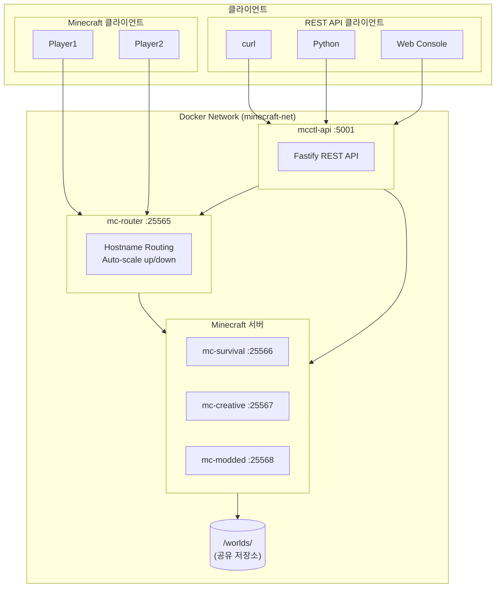
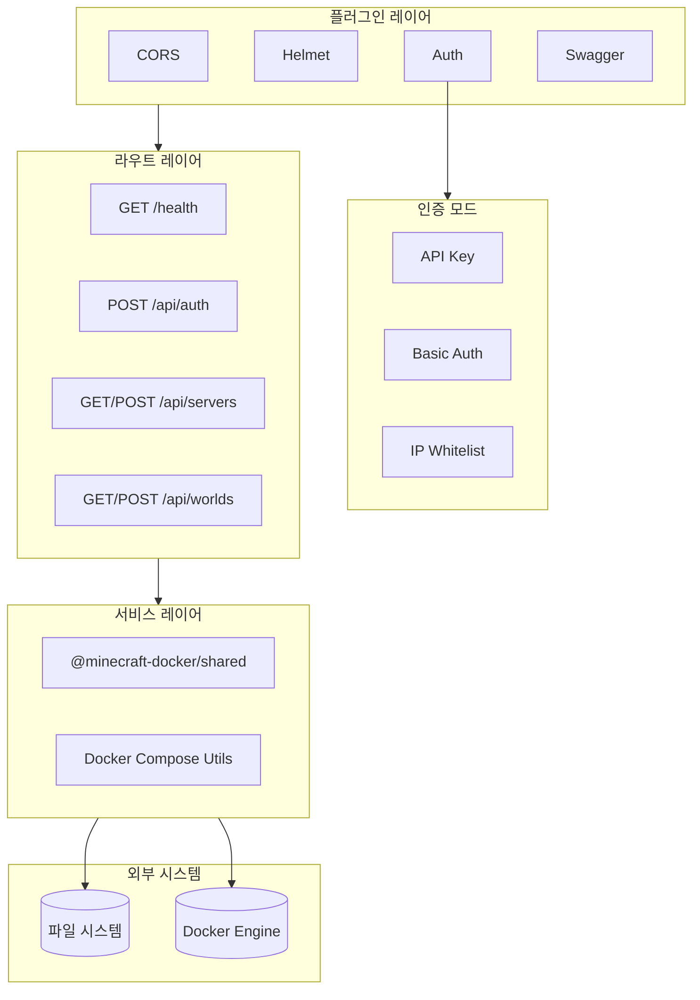
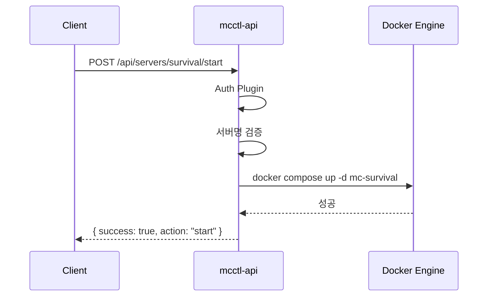
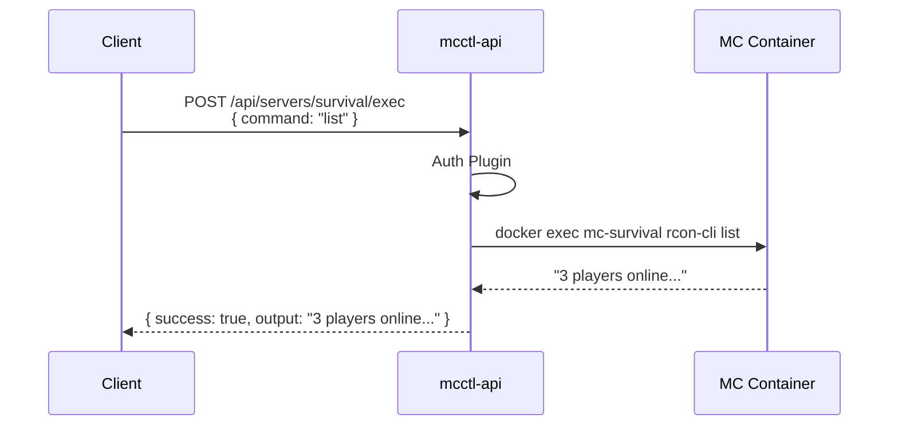
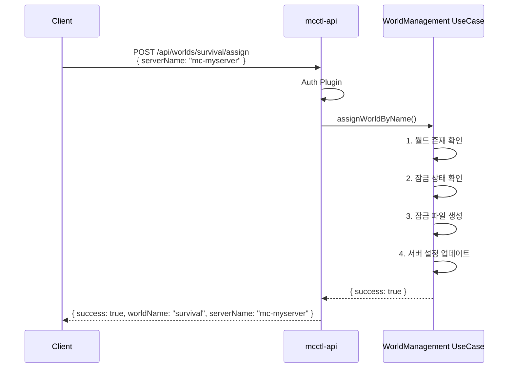
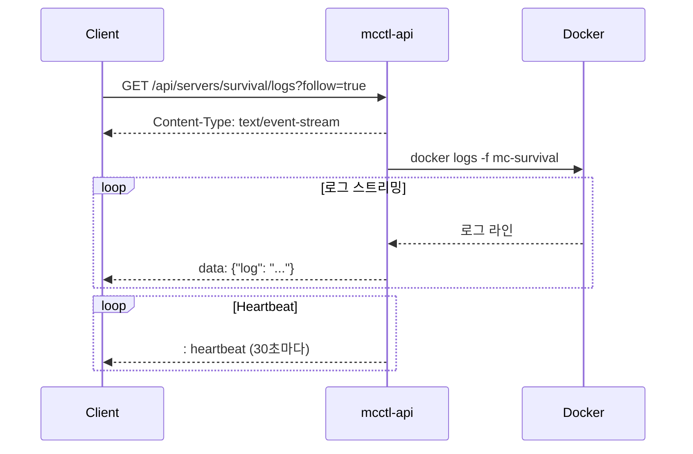

# REST API 개요

mcctl-api는 Docker Minecraft 서버를 관리하기 위한 RESTful 인터페이스를 제공합니다. 외부 통합, 자동화, 그리고 Web Console의 백엔드로 사용됩니다.

## 시스템 아키텍처



## mcctl-api 내부 아키텍처



## 요청 흐름 시퀀스

### 서버 시작 요청



### RCON 명령 실행



### 월드 할당 흐름



### SSE 로그 스트리밍



## 기본 URL

```
http://localhost:5001
```

## 인증

API는 5가지 인증 모드를 지원합니다:

| 모드 | 설명 | 헤더 |
|------|------|------|
| `disabled` | 인증 없음 (개발용) | - |
| `api-key` | 헤더에 API 키 | `X-API-Key: mctk_xxx` |
| `ip-whitelist` | IP 기반 접근 제어 | - |
| `basic` | HTTP Basic Auth | `Authorization: Basic xxx` |
| `combined` | API 키 + IP 화이트리스트 | 둘 다 필요 |

### API 키 인증

```bash
curl -H "X-API-Key: mctk_your_key_here" http://localhost:5001/api/servers
```

### Basic 인증

```bash
curl -u admin:password http://localhost:5001/api/servers
```

## 빠른 시작

```bash
# 1. 콘솔 서비스 초기화
mcctl console init

# 2. API 서비스 시작
mcctl console api start

# 3. 연결 테스트
curl http://localhost:5001/health

# 4. 서버 목록 조회 (API 키 사용)
curl -H "X-API-Key: $(cat ~/minecraft-servers/api.key)" \
  http://localhost:5001/api/servers
```

## API 엔드포인트 그룹

### 헬스 체크

| 메소드 | 엔드포인트 | 설명 |
|--------|-----------|------|
| GET | `/health` | 서비스 상태 확인 |

### 서버 관리

| 메소드 | 엔드포인트 | 설명 |
|--------|-----------|------|
| GET | `/api/servers` | 전체 서버 목록 |
| GET | `/api/servers/:name` | 서버 상세 정보 |
| GET | `/api/servers/:name/logs` | 서버 로그 (SSE 지원) |
| POST | `/api/servers/:name/exec` | RCON 명령 실행 |
| POST | `/api/servers/:name/start` | 서버 시작 |
| POST | `/api/servers/:name/stop` | 서버 정지 |
| POST | `/api/servers/:name/restart` | 서버 재시작 |

### 월드 관리

| 메소드 | 엔드포인트 | 설명 |
|--------|-----------|------|
| GET | `/api/worlds` | 전체 월드 목록 |
| GET | `/api/worlds/:name` | 월드 상세 정보 |
| POST | `/api/worlds` | 새 월드 생성 |
| POST | `/api/worlds/:name/assign` | 월드를 서버에 할당 |
| POST | `/api/worlds/:name/release` | 월드 잠금 해제 |
| DELETE | `/api/worlds/:name` | 월드 삭제 |

### 인증

| 메소드 | 엔드포인트 | 설명 |
|--------|-----------|------|
| POST | `/api/auth/login` | 사용자 로그인 |
| GET | `/api/auth/me` | 현재 사용자 정보 |

### 콘솔 명령

| 메소드 | 엔드포인트 | 설명 |
|--------|-----------|------|
| POST | `/servers/:id/console/exec` | RCON 명령 실행 (대체 경로) |

## 응답 형식

### 성공 응답

```json
{
  "servers": [...],
  "total": 2
}
```

### 에러 응답

```json
{
  "error": "NotFound",
  "message": "Server 'unknown' not found"
}
```

### HTTP 상태 코드

| 코드 | 설명 |
|------|------|
| 200 | 성공 |
| 201 | 생성됨 |
| 400 | 잘못된 요청 |
| 401 | 인증 필요 |
| 403 | 접근 금지 |
| 404 | 찾을 수 없음 |
| 409 | 충돌 |
| 500 | 서버 오류 |

## 실시간 로그 스트리밍 (SSE)

로그 엔드포인트는 실시간 로그 스트리밍을 위한 Server-Sent Events를 지원합니다:

```bash
curl -H "Accept: text/event-stream" \
  "http://localhost:5001/api/servers/survival/logs?follow=true"
```

```
data: {"log": "[10:30:15] Player joined"}
data: {"log": "[10:30:20] Player left"}
: heartbeat
```

## OpenAPI/Swagger

인터랙티브 API 문서는 다음 주소에서 이용 가능합니다:

```
http://localhost:5001/docs
```

제공 기능:
- 인터랙티브 엔드포인트 테스트
- 요청/응답 스키마 문서화
- 인증 테스트

## 다음 단계

- **[엔드포인트 레퍼런스](endpoints.md)** - 상세 엔드포인트 문서
- **[설치 가이드](../console/installation.md)** - 설정 가이드
- **[CLI 명령어](../console/cli-commands.md)** - mcctl console 명령어
