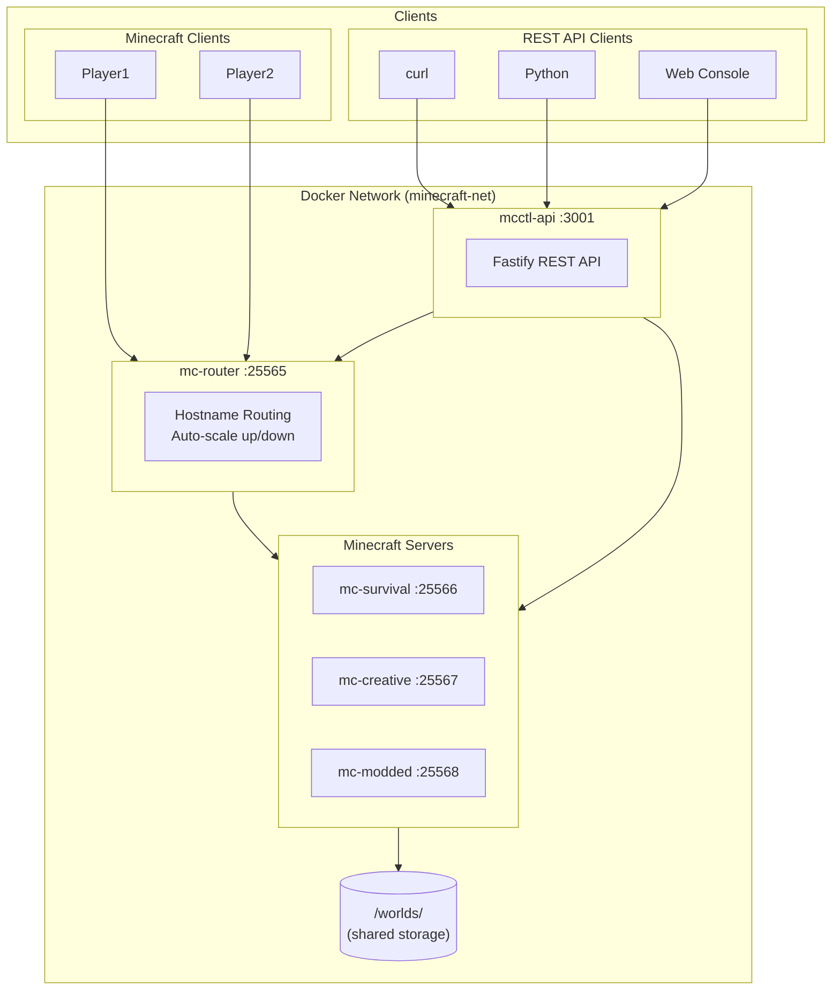
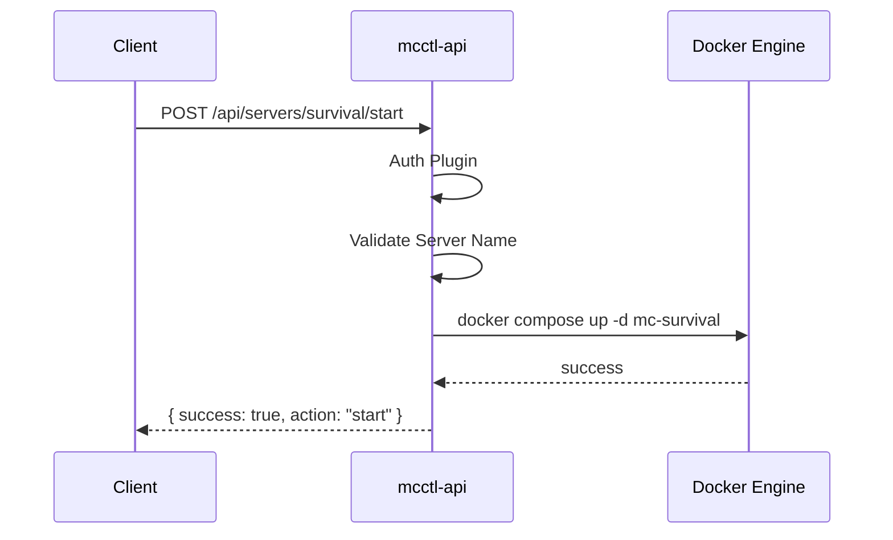
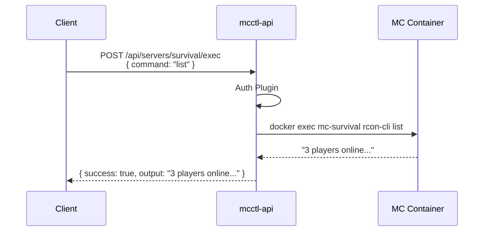
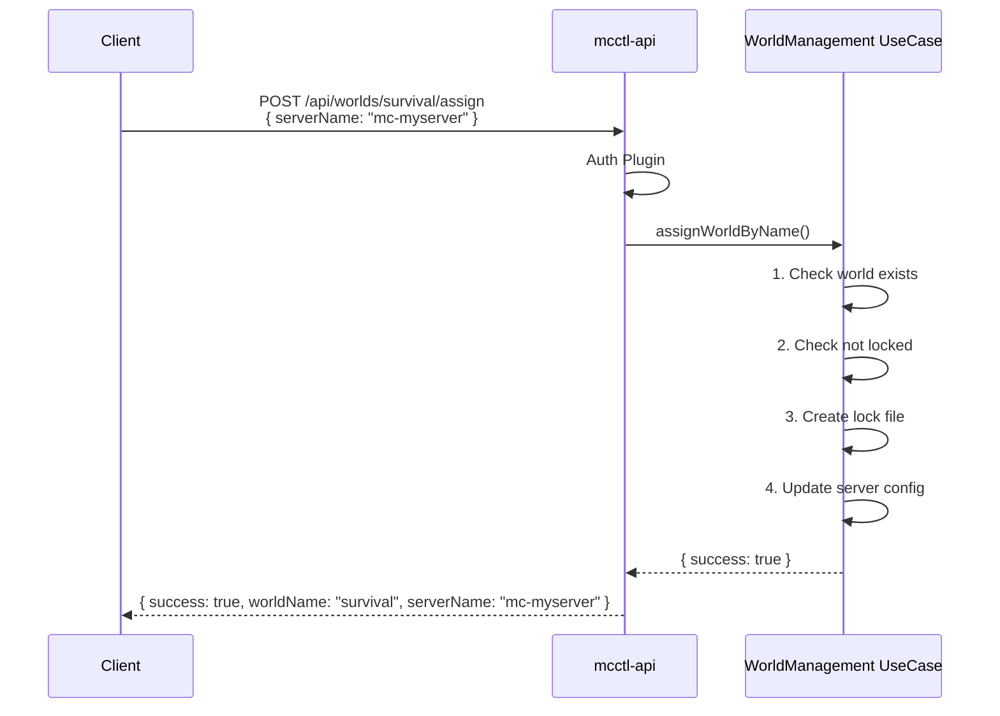
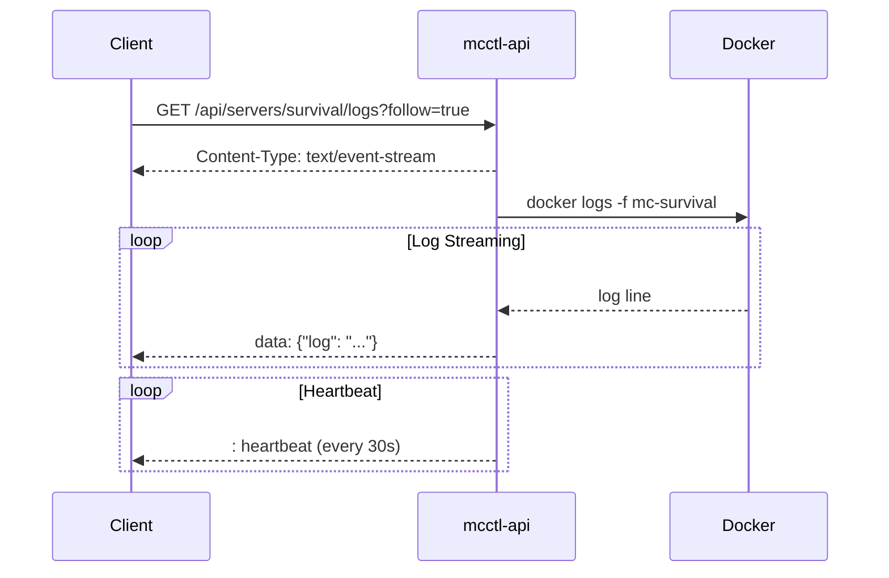

# REST API Overview

The mcctl-api provides a RESTful interface for managing Docker Minecraft servers. It enables external integrations, automation, and serves as the backend for the Web Console.

## System Architecture



## mcctl-api Internal Architecture

```mermaid
flowchart TB
    subgraph API["mcctl-api (Fastify)"]
        subgraph Plugins["Plugins Layer"]
            CORS[CORS]
            Helmet[Helmet]
            Auth[Auth]
            Swagger[Swagger]
        end

        subgraph AuthModes["Authentication Modes"]
            APIKey[API Key]
            Basic[Basic Auth]
            IPWhite[IP Whitelist]
        end

        subgraph Routes["Routes Layer"]
            Health[/health]
            AuthRoute[/api/auth]
            ServersRoute[/api/servers]
            WorldsRoute[/api/worlds]
            Actions[/actions<br/>start/stop/restart]
            Console[/console/exec]
        end

        subgraph Services["Services Layer"]
            Shared["@minecraft-docker/shared<br/>Paths, Repositories,<br/>UseCases, Adapters"]
            DockerUtils["Docker Compose Utils<br/>start/stop, logs, exec"]
        end
    end

    subgraph External["External Systems"]
        FS[("File System<br/>worlds/, servers/,<br/>users.yaml, api.key")]
        DockerEngine[("Docker Engine<br/>containers, images,<br/>networks")]
    end

    Auth --> AuthModes
    Plugins --> Routes
    Routes --> Services
    Services --> FS
    Services --> DockerEngine
```

## Request Flow Sequence

### Server Start Request



### RCON Command Execution



### World Assignment Flow



### SSE Log Streaming



## Base URL

```
http://localhost:3001
```

## Authentication

The API supports 5 authentication modes:

| Mode | Description | Header |
|------|-------------|--------|
| `disabled` | No authentication (dev only) | - |
| `api-key` | API key in header | `X-API-Key: mctk_xxx` |
| `ip-whitelist` | IP-based access control | - |
| `basic` | HTTP Basic Auth | `Authorization: Basic xxx` |
| `combined` | API key + IP whitelist | Both required |

### API Key Authentication

```bash
curl -H "X-API-Key: mctk_your_key_here" http://localhost:3001/api/servers
```

### Basic Authentication

```bash
curl -u admin:password http://localhost:3001/api/servers
```

## Quick Start

```bash
# 1. Initialize console service
mcctl console init

# 2. Start API service
mcctl console api start

# 3. Test connection
curl http://localhost:3001/health

# 4. List servers (with API key)
curl -H "X-API-Key: $(cat ~/minecraft-servers/api.key)" \
  http://localhost:3001/api/servers
```

## API Endpoint Groups

### Health Check

| Method | Endpoint | Description |
|--------|----------|-------------|
| GET | `/health` | Service health status |

### Server Management

| Method | Endpoint | Description |
|--------|----------|-------------|
| GET | `/api/servers` | List all servers |
| GET | `/api/servers/:name` | Get server details |
| GET | `/api/servers/:name/logs` | Get server logs (supports SSE) |
| POST | `/api/servers/:name/exec` | Execute RCON command |
| POST | `/api/servers/:name/start` | Start server |
| POST | `/api/servers/:name/stop` | Stop server |
| POST | `/api/servers/:name/restart` | Restart server |

### World Management

| Method | Endpoint | Description |
|--------|----------|-------------|
| GET | `/api/worlds` | List all worlds |
| GET | `/api/worlds/:name` | Get world details |
| POST | `/api/worlds` | Create new world |
| POST | `/api/worlds/:name/assign` | Assign world to server |
| POST | `/api/worlds/:name/release` | Release world lock |
| DELETE | `/api/worlds/:name` | Delete world |

### Authentication

| Method | Endpoint | Description |
|--------|----------|-------------|
| POST | `/api/auth/login` | User login |
| GET | `/api/auth/me` | Get current user |

### Console Commands

| Method | Endpoint | Description |
|--------|----------|-------------|
| POST | `/servers/:id/console/exec` | Execute RCON command (alternative) |

## Response Format

### Success Response

```json
{
  "servers": [...],
  "total": 2
}
```

### Error Response

```json
{
  "error": "NotFound",
  "message": "Server 'unknown' not found"
}
```

### HTTP Status Codes

| Code | Description |
|------|-------------|
| 200 | Success |
| 201 | Created |
| 400 | Bad Request |
| 401 | Unauthorized |
| 403 | Forbidden |
| 404 | Not Found |
| 409 | Conflict |
| 500 | Internal Server Error |

## Real-time Log Streaming (SSE)

The logs endpoint supports Server-Sent Events for real-time log streaming:

```bash
curl -H "Accept: text/event-stream" \
  "http://localhost:3001/api/servers/survival/logs?follow=true"
```

```
data: {"log": "[10:30:15] Player joined"}
data: {"log": "[10:30:20] Player left"}
: heartbeat
```

## OpenAPI/Swagger

Interactive API documentation is available at:

```
http://localhost:3001/docs
```

This provides:
- Interactive endpoint testing
- Request/response schema documentation
- Authentication testing

## Next Steps

- **[Endpoints Reference](endpoints.md)** - Detailed endpoint documentation
- **[Installation](../admin-service/installation.md)** - Setup guide
- **[CLI Commands](../admin-service/cli-commands.md)** - mcctl console commands
