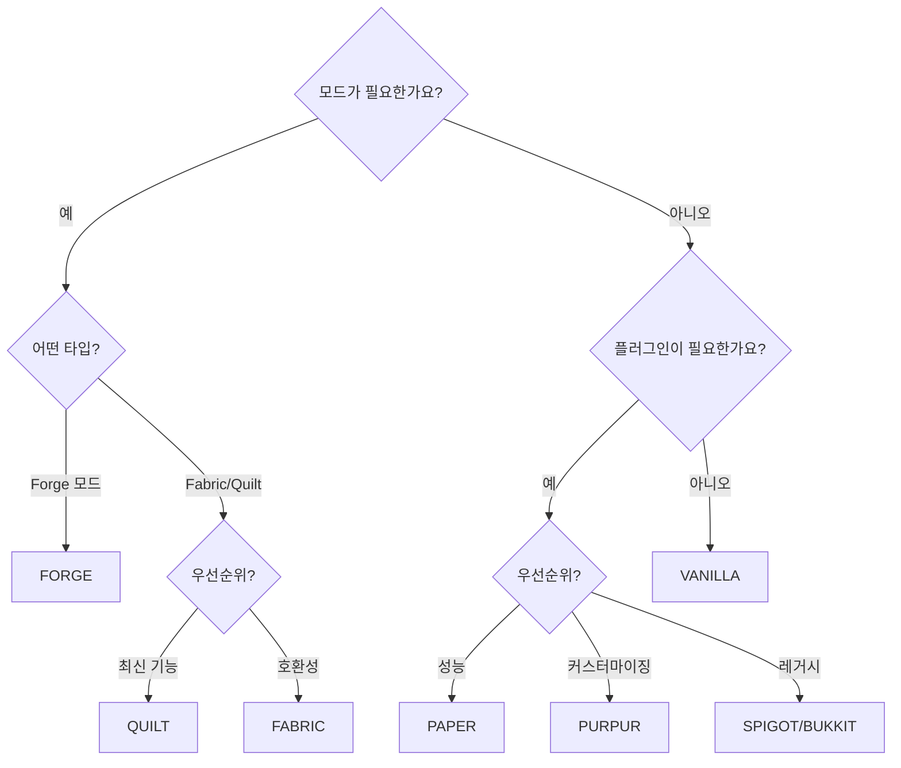

# 서버 타입

mcctl에서 지원하는 각 Minecraft 서버 플랫폼에 대한 상세 가이드입니다.

## 빠른 시작

mcctl을 사용하여 원하는 타입의 서버를 생성합니다:

```bash
# Paper (대부분의 사용자에게 권장)
mcctl create myserver -t PAPER -v 1.21.1

# Vanilla (순수 Minecraft)
mcctl create myserver -t VANILLA -v 1.21.1

# Forge (모드)
mcctl create myserver -t FORGE -v 1.20.4

# Fabric (경량 모드)
mcctl create myserver -t FABRIC -v 1.21.1
```

## 개요

| 타입 | 플러그인 | 모드 | 성능 | 권장 용도 |
|------|----------|------|------|-----------|
| **PAPER** | 예 | 아니오 | 매우 좋음 | 일반 사용, 플러그인 |
| **VANILLA** | 아니오 | 아니오 | 좋음 | 순수 Minecraft 경험 |
| **FORGE** | 아니오 | 예 | 다양함 | Forge 모드팩 |
| **FABRIC** | 아니오 | 예 | 매우 좋음 | 성능 모드 |
| **SPIGOT** | 예 | 아니오 | 좋음 | 레거시 플러그인 호환성 |
| **BUKKIT** | 예 | 아니오 | 보통 | 매우 오래된 플러그인 |
| **PURPUR** | 예 | 아니오 | 매우 좋음 | 고급 커스터마이징 |
| **QUILT** | 아니오 | 예 | 매우 좋음 | 현대적인 Fabric 대안 |

---

## Paper

**대부분의 사용자에게 권장됩니다.**

Paper는 Bukkit 및 Spigot 플러그인을 지원하면서 상당한 성능 향상을 제공하는 고성능 Minecraft 서버입니다.

### Paper 서버 생성

```bash
mcctl create myserver -t PAPER -v 1.21.1
```

### 특징

- Vanilla 대비 상당한 성능 향상
- 완전한 Bukkit/Spigot 플러그인 호환성
- 비동기 청크 로딩
- 악용 방지 패치
- 광범위한 설정 옵션

### 권장 설정

```bash
# Aikar의 최적화된 JVM 플래그 활성화
mcctl config myserver USE_AIKAR_FLAGS true
```

### 플러그인 추가

```bash
# Modrinth에서
mcctl config myserver MODRINTH_PROJECTS "essentialsx,luckperms"

# Spigot에서
mcctl config myserver SPIGET_RESOURCES "28140,81534"

# 변경 사항 적용
mcctl stop myserver && mcctl start myserver
```

또는 플러그인 JAR 파일을 `shared/plugins/` 디렉토리에 넣습니다.

### 모범 사례

- 최적의 성능을 위해 항상 `USE_AIKAR_FLAGS=true` 활성화
- 가능한 경우 Paper 전용 플러그인 사용
- Paper의 내장 프로파일러로 모니터링: `/timings report`

---

## Vanilla

Mojang의 공식 Minecraft 서버입니다.

### Vanilla 서버 생성

```bash
mcctl create myserver -t VANILLA -v 1.21.1
```

### 특징

- 공식 Minecraft 경험
- 수정 없음
- 모든 Minecraft 기능과의 호환성 보장
- 가장 작은 용량

### 사용 사례

- 순수한 Minecraft 경험
- 바닐라 동작 테스트
- 최소한의 서버 요구사항

---

## Forge

Forge 모드를 실행하기 위한 서버입니다.

### Forge 서버 생성

```bash
mcctl create myserver -t FORGE -v 1.20.4
```

### 특징

- 대규모 모드 생태계
- 복잡한 모드팩 지원
- 산업/기술 모드
- RPG 모드

### 설정

```bash
# 메모리 설정 (모드팩은 더 많이 필요)
mcctl config myserver MEMORY 8G

# 모드 추가 (.env에 CF_API_KEY 필요)
mcctl config myserver CURSEFORGE_FILES "jei,journeymap,create"

# 또는 특정 Forge 버전
mcctl config myserver FORGE_VERSION "47.2.0"

# 변경 사항 적용
mcctl stop myserver && mcctl start myserver
```

### Java 버전 요구사항

| Minecraft 버전 | 필요한 Java | 이미지 태그 |
|----------------|-------------|-------------|
| 1.20.x+ | Java 17 또는 21 | `latest` |
| 1.17.x - 1.19.x | Java 17 | `java17` |
| 1.16.x 이하 | Java 8 | `java8` |

!!! warning "Forge 1.16.5 이하"
    이전 Forge 버전의 경우 서버의 docker-compose.yml을 수정하여 java8 이미지를 사용해야 합니다:
    ```yaml
    image: itzg/minecraft-server:java8
    ```

### 메모리 권장사항

| 모드팩 크기 | 권장 메모리 |
|-------------|-------------|
| 가벼움 (10-30개 모드) | 4-6G |
| 중간 (30-100개 모드) | 6-8G |
| 무거움 (100개+ 모드) | 8-12G |

```bash
mcctl config myserver MEMORY 8G
```

---

## Fabric

뛰어난 성능을 가진 경량 모딩 플랫폼입니다.

### Fabric 서버 생성

```bash
mcctl create myserver -t FABRIC -v 1.21.1
```

### 특징

- 빠른 시작 및 런타임
- 성능 최적화 모드 (Lithium, Sodium)
- 현대적인 모딩 API
- 더 작은 모드 파일 크기

### 설정

```bash
# 메모리 설정
mcctl config myserver MEMORY 6G

# Modrinth에서 필수 Fabric 모드
mcctl config myserver MODRINTH_PROJECTS "fabric-api,lithium,starlight"
mcctl config myserver MODRINTH_DOWNLOAD_DEPENDENCIES required

# 또는 특정 Fabric 로더 버전
mcctl config myserver FABRIC_LOADER_VERSION "0.15.0"

# 변경 사항 적용
mcctl stop myserver && mcctl start myserver
```

### 권장 모드

| 모드 | 용도 | mcctl config |
|------|------|--------------|
| `fabric-api` | 대부분의 모드에 필요 | `MODRINTH_PROJECTS` |
| `lithium` | 게임 로직 최적화 | `MODRINTH_PROJECTS` |
| `starlight` | 조명 엔진 재작성 | `MODRINTH_PROJECTS` |
| `krypton` | 네트워크 최적화 | `MODRINTH_PROJECTS` |
| `ferritecore` | 메모리 최적화 | `MODRINTH_PROJECTS` |

```bash
mcctl config myserver MODRINTH_PROJECTS "fabric-api,lithium,starlight,krypton,ferritecore"
```

### 성능 비교

최적화 모드가 있는 Fabric은 일반적으로 다음을 제공합니다:

- Vanilla 대비 50-100% 더 나은 TPS
- 더 빠른 청크 로딩
- 더 낮은 메모리 사용량

---

## Spigot

플러그인을 지원하는 수정된 Bukkit 서버입니다.

### Spigot 서버 생성

```bash
mcctl create myserver -t SPIGOT -v 1.21.1
```

### 특징

- Bukkit 플러그인 호환성
- Bukkit 대비 성능 향상
- 넓은 플러그인 생태계

### 사용 시기

- 특정 Spigot 전용 플러그인이 필요한 경우
- 레거시 서버 마이그레이션
- Paper가 호환성 문제를 일으키는 경우

!!! note "Paper 권장"
    Paper는 더 나은 성능을 제공하고 완전한 Spigot 호환성을 유지하므로 일반적으로 Spigot보다 선호됩니다.

---

## Bukkit

클래식 Minecraft 플러그인 서버입니다.

### Bukkit 서버 생성

```bash
mcctl create myserver -t BUKKIT -v 1.21.1
```

### 특징

- 원래의 플러그인 API
- 레거시 플러그인 지원
- 안정적이고 잘 문서화됨

### 사용 시기

- Spigot/Paper와 작동하지 않는 매우 오래된 플러그인
- 역사적/보관 목적

---

## Purpur

추가 기능과 커스터마이징을 제공하는 Paper 포크입니다.

### Purpur 서버 생성

```bash
mcctl create myserver -t PURPUR -v 1.21.1
```

### 특징

- 모든 Paper 기능과 그 이상
- 확장된 설정 옵션
- 재미있는 게임플레이 추가 기능
- 활발한 개발

### 설정

```bash
mcctl config myserver USE_AIKAR_FLAGS true
```

### 고유 기능

- 탈 수 있는 몹 (어떤 몹을 탈 수 있는지 설정)
- 데미지 인디케이터에 플레이어 체력 표시
- 설정 가능한 주민 로보토미
- 확장된 권한

---

## Quilt

개선된 API를 가진 현대적인 Fabric 포크입니다.

### Quilt 서버 생성

```bash
mcctl create myserver -t QUILT -v 1.21.1
```

### 특징

- Fabric 모드 호환성
- 개선된 로더와 API
- 더 나은 모드 충돌 해결
- 커뮤니티 중심 개발

### 설정

```bash
mcctl config myserver MODRINTH_PROJECTS "qsl,fabric-api"
```

### 사용 시기

- Quilt의 모딩 접근 방식을 선호하는 경우
- Quilt 전용 모드가 필요한 경우
- 개선된 모드 호환성을 원하는 경우

---

## 서버 타입 선택

### 의사결정 트리



### 빠른 권장사항

| 사용 사례 | 명령어 |
|-----------|--------|
| 일반 멀티플레이어 | `mcctl create myserver -t PAPER -v 1.21.1` |
| 성능 중심 | `mcctl create myserver -t PAPER -v 1.21.1` 또는 `-t FABRIC` |
| 복잡한 모드팩 | `mcctl create myserver -t FORGE -v 1.20.4` |
| 가벼운 최적화 모드 | `mcctl create myserver -t FABRIC -v 1.21.1` |
| 순수 바닐라 | `mcctl create myserver -t VANILLA -v 1.21.1` |
| 최대 커스터마이징 | `mcctl create myserver -t PURPUR -v 1.21.1` |

## 완전한 설정 예제

### 서바이벌 서버 (Paper)

```bash
# 서버 생성
mcctl create survival -t PAPER -v 1.21.1

# 설정
mcctl config survival MOTD "서바이벌 서버 - 행운을 빕니다!"
mcctl config survival DIFFICULTY hard
mcctl config survival GAMEMODE survival
mcctl config survival USE_AIKAR_FLAGS true

# 플러그인 추가
mcctl config survival MODRINTH_PROJECTS "essentialsx,luckperms"

# 적용을 위해 재시작
mcctl stop survival && mcctl start survival

# 운영자 추가
mcctl op survival add YourName
```

### 모드 서버 (Forge)

```bash
# 서버 생성
mcctl create modded -t FORGE -v 1.20.4

# 설정
mcctl config modded MEMORY 8G
mcctl config modded USE_AIKAR_FLAGS true

# 모드 추가 (.env에 CF_API_KEY 필요)
mcctl config modded CURSEFORGE_FILES "create,jei,journeymap"

# 적용을 위해 재시작
mcctl stop modded && mcctl start modded
```

### 성능 서버 (Fabric)

```bash
# 서버 생성
mcctl create performance -t FABRIC -v 1.21.1

# 설정
mcctl config performance MEMORY 6G
mcctl config performance MODRINTH_PROJECTS "fabric-api,lithium,starlight,krypton"
mcctl config performance MODRINTH_DOWNLOAD_DEPENDENCIES required

# 적용을 위해 재시작
mcctl stop performance && mcctl start performance
```

## 참고

- **[환경 변수](environment.ko.md)** - 모든 설정 옵션
- **[CLI 명령어](../cli/commands.ko.md)** - 전체 mcctl 레퍼런스
- **[itzg/minecraft-server 타입](https://docker-minecraft-server.readthedocs.io/en/latest/types-and-platforms/)** - 전체 문서
