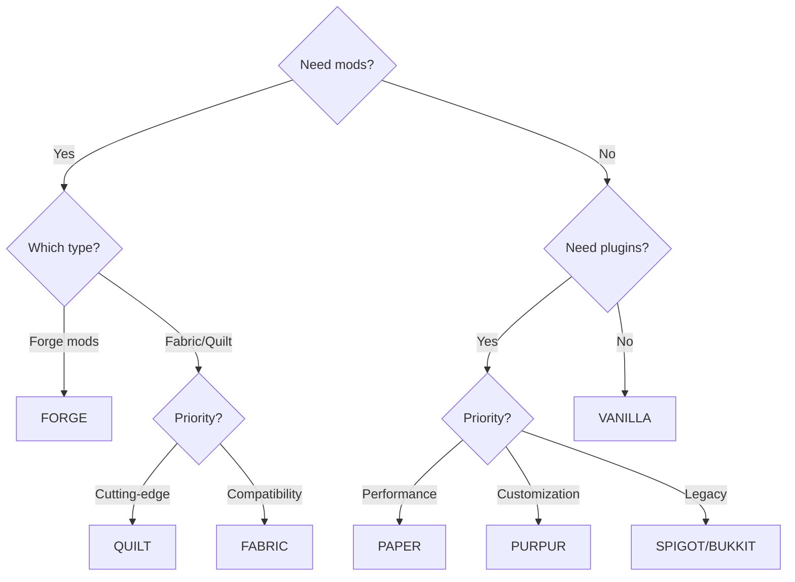

# Server Types

Detailed guide for each Minecraft server platform supported by mcctl.

## Quick Start

Create a server with your desired type using mcctl:

```bash
# Paper (recommended for most users)
mcctl create myserver -t PAPER -v 1.21.1

# Vanilla (pure Minecraft)
mcctl create myserver -t VANILLA -v 1.21.1

# Forge (mods)
mcctl create myserver -t FORGE -v 1.20.4

# Fabric (lightweight mods)
mcctl create myserver -t FABRIC -v 1.21.1
```

## Overview

| Type | Plugins | Mods | Performance | Recommended For |
|------|---------|------|-------------|-----------------|
| **PAPER** | Yes | No | Excellent | General use, plugins |
| **VANILLA** | No | No | Good | Pure Minecraft experience |
| **FORGE** | No | Yes | Varies | Forge mod packs |
| **FABRIC** | No | Yes | Excellent | Performance mods |
| **SPIGOT** | Yes | No | Good | Legacy plugin compatibility |
| **BUKKIT** | Yes | No | Moderate | Very old plugins |
| **PURPUR** | Yes | No | Excellent | Advanced customization |
| **QUILT** | No | Yes | Excellent | Modern Fabric alternative |

---

## Paper

**Recommended for most users.**

Paper is a high-performance Minecraft server that supports Bukkit and Spigot plugins while providing significant performance improvements.

### Create Paper Server

```bash
mcctl create myserver -t PAPER -v 1.21.1
```

### Features

- Significant performance improvements over Vanilla
- Full Bukkit/Spigot plugin compatibility
- Async chunk loading
- Anti-exploit patches
- Extensive configuration options

### Recommended Configuration

```bash
# Enable Aikar's optimized JVM flags
mcctl config myserver USE_AIKAR_FLAGS true
```

### Adding Plugins

```bash
# From Modrinth
mcctl config myserver MODRINTH_PROJECTS "essentialsx,luckperms"

# From Spigot
mcctl config myserver SPIGET_RESOURCES "28140,81534"

# Apply changes
mcctl stop myserver && mcctl start myserver
```

Or place plugin JAR files in `shared/plugins/` directory.

### Best Practices

- Always enable `USE_AIKAR_FLAGS=true` for optimal performance
- Use Paper-specific plugins when available
- Monitor with Paper's built-in profiler: `/timings report`

---

## Vanilla

The official Minecraft server from Mojang.

### Create Vanilla Server

```bash
mcctl create myserver -t VANILLA -v 1.21.1
```

### Features

- Official Minecraft experience
- No modifications
- Guaranteed compatibility with all Minecraft features
- Smallest footprint

### Use Cases

- Pure Minecraft experience
- Testing vanilla behavior
- Minimal server requirements

---

## Forge

Server for running Forge mods.

### Create Forge Server

```bash
mcctl create myserver -t FORGE -v 1.20.4
```

### Features

- Large mod ecosystem
- Complex modpacks support
- Industrial/tech mods
- RPG mods

### Configuration

```bash
# Set memory (modpacks need more)
mcctl config myserver MEMORY 8G

# Add mods (requires CF_API_KEY in .env)
mcctl config myserver CURSEFORGE_FILES "jei,journeymap,create"

# Or specific Forge version
mcctl config myserver FORGE_VERSION "47.2.0"

# Apply changes
mcctl stop myserver && mcctl start myserver
```

### Java Version Requirements

| Minecraft Version | Required Java | Image Tag |
|-------------------|---------------|-----------|
| 1.20.x+ | Java 17 or 21 | `latest` |
| 1.17.x - 1.19.x | Java 17 | `java17` |
| 1.16.x and below | Java 8 | `java8` |

!!! warning "Forge 1.16.5 and Below"
    For older Forge versions, you need to modify the server's docker-compose.yml to use the java8 image:
    ```yaml
    image: itzg/minecraft-server:java8
    ```

### Memory Recommendations

| Modpack Size | Recommended Memory |
|--------------|-------------------|
| Light (10-30 mods) | 4-6G |
| Medium (30-100 mods) | 6-8G |
| Heavy (100+ mods) | 8-12G |

```bash
mcctl config myserver MEMORY 8G
```

---

## Fabric

Lightweight modding platform with excellent performance.

### Create Fabric Server

```bash
mcctl create myserver -t FABRIC -v 1.21.1
```

### Features

- Fast startup and runtime
- Performance optimization mods (Lithium, Sodium)
- Modern modding API
- Smaller mod file sizes

### Configuration

```bash
# Set memory
mcctl config myserver MEMORY 6G

# Essential Fabric mods from Modrinth
mcctl config myserver MODRINTH_PROJECTS "fabric-api,lithium,starlight"
mcctl config myserver MODRINTH_DOWNLOAD_DEPENDENCIES required

# Or specific Fabric loader version
mcctl config myserver FABRIC_LOADER_VERSION "0.15.0"

# Apply changes
mcctl stop myserver && mcctl start myserver
```

### Recommended Mods

| Mod | Purpose | mcctl config |
|-----|---------|--------------|
| `fabric-api` | Required by most mods | `MODRINTH_PROJECTS` |
| `lithium` | Game logic optimization | `MODRINTH_PROJECTS` |
| `starlight` | Lighting engine rewrite | `MODRINTH_PROJECTS` |
| `krypton` | Network optimization | `MODRINTH_PROJECTS` |
| `ferritecore` | Memory optimization | `MODRINTH_PROJECTS` |

```bash
mcctl config myserver MODRINTH_PROJECTS "fabric-api,lithium,starlight,krypton,ferritecore"
```

### Performance Comparison

Fabric with optimization mods typically provides:

- 50-100% better TPS than Vanilla
- Faster chunk loading
- Lower memory usage

---

## Spigot

Modified Bukkit server with plugin support.

### Create Spigot Server

```bash
mcctl create myserver -t SPIGOT -v 1.21.1
```

### Features

- Bukkit plugin compatibility
- Performance improvements over Bukkit
- Wide plugin ecosystem

### When to Use

- Need specific Spigot-only plugins
- Legacy server migration
- Paper causes compatibility issues

!!! note "Paper Recommended"
    Paper is generally preferred over Spigot as it provides better performance and maintains full Spigot compatibility.

---

## Bukkit

Classic Minecraft plugin server.

### Create Bukkit Server

```bash
mcctl create myserver -t BUKKIT -v 1.21.1
```

### Features

- Original plugin API
- Legacy plugin support
- Stable and well-documented

### When to Use

- Very old plugins that don't work with Spigot/Paper
- Historical/archival purposes

---

## Purpur

Paper fork with additional features and customization.

### Create Purpur Server

```bash
mcctl create myserver -t PURPUR -v 1.21.1
```

### Features

- All Paper features plus more
- Extended configuration options
- Fun gameplay additions
- Active development

### Configuration

```bash
mcctl config myserver USE_AIKAR_FLAGS true
```

### Unique Features

- Rideable mobs (configure which mobs can be ridden)
- Player health on damage indicators
- Configurable villager lobotomization
- Extended permissions

---

## Quilt

Modern Fabric fork with improved APIs.

### Create Quilt Server

```bash
mcctl create myserver -t QUILT -v 1.21.1
```

### Features

- Fabric mod compatibility
- Improved loader and API
- Better mod conflict resolution
- Community-focused development

### Configuration

```bash
mcctl config myserver MODRINTH_PROJECTS "qsl,fabric-api"
```

### When to Use

- Prefer Quilt's approach to modding
- Need Quilt-exclusive mods
- Want improved mod compatibility

---

## Choosing a Server Type

### Decision Tree



### Quick Recommendations

| Use Case | Command |
|----------|---------|
| General multiplayer | `mcctl create myserver -t PAPER -v 1.21.1` |
| Performance-focused | `mcctl create myserver -t PAPER -v 1.21.1` or `-t FABRIC` |
| Complex modpacks | `mcctl create myserver -t FORGE -v 1.20.4` |
| Light optimization mods | `mcctl create myserver -t FABRIC -v 1.21.1` |
| Pure vanilla | `mcctl create myserver -t VANILLA -v 1.21.1` |
| Maximum customization | `mcctl create myserver -t PURPUR -v 1.21.1` |

## Complete Setup Examples

### Survival Server (Paper)

```bash
# Create server
mcctl create survival -t PAPER -v 1.21.1

# Configure
mcctl config survival MOTD "Survival Server - Good luck!"
mcctl config survival DIFFICULTY hard
mcctl config survival GAMEMODE survival
mcctl config survival USE_AIKAR_FLAGS true

# Add plugins
mcctl config survival MODRINTH_PROJECTS "essentialsx,luckperms"

# Restart to apply
mcctl stop survival && mcctl start survival

# Add operators
mcctl op survival add YourName
```

### Modded Server (Forge)

```bash
# Create server
mcctl create modded -t FORGE -v 1.20.4

# Configure
mcctl config modded MEMORY 8G
mcctl config modded USE_AIKAR_FLAGS true

# Add mods (requires CF_API_KEY in .env)
mcctl config modded CURSEFORGE_FILES "create,jei,journeymap"

# Restart to apply
mcctl stop modded && mcctl start modded
```

### Performance Server (Fabric)

```bash
# Create server
mcctl create performance -t FABRIC -v 1.21.1

# Configure
mcctl config performance MEMORY 6G
mcctl config performance MODRINTH_PROJECTS "fabric-api,lithium,starlight,krypton"
mcctl config performance MODRINTH_DOWNLOAD_DEPENDENCIES required

# Restart to apply
mcctl stop performance && mcctl start performance
```

## See Also

- **[Environment Variables](environment.md)** - All configuration options
- **[CLI Commands](../cli/commands.md)** - Full mcctl reference
- **[itzg/minecraft-server Types](https://docker-minecraft-server.readthedocs.io/en/latest/types-and-platforms/)** - Full documentation
