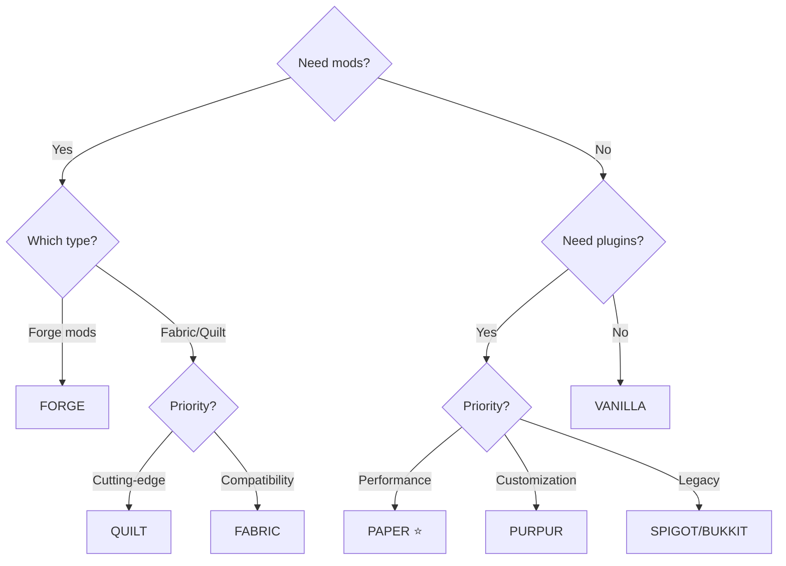

# Server Types

Detailed guide for each Minecraft server platform supported by mcctl.

## Overview

| Type | Plugins | Mods | Performance | Recommended For |
|------|---------|------|-------------|-----------------|
| **PAPER** | Yes | No | Excellent | General use, plugins |
| **VANILLA** | No | No | Good | Pure Minecraft experience |
| **FORGE** | No | Yes | Varies | Forge mod packs |
| **FABRIC** | No | Yes | Excellent | Performance mods |
| **SPIGOT** | Yes | No | Good | Legacy plugin compatibility |
| **BUKKIT** | Yes | No | Moderate | Very old plugins |
| **PURPUR** | Yes | No | Excellent | Advanced customization |
| **QUILT** | No | Yes | Excellent | Modern Fabric alternative |

---

## Paper

**Recommended for most users.**

Paper is a high-performance Minecraft server that supports Bukkit and Spigot plugins while providing significant performance improvements.

### Features

- Significant performance improvements over Vanilla
- Full Bukkit/Spigot plugin compatibility
- Async chunk loading
- Anti-exploit patches
- Extensive configuration options

### Configuration

```bash
# servers/myserver/config.env
TYPE=PAPER
VERSION=1.21.1
MEMORY=4G

# Enable Aikar's optimized JVM flags
USE_AIKAR_FLAGS=true
```

### Adding Plugins

Place plugin JAR files in `shared/plugins/` or use automatic download:

```bash
# From Modrinth
MODRINTH_PROJECTS=essentialsx,luckperms

# From Spigot
SPIGET_RESOURCES=28140,81534
```

### Best Practices

- Always enable `USE_AIKAR_FLAGS=true` for optimal performance
- Use Paper-specific plugins when available
- Monitor with Paper's built-in profiler: `/timings report`

---

## Vanilla

The official Minecraft server from Mojang.

### Features

- Official Minecraft experience
- No modifications
- Guaranteed compatibility with all Minecraft features
- Smallest footprint

### Configuration

```bash
# servers/myserver/config.env
TYPE=VANILLA
VERSION=1.21.1
MEMORY=2G
```

### Use Cases

- Pure Minecraft experience
- Testing vanilla behavior
- Minimal server requirements

---

## Forge

Server for running Forge mods.

### Features

- Large mod ecosystem
- Complex modpacks support
- Industrial/tech mods
- RPG mods

### Configuration

```bash
# servers/myserver/config.env
TYPE=FORGE
VERSION=1.20.4
MEMORY=8G

# CurseForge API key required for mod downloads
CF_API_KEY=${CF_API_KEY}
CURSEFORGE_FILES=jei,journeymap,create

# Or specific Forge version
FORGE_VERSION=47.2.0
```

### Java Version Requirements

| Minecraft Version | Required Java |
|-------------------|---------------|
| 1.20.x+ | Java 17 or 21 |
| 1.17.x - 1.19.x | Java 17 |
| 1.16.x and below | Java 8 |

!!! warning "Forge 1.16.5 and Below"
    For older Forge versions, use the java8 image tag:
    ```yaml
    # docker-compose.yml
    image: itzg/minecraft-server:java8
    ```

### Memory Recommendations

| Modpack Size | Recommended Memory |
|--------------|-------------------|
| Light (10-30 mods) | 4-6G |
| Medium (30-100 mods) | 6-8G |
| Heavy (100+ mods) | 8-12G |

---

## Fabric

Lightweight modding platform with excellent performance.

### Features

- Fast startup and runtime
- Performance optimization mods (Lithium, Sodium)
- Modern modding API
- Smaller mod file sizes

### Configuration

```bash
# servers/myserver/config.env
TYPE=FABRIC
VERSION=1.21.1
MEMORY=6G

# Essential Fabric mods from Modrinth
MODRINTH_PROJECTS=fabric-api,lithium,starlight
MODRINTH_DOWNLOAD_DEPENDENCIES=required

# Or specific Fabric loader version
FABRIC_LOADER_VERSION=0.15.0
```

### Recommended Mods

| Mod | Purpose |
|-----|---------|
| `fabric-api` | Required by most mods |
| `lithium` | Game logic optimization |
| `starlight` | Lighting engine rewrite |
| `krypton` | Network optimization |
| `ferritecore` | Memory optimization |

### Performance Comparison

Fabric with optimization mods typically provides:

- 50-100% better TPS than Vanilla
- Faster chunk loading
- Lower memory usage

---

## Spigot

Modified Bukkit server with plugin support.

### Features

- Bukkit plugin compatibility
- Performance improvements over Bukkit
- Wide plugin ecosystem

### Configuration

```bash
# servers/myserver/config.env
TYPE=SPIGOT
VERSION=1.21.1
MEMORY=4G
```

### When to Use

- Need specific Spigot-only plugins
- Legacy server migration
- Paper causes compatibility issues

!!! note "Paper Recommended"
    Paper is generally preferred over Spigot as it provides better performance and maintains full Spigot compatibility.

---

## Bukkit

Classic Minecraft plugin server.

### Features

- Original plugin API
- Legacy plugin support
- Stable and well-documented

### Configuration

```bash
# servers/myserver/config.env
TYPE=BUKKIT
VERSION=1.21.1
MEMORY=4G
```

### When to Use

- Very old plugins that don't work with Spigot/Paper
- Historical/archival purposes

---

## Purpur

Paper fork with additional features and customization.

### Features

- All Paper features plus more
- Extended configuration options
- Fun gameplay additions
- Active development

### Configuration

```bash
# servers/myserver/config.env
TYPE=PURPUR
VERSION=1.21.1
MEMORY=4G

USE_AIKAR_FLAGS=true
```

### Unique Features

- Rideable mobs (configure which mobs can be ridden)
- Player health on damage indicators
- Configurable villager lobotomization
- Extended permissions

---

## Quilt

Modern Fabric fork with improved APIs.

### Features

- Fabric mod compatibility
- Improved loader and API
- Better mod conflict resolution
- Community-focused development

### Configuration

```bash
# servers/myserver/config.env
TYPE=QUILT
VERSION=1.21.1
MEMORY=6G

MODRINTH_PROJECTS=qsl,fabric-api
```

### When to Use

- Prefer Quilt's approach to modding
- Need Quilt-exclusive mods
- Want improved mod compatibility

---

## Choosing a Server Type

### Decision Tree



### Quick Recommendations

| Use Case | Recommended Type |
|----------|------------------|
| General multiplayer | PAPER |
| Performance-focused | PAPER or FABRIC |
| Complex modpacks | FORGE |
| Light optimization mods | FABRIC |
| Pure vanilla | VANILLA |
| Maximum customization | PURPUR |

## See Also

- **[Environment Variables](environment.md)** - All configuration options
- **[itzg/minecraft-server Types](https://docker-minecraft-server.readthedocs.io/en/latest/types-and-platforms/)** - Full documentation
