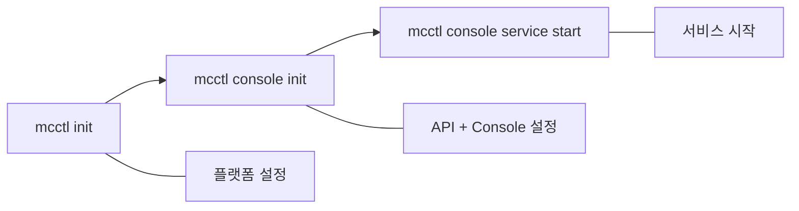

# 통합 설치 가이드: Init에서 Console까지

이 가이드에서는 mcctl 플랫폼 초기화부터 웹 기반 관리 콘솔 실행까지 **원스톱 설치 과정** 전체를 안내합니다. 이 가이드를 따라하면 CLI와 웹 기반 관리 기능을 모두 갖춘 마인크래프트 서버 관리 플랫폼이 완성됩니다.

## 전체 흐름 개요

설치 과정은 세 가지 주요 단계로 구성됩니다:



| 단계 | 명령어 | 수행 내용 |
|------|--------|----------|
| **1. 플랫폼 초기화** | `mcctl init` | 디렉토리 구조 생성, Docker 네트워크 설정, 호스트 IP 구성 |
| **2. 콘솔 초기화** | `mcctl console init` | API/Console 서비스 설치, 관리자 계정 생성, 인증 설정 |
| **3. 서비스 시작** | `mcctl console service start` | PM2로 관리되는 API 및 Console 프로세스 시작 |

## 사전 요구 사항

시작하기 전에 다음이 설치되어 있는지 확인하세요:

- [x] **Node.js 18 이상**
  ```bash
  node --version  # v18.0.0 이상이어야 합니다
  ```

- [x] **Docker Engine 24.0.0 이상**
  ```bash
  docker --version
  docker compose version  # v2.20.0 이상 필요
  ```

- [x] **mcctl CLI 전역 설치**
  ```bash
  npm install -g @minecraft-docker/mcctl
  mcctl --version
  ```

!!! tip "처음 설치하시나요?"
    아직 mcctl을 설치하지 않았다면 [설치 가이드](../getting-started/installation.ko.md)에서 Node.js, Docker, mcctl 설치 방법을 확인하세요.

## 1단계: 플랫폼 초기화 (`mcctl init`)

`mcctl init` 명령은 마인크래프트 서버 운영을 위한 기본 플랫폼을 설정합니다.

### 명령 실행

```bash
mcctl init
```

초기화 과정은 6개 단계로 진행됩니다:

### Step 1: 사전 요구 사항 확인

mcctl이 필요한 소프트웨어의 설치 여부와 버전 요구 사항을 자동으로 확인합니다.

```
[1/6] Checking prerequisites...

  Prerequisite Check Results:
  ✓ Docker Engine    24.0.7
  ✓ Docker Compose   2.24.5
  ✓ Node.js          20.10.0
```

!!! warning "요구 사항 미충족 시"
    확인이 실패하면 초기화가 중단되고, 누락된 구성 요소의 설치 방법이 안내됩니다. 문제를 해결한 후 `mcctl init`를 다시 실행하세요.

### Step 2: 디렉토리 구조 생성

`~/minecraft-servers/` (기본 위치)에 플랫폼 디렉토리 구조를 생성합니다:

```
[2/6] Creating directory structure...

  Created: ~/.minecraft-servers/servers
  Created: ~/.minecraft-servers/servers/_template
  Created: ~/.minecraft-servers/worlds
  Created: ~/.minecraft-servers/worlds/.locks
  Created: ~/.minecraft-servers/shared/plugins
  Created: ~/.minecraft-servers/shared/mods
  Created: ~/.minecraft-servers/backups
```

!!! tip "커스텀 데이터 디렉토리"
    다른 위치를 사용하려면 `--root` 옵션을 지정하세요:
    ```bash
    mcctl --root /path/to/data init
    ```

### Step 3: 템플릿 파일 복사

구성 템플릿이 데이터 디렉토리로 복사됩니다:

```
[3/6] Copying template files...

  Copied: docker-compose.yml
  Copied: .env
  Copied: .gitignore
  Copied: servers/compose.yml
  Copied: servers/_template/docker-compose.yml
  Copied: servers/_template/config.env
```

### Step 4: 호스트 IP 설정

서버 호스트명 라우팅(nip.io)에 사용할 호스트 IP 주소를 선택합니다:

```
[4/6] Configuring host IP address(es)...

  Detected network interfaces:
    192.168.1.100 (eth0)
    172.17.0.1 (docker0)

? Select host IP address(es):
  ✓ 192.168.1.100 (eth0)

  ✓ Set HOST_IP=192.168.1.100
```

!!! info "다중 IP 지원"
    여러 네트워크 인터페이스가 있는 경우(예: LAN + VPN) 여러 IP를 선택할 수 있습니다. 첫 번째가 기본 `HOST_IP`가 되고, 모든 IP가 `HOST_IPS`에 저장되어 다중 호스트명 라우팅에 사용됩니다.

### Step 4.5: playit.gg 설정 (선택 사항)

포트 포워딩 없이 외부에서 접속할 수 있는 [playit.gg](https://playit.gg) 터널링을 선택적으로 활성화할 수 있습니다:

```
[4.5/6] Configuring playit.gg (optional)...

  playit.gg enables external access without port forwarding.
  Setup: https://playit.gg/account/agents/new-docker

? Enable playit.gg tunneling? No
  ✓ playit.gg disabled
```

!!! note "나중에 설정 가능"
    playit.gg는 나중에 `mcctl init --reconfigure`로 설정할 수 있습니다. 초기 설정 시에는 건너뛰어도 괜찮습니다.

### Step 5: 구성 파일 생성

플랫폼 구성 파일 `.mcctl.json`이 생성됩니다:

```
[5/6] Creating configuration...

  Created: .mcctl.json
```

### Step 6: Docker 네트워크 설정

마인크래프트 서버 전용 Docker 브리지 네트워크를 생성합니다:

```
[6/6] Setting up Docker network...

  ✓ Created network: minecraft-net
```

### 초기화 완료

모든 단계가 성공적으로 완료되면 다음과 같이 표시됩니다:

```
════════════════════════════════════════════════════════
  ✓ Platform initialized successfully!
════════════════════════════════════════════════════════

  Next steps:

  1. Edit configuration (optional):
     nano ~/minecraft-servers/.env

  2. Create your first server:
     mcctl create myserver

  3. Connect via Minecraft:
     myserver.local:25565

  For help:
     mcctl --help
```

이 시점에서 플랫폼은 CLI를 통해 마인크래프트 서버를 생성하고 관리할 준비가 되었습니다. 웹 기반 관리 인터페이스를 추가하려면 2단계로 계속 진행하세요.

---

## 2단계: 콘솔 초기화 (`mcctl console init`)

`mcctl console init` 명령은 REST API(`mcctl-api`)와 선택적 웹 관리 UI(`mcctl-console`)로 구성된 Management Console을 설치하고 구성합니다.

### 명령 실행

```bash
mcctl console init
```

### Step 1: 사전 요구 사항 확인

콘솔 초기화는 플랫폼 초기화 이상의 추가 사전 요구 사항을 확인합니다:

```
Checking prerequisites...

  Prerequisite Check Results:
  ✓ Node.js          20.10.0
  ✓ Docker Engine    24.0.7
  ✓ Docker Compose   2.24.5
  ✓ PM2              5.3.0
```

!!! warning "PM2 필수"
    PM2는 API와 Console 프로세스를 관리하는 데 필요합니다. PM2가 설치되어 있지 않다면 전역으로 설치하세요:
    ```bash
    npm install -g pm2
    ```
    PM2는 `mcctl`의 의존성으로 함께 설치되기도 하지만, PM2 명령어를 직접 사용하려면 전역 설치를 권장합니다.

### Step 2: 서비스 선택

설치할 서비스를 선택하는 프롬프트가 표시됩니다:

```
Initialize Console Service

  Node.js: v20.10.0
  PM2: 5.3.0

? Select services to install:
  ✓ mcctl-api       - REST API server for managing Minecraft servers
  ○ mcctl-console   - Web UI for server management
```

| 서비스 | 설명 | 기본 포트 |
|--------|------|----------|
| **mcctl-api** | Docker와 RCON을 통해 마인크래프트 서버를 관리하는 Fastify REST API 서버 | 5001 |
| **mcctl-console** | 대시보드, 서버 관리, 관리자 기능이 포함된 Next.js 웹 애플리케이션 | 5000 |

!!! tip "API 전용 모드"
    REST API만 필요한 경우(자동화, 스크립트, 자체 UI 개발 등) `mcctl-api`만 선택하세요. 나중에 `mcctl console init`을 다시 실행하여 `mcctl-console`을 추가할 수 있습니다.

### Step 3: 관리자 계정 설정 (Console 선택 시에만)

`mcctl-console`을 선택한 경우, 관리자 계정을 생성하는 프롬프트가 표시됩니다:

**관리자 이메일:**

```
? Admin email? admin@example.com
```

Better Auth를 통한 인증에 사용되는 이메일입니다.

**관리자 이름:**

```
? Admin name? Administrator
```

관리자 계정의 표시 이름입니다.

**관리자 비밀번호:**

```
? Admin password? ********
```

비밀번호 요구 사항:

- 최소 8자 이상
- 대문자(A-Z) 1개 이상
- 소문자(a-z) 1개 이상
- 숫자(0-9) 1개 이상

!!! note "API 전용 모드"
    `mcctl-console` 없이 `mcctl-api`만 선택한 경우, 관리자 계정 설정은 완전히 건너뜁니다. 인증은 API 접근 모드를 통해 처리됩니다.

### Step 4: API 접근 모드 선택

REST API의 인증 모드를 선택합니다:

```
? API access mode?
  ● internal       - Local network only (default, most secure)
  ○ api-key        - External access with API key
  ○ ip-whitelist   - IP-based access control
  ○ api-key-ip     - Both API key and IP required
  ○ open           - No authentication (development only)
```

| 모드 | 보안 수준 | 적합한 용도 |
|------|----------|------------|
| `internal` | 최고 | 가정/로컬 네트워크 배포 |
| `api-key` | 높음 | 원격 접근, 자동화 스크립트 |
| `ip-whitelist` | 높음 | 알려진 클라이언트 IP, 기업 네트워크 |
| `api-key-ip` | 최대 | API 키와 IP 모두 필요한 고보안 환경 |
| `open` | 없음 | 로컬 개발/테스트 전용 |

!!! danger "open 모드 경고"
    `open` 모드는 모든 인증을 비활성화합니다. 선택하면 확인 프롬프트가 표시됩니다:
    ```
    WARNING: Open mode has no authentication. Use only for local development!
    ? Are you sure you want to use open mode? No
    ```
    프로덕션 환경이나 인터넷에서 접근 가능한 네트워크에서는 절대 `open` 모드를 사용하지 마세요.

### Step 5: API 키 생성 (조건부)

`api-key` 또는 `api-key-ip` 모드를 선택한 경우, API 키가 자동으로 생성됩니다:

```
Generating API key...  done
```

API 키는 초기화 완료 시 표시됩니다. **안전한 곳에 저장하세요** -- 한 번만 표시됩니다.

### Step 6: IP 화이트리스트 설정 (조건부)

`ip-whitelist` 또는 `api-key-ip` 모드를 선택한 경우, 허용할 IP를 입력합니다:

```
? Allowed IPs (comma-separated)? 127.0.0.1, 192.168.1.0/24
```

개별 IP 주소 또는 CIDR 범위를 쉼표로 구분하여 입력할 수 있습니다.

### Step 7: 서비스 패키지 설치

mcctl-api와 mcctl-console 패키지가 npm에서 자동으로 설치됩니다:

```
Checking mcctl-api installation...  mcctl-api ready
Checking mcctl-console installation...  mcctl-console ready
```

패키지는 데이터 루트 아래의 `.services/` 디렉토리에 설치됩니다.

### Step 8: PM2 Ecosystem 설정

PM2 ecosystem 구성 파일이 생성됩니다:

```
Resolving service script paths...  Using production node_modules paths
Generating PM2 ecosystem config...  PM2 ecosystem config generated
```

이 과정에서 platform 디렉토리에 `ecosystem.config.cjs`가 생성되며, PM2가 API와 Console 프로세스를 실행하는 방법을 정의합니다.

### Step 9: 구성 저장

관리자 구성이 저장됩니다:

```
Saving configuration...  Configuration saved
```

### 콘솔 초기화 완료

모든 단계가 완료되면 요약 정보가 표시됩니다:

```
Console Service initialized!

  Configuration:
    Config file: /home/user/minecraft-servers/.mcctl-admin.yml
    Console DB:  /home/user/minecraft-servers/data/mcctl.db
    PM2 config:  /home/user/minecraft-servers/platform/ecosystem.config.cjs
    Access mode: internal

  Endpoints:
    API:     http://localhost:5001
    Console: http://localhost:5000

  Next steps:
    1. Start the service: mcctl console service start
    2. Access the console in your browser
```

`api-key` 또는 `api-key-ip` 모드를 선택한 경우 API 키도 함께 표시됩니다:

```
  API Key (save this, shown only once):
    mck_a1b2c3d4e5f6g7h8i9j0...
```

!!! warning "API 키를 안전하게 보관하세요"
    API 키는 초기화 시 한 번만 표시됩니다. 복사하여 안전한 곳에 저장하세요. 분실한 경우 다음 명령으로 재생성할 수 있습니다:
    ```bash
    mcctl console api key regenerate
    ```

---

## 3단계: 서비스 시작 (`mcctl console service start`)

모든 설정이 완료되었으니 서비스를 시작합니다:

```bash
mcctl console service start
```

### 서비스 시작

PM2가 구성된 서비스를 시작합니다:

```
Starting console services via PM2...
  Started mcctl-api
  Started mcctl-console
Console services started successfully
```

### 상태 확인

시작 후 상태 보고서가 자동으로 표시됩니다:

```
  Console Service Status (PM2)

  mcctl-api
    Status: online
    PID: 12345
    CPU: 0%
    Memory: 50.2 MB
    Uptime: 5s
    Restarts: 0

  mcctl-console
    Status: online
    PID: 12346
    URL: http://localhost:5000
    CPU: 0%
    Memory: 80.5 MB
    Uptime: 3s
    Restarts: 0

  All services healthy
```

### API 상태 확인

API 엔드포인트를 테스트합니다:

```bash
curl http://localhost:5001/health
```

예상 응답:

```json
{"status":"healthy"}
```

### 웹 콘솔 접속

1. 브라우저에서 `http://localhost:5000`으로 이동합니다
2. `mcctl console init`에서 생성한 관리자 이메일과 비밀번호로 로그인합니다
3. 마인크래프트 서버 목록이 포함된 대시보드가 표시됩니다

---

## 전체 설치 예시

처음부터 끝까지의 전체 설치 흐름입니다:

```bash
# 1단계: mcctl 설치
npm install -g @minecraft-docker/mcctl

# 2단계: 플랫폼 초기화
mcctl init
# 대화형 프롬프트 따라하기 (IP 선택, playit.gg)

# 3단계: 첫 번째 마인크래프트 서버 생성
mcctl create survival -t PAPER -v 1.21.1

# 4단계: Management Console 초기화
mcctl console init
# 서비스 선택 -> 관리자 계정 생성 -> 접근 모드 선택

# 5단계: Console 서비스 시작
mcctl console service start

# 6단계: 모든 것이 실행 중인지 확인
mcctl status                    # 마인크래프트 서버 확인
mcctl console service status    # Console 서비스 확인
curl http://localhost:5001/health  # API 상태 확인

# 7단계: 웹 콘솔 열기
# 브라우저에서 http://localhost:5000 으로 이동
```

---

## 구성 파일 참조

전체 설치 완료 후 데이터 디렉토리에 다음 파일들이 존재합니다:

| 파일 | 생성 주체 | 설명 |
|------|----------|------|
| `.mcctl.json` | `mcctl init` | 플랫폼 구성 (버전, 기본값, 기능) |
| `.env` | `mcctl init` | 환경 변수 (HOST_IP, 메모리, 시간대) |
| `docker-compose.yml` | `mcctl init` | mc-router용 메인 Docker 오케스트레이션 |
| `.mcctl-admin.yml` | `mcctl console init` | Console 서비스 구성 (접근 모드, 포트) |
| `data/mcctl.db` | `mcctl console init` | 사용자 계정용 SQLite 데이터베이스 (Better Auth) |
| `platform/ecosystem.config.cjs` | `mcctl console init` | API와 Console용 PM2 프로세스 구성 |

---

## 부팅 시 자동 시작 설정

시스템 부팅 시 서비스가 자동으로 시작되도록 설정하려면:

```bash
# PM2 시작 스크립트 생성
pm2 startup

# PM2가 표시하는 명령을 실행합니다 (예시):
sudo env PATH=$PATH:/usr/bin pm2 startup systemd -u $USER --hp $HOME

# 현재 프로세스 목록 저장
pm2 save
```

---

## 커스텀 포트 설정

기본 포트(5000, 5001)가 다른 서비스와 충돌하는 경우 커스텀 포트를 지정하세요:

```bash
mcctl console init --api-port 8001 --console-port 8000
```

서비스 시작 시에도 커스텀 포트를 지정할 수 있습니다:

```bash
mcctl console service start --api-port 8001 --console-port 8000
```

---

## 재초기화

### 플랫폼 설정 재구성

완전한 재초기화 없이 플랫폼 설정(IP, 메모리, 시간대)을 변경하려면:

```bash
mcctl init --reconfigure
```

### 콘솔 재초기화

Console 구성을 초기화하려면 (주요 업데이트 후 유용):

```bash
mcctl console init --force
```

`--force` 플래그는 확인 프롬프트를 건너뛰고 기존 구성을 정리한 후 재초기화합니다.

---

## 문제 해결

### 플랫폼 초기화 문제

#### `mcctl init`이 "이미 초기화됨"으로 표시

```
Platform is already initialized
```

**해결 방법**: `--reconfigure`를 사용하여 설정을 변경하거나, 데이터 디렉토리를 삭제하여 새로 시작하세요:

```bash
# 방법 1: 기존 설정 재구성
mcctl init --reconfigure

# 방법 2: 전체 초기화 (주의: 모든 서버 데이터가 삭제됩니다)
rm -rf ~/minecraft-servers
mcctl init
```

#### Docker 네트워크 생성 실패

```
Failed to create Docker network
```

**해결 방법**: 네트워크가 이미 존재할 수 있습니다. 다음으로 확인하세요:

```bash
docker network ls | grep minecraft-net
```

### 콘솔 초기화 문제

#### "Platform not initialized" 오류

```
Platform not initialized. Run: mcctl init
```

**해결 방법**: `mcctl console init` 전에 먼저 `mcctl init`을 실행하세요.

#### PM2 미설치

```
PM2 is not installed.
Install PM2 globally with: npm install -g pm2
```

**해결 방법**:

```bash
npm install -g pm2
```

#### 패키지 설치 실패

```
Failed to install mcctl-api: ...
```

**해결 방법**: 수동으로 설치해 보세요:

```bash
cd ~/minecraft-servers/.services
npm install @minecraft-docker/mcctl-api@latest
npm install @minecraft-docker/mcctl-console@latest
```

### 서비스 시작 문제

#### Ecosystem 설정 파일 없음

```
Ecosystem config not found.
Please run 'mcctl console init' to initialize console services
```

**해결 방법**: `mcctl console init`을 실행하여 ecosystem 구성을 생성하세요.

#### 포트 사용 중

```bash
# 어떤 프로세스가 포트를 사용하고 있는지 확인
lsof -i :5000
lsof -i :5001

# 또는 netstat 사용
netstat -tlnp | grep -E "5000|5001"
```

**해결 방법**: 충돌하는 프로세스를 중지하거나 `--api-port`와 `--console-port`로 커스텀 포트를 사용하세요.

#### 서비스가 계속 재시작됨

```bash
# 오류 로그 확인
mcctl console service logs -f

# 또는 PM2 로그 직접 확인
pm2 logs mcctl-api --lines 100
pm2 logs mcctl-console --lines 100
```

일반적인 원인:

- 의존성 누락: `mcctl console init`을 다시 실행하세요
- 포트 충돌: 커스텀 포트를 사용하세요
- 메모리 부족: 시스템 메모리를 늘리거나 ecosystem 설정에서 `max_memory_restart`를 줄이세요

### 로그인 문제

#### 웹 콘솔에 로그인할 수 없음

1. 관리자 계정이 생성되었는지 확인:
   ```bash
   mcctl console user list
   ```

2. 관리자 비밀번호 재설정:
   ```bash
   mcctl console user reset-password admin@example.com
   ```

3. `mcctl-console`이 실행 중인지 확인:
   ```bash
   mcctl console service status
   ```

---

## 다음 단계

설치가 완료되면:

- **[웹 콘솔 가이드](web-console.ko.md)** - 웹 관리 인터페이스 사용법
- **[CLI 명령어 참조](cli-commands.ko.md)** - Console CLI 전체 참조
- **[API 참조](api-reference.ko.md)** - REST API 문서
- **[빠른 시작 가이드](../getting-started/quickstart.ko.md)** - 마인크래프트 서버 생성 및 관리
