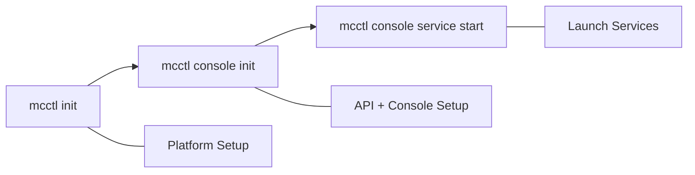

# Complete Setup Guide: From Init to Console

This guide walks you through the **complete one-stop setup** process, from initializing the mcctl platform to launching the Management Console with a web-based admin interface. By the end, you will have a fully operational Minecraft server management platform with both CLI and web-based management capabilities.

## Overview

The setup process consists of three main phases:



| Phase | Command | What It Does |
|-------|---------|-------------|
| **1. Platform Init** | `mcctl init` | Creates directory structure, configures Docker network, sets up host IP |
| **2. Console Init** | `mcctl console init` | Installs API/Console services, creates admin user, configures authentication |
| **3. Service Start** | `mcctl console service start` | Starts PM2-managed API and Console processes |

## Prerequisites

Before starting, ensure you have the following installed:

- [x] **Node.js 18 or higher**
  ```bash
  node --version  # Should be v18.0.0 or higher
  ```

- [x] **Docker Engine 24.0.0 or higher**
  ```bash
  docker --version
  docker compose version  # v2.20.0 or higher required
  ```

- [x] **mcctl CLI installed globally**
  ```bash
  npm install -g @minecraft-docker/mcctl
  mcctl --version
  ```

!!! tip "New Installation?"
    If you haven't installed mcctl yet, see the [Installation Guide](../getting-started/installation.md) for detailed instructions on setting up Node.js, Docker, and mcctl.

## Phase 1: Platform Initialization (`mcctl init`)

The `mcctl init` command sets up the foundational platform for running Minecraft servers.

### Running the Command

```bash
mcctl init
```

The initialization process goes through 6 steps:

### Step 1: Prerequisite Check

mcctl automatically checks that all required software is installed and meets version requirements.

```
[1/6] Checking prerequisites...

  Prerequisite Check Results:
  ✓ Docker Engine    24.0.7
  ✓ Docker Compose   2.24.5
  ✓ Node.js          20.10.0
```

!!! warning "Prerequisite Failures"
    If any check fails, the init process stops and displays instructions on how to install the missing component. Fix the issue and run `mcctl init` again.

### Step 2: Directory Structure

mcctl creates the platform directory structure at `~/minecraft-servers/` (default):

```
[2/6] Creating directory structure...

  Created: ~/.minecraft-servers/servers
  Created: ~/.minecraft-servers/servers/_template
  Created: ~/.minecraft-servers/worlds
  Created: ~/.minecraft-servers/worlds/.locks
  Created: ~/.minecraft-servers/shared/plugins
  Created: ~/.minecraft-servers/shared/mods
  Created: ~/.minecraft-servers/backups
```

!!! tip "Custom Data Directory"
    To use a different location, specify `--root`:
    ```bash
    mcctl --root /path/to/data init
    ```

### Step 3: Template Files

Configuration templates are copied to the data directory:

```
[3/6] Copying template files...

  Copied: docker-compose.yml
  Copied: .env
  Copied: .gitignore
  Copied: servers/compose.yml
  Copied: servers/_template/docker-compose.yml
  Copied: servers/_template/config.env
```

### Step 4: Host IP Configuration

You are prompted to select the host IP address(es) used for server hostname routing (nip.io):

```
[4/6] Configuring host IP address(es)...

  Detected network interfaces:
    192.168.1.100 (eth0)
    172.17.0.1 (docker0)

? Select host IP address(es):
  ✓ 192.168.1.100 (eth0)

  ✓ Set HOST_IP=192.168.1.100
```

!!! info "Multiple IPs"
    If you have multiple network interfaces (e.g., LAN + VPN), you can select multiple IPs. The first becomes the primary `HOST_IP`, and all are stored in `HOST_IPS` for multi-hostname routing.

### Step 4.5: playit.gg Configuration (Optional)

You can optionally enable [playit.gg](https://playit.gg) tunneling for external access without port forwarding:

```
[4.5/6] Configuring playit.gg (optional)...

  playit.gg enables external access without port forwarding.
  Setup: https://playit.gg/account/agents/new-docker

? Enable playit.gg tunneling? No
  ✓ playit.gg disabled
```

!!! note "Skip for Now"
    You can always configure playit.gg later with `mcctl init --reconfigure`. For the initial setup, it is fine to skip this step.

### Step 5: Configuration File

The platform configuration file `.mcctl.json` is created:

```
[5/6] Creating configuration...

  Created: .mcctl.json
```

### Step 6: Docker Network

mcctl creates a dedicated Docker bridge network for Minecraft servers:

```
[6/6] Setting up Docker network...

  ✓ Created network: minecraft-net
```

### Init Complete

After all steps complete successfully, you see:

```
════════════════════════════════════════════════════════
  ✓ Platform initialized successfully!
════════════════════════════════════════════════════════

  Next steps:

  1. Edit configuration (optional):
     nano ~/minecraft-servers/.env

  2. Create your first server:
     mcctl create myserver

  3. Connect via Minecraft:
     myserver.local:25565

  For help:
     mcctl --help
```

At this point, your platform is ready to create and manage Minecraft servers via the CLI. To add the web-based management interface, continue to Phase 2.

---

## Phase 2: Console Initialization (`mcctl console init`)

The `mcctl console init` command installs and configures the Management Console, which provides a REST API (`mcctl-api`) and an optional web management UI (`mcctl-console`).

### Running the Command

```bash
mcctl console init
```

### Step 1: Prerequisite Check

Console init verifies additional prerequisites beyond the platform init:

```
Checking prerequisites...

  Prerequisite Check Results:
  ✓ Node.js          20.10.0
  ✓ Docker Engine    24.0.7
  ✓ Docker Compose   2.24.5
  ✓ PM2              5.3.0
```

!!! warning "PM2 Required"
    PM2 is required for managing the API and Console processes. If PM2 is not installed, install it globally:
    ```bash
    npm install -g pm2
    ```
    PM2 is also bundled as a dependency of `mcctl` and installed automatically, but a global installation is recommended for direct PM2 commands.

### Step 2: Service Selection

You are prompted to select which services to install:

```
Initialize Console Service

  Node.js: v20.10.0
  PM2: 5.3.0

? Select services to install:
  ✓ mcctl-api       - REST API server for managing Minecraft servers
  ○ mcctl-console   - Web UI for server management
```

| Service | Description | Default Port |
|---------|-------------|-------------|
| **mcctl-api** | Fastify REST API server that manages Minecraft servers via Docker and RCON | 5001 |
| **mcctl-console** | Next.js web application with dashboard, server management, and admin features | 5000 |

!!! tip "API-Only Mode"
    If you only need the REST API (for automation, scripts, or building your own UI), select only `mcctl-api`. You can always add `mcctl-console` later by running `mcctl console init` again.

### Step 3: Admin User Setup (Console Only)

If you selected `mcctl-console`, you are prompted to create an admin account:

**Admin Email:**

```
? Admin email? admin@example.com
```

The email is used for authentication via Better Auth.

**Admin Name:**

```
? Admin name? Administrator
```

A display name for the admin account.

**Admin Password:**

```
? Admin password? ********
```

Password requirements:

- At least 8 characters
- At least one uppercase letter (A-Z)
- At least one lowercase letter (a-z)
- At least one number (0-9)

!!! note "API-Only Mode"
    If you only selected `mcctl-api` (without `mcctl-console`), the admin user setup is skipped entirely. Authentication is handled via API access modes instead.

### Step 4: API Access Mode

Select the authentication mode for the REST API:

```
? API access mode?
  ● internal       - Local network only (default, most secure)
  ○ api-key        - External access with API key
  ○ ip-whitelist   - IP-based access control
  ○ api-key-ip     - Both API key and IP required
  ○ open           - No authentication (development only)
```

| Mode | Security Level | Best For |
|------|---------------|----------|
| `internal` | Highest | Home/local network deployments |
| `api-key` | High | Remote access, automation scripts |
| `ip-whitelist` | High | Known client IPs, corporate networks |
| `api-key-ip` | Maximum | High-security environments requiring both |
| `open` | None | Local development/testing only |

!!! danger "open Mode Warning"
    The `open` mode disables all authentication. If you select it, a confirmation prompt appears:
    ```
    WARNING: Open mode has no authentication. Use only for local development!
    ? Are you sure you want to use open mode? No
    ```
    Never use `open` mode in production or on networks accessible from the internet.

### Step 5: API Key Generation (Conditional)

If you selected `api-key` or `api-key-ip` mode, an API key is automatically generated:

```
Generating API key...  done
```

The API key is displayed at the end of initialization. **Save it securely** -- it is shown only once.

### Step 6: IP Whitelist Configuration (Conditional)

If you selected `ip-whitelist` or `api-key-ip` mode, you are prompted for allowed IPs:

```
? Allowed IPs (comma-separated)? 127.0.0.1, 192.168.1.0/24
```

You can enter individual IP addresses or CIDR ranges, separated by commas.

### Step 7: Service Installation

mcctl-api and mcctl-console packages are automatically installed from npm:

```
Checking mcctl-api installation...  mcctl-api ready
Checking mcctl-console installation...  mcctl-console ready
```

The packages are installed in the `.services/` directory under your data root.

### Step 8: PM2 Ecosystem Configuration

A PM2 ecosystem configuration file is generated:

```
Resolving service script paths...  Using production node_modules paths
Generating PM2 ecosystem config...  PM2 ecosystem config generated
```

This creates `ecosystem.config.cjs` in the platform directory, which tells PM2 how to run the API and Console processes.

### Step 9: Configuration Save

The admin configuration is saved:

```
Saving configuration...  Configuration saved
```

### Console Init Complete

After all steps, a summary is displayed:

```
Console Service initialized!

  Configuration:
    Config file: /home/user/minecraft-servers/.mcctl-admin.yml
    Console DB:  /home/user/minecraft-servers/data/mcctl.db
    PM2 config:  /home/user/minecraft-servers/platform/ecosystem.config.cjs
    Access mode: internal

  Endpoints:
    API:     http://localhost:5001
    Console: http://localhost:5000

  Next steps:
    1. Start the service: mcctl console service start
    2. Access the console in your browser
```

If you chose `api-key` or `api-key-ip` mode, the API key is also displayed:

```
  API Key (save this, shown only once):
    mck_a1b2c3d4e5f6g7h8i9j0...
```

!!! warning "Save Your API Key"
    The API key is only shown once during initialization. Copy and store it in a secure location. If you lose it, you can regenerate it with:
    ```bash
    mcctl console api key regenerate
    ```

---

## Phase 3: Starting Services (`mcctl console service start`)

Now that everything is configured, start the services:

```bash
mcctl console service start
```

### Service Startup

PM2 starts the configured services:

```
Starting console services via PM2...
  Started mcctl-api
  Started mcctl-console
Console services started successfully
```

### Status Verification

After starting, a status report is automatically displayed:

```
  Console Service Status (PM2)

  mcctl-api
    Status: online
    PID: 12345
    CPU: 0%
    Memory: 50.2 MB
    Uptime: 5s
    Restarts: 0

  mcctl-console
    Status: online
    PID: 12346
    URL: http://localhost:5000
    CPU: 0%
    Memory: 80.5 MB
    Uptime: 3s
    Restarts: 0

  All services healthy
```

### Verify API Health

Test the API endpoint:

```bash
curl http://localhost:5001/health
```

Expected response:

```json
{"status":"healthy"}
```

### Access the Web Console

1. Open your browser and navigate to `http://localhost:5000`
2. Log in with the admin email and password you created during `mcctl console init`
3. You should see the Dashboard with your Minecraft server list

---

## Complete Setup Example

Here is the entire setup flow from start to finish:

```bash
# Step 1: Install mcctl
npm install -g @minecraft-docker/mcctl

# Step 2: Initialize platform
mcctl init
# Follow interactive prompts (IP selection, playit.gg)

# Step 3: Create your first Minecraft server
mcctl create survival -t PAPER -v 1.21.1

# Step 4: Initialize Management Console
mcctl console init
# Select services -> Create admin user -> Choose access mode

# Step 5: Start Console services
mcctl console service start

# Step 6: Verify everything is running
mcctl status                    # Check Minecraft servers
mcctl console service status    # Check Console services
curl http://localhost:5001/health  # Check API health

# Step 7: Open web console
# Navigate to http://localhost:5000 in your browser
```

---

## Configuration Files Reference

After completing the full setup, the following files exist in your data directory:

| File | Created By | Description |
|------|-----------|-------------|
| `.mcctl.json` | `mcctl init` | Platform configuration (version, defaults, features) |
| `.env` | `mcctl init` | Environment variables (HOST_IP, memory, timezone) |
| `docker-compose.yml` | `mcctl init` | Main Docker orchestration for mc-router |
| `.mcctl-admin.yml` | `mcctl console init` | Console service configuration (access mode, ports) |
| `data/mcctl.db` | `mcctl console init` | SQLite database for user accounts (Better Auth) |
| `platform/ecosystem.config.cjs` | `mcctl console init` | PM2 process configuration for API and Console |

---

## Auto-Start on Boot

To ensure your services start automatically when the system boots:

```bash
# Generate PM2 startup script
pm2 startup

# Run the command that PM2 displays (example):
sudo env PATH=$PATH:/usr/bin pm2 startup systemd -u $USER --hp $HOME

# Save current process list
pm2 save
```

---

## Custom Port Configuration

If the default ports (5000, 5001) conflict with other services, specify custom ports:

```bash
mcctl console init --api-port 8001 --console-port 8000
```

Or start services with custom ports:

```bash
mcctl console service start --api-port 8001 --console-port 8000
```

---

## Reinitializing

### Reconfigure Platform Settings

To change platform settings (IP, memory, timezone) without full reinitialization:

```bash
mcctl init --reconfigure
```

### Reinitialize Console

To reset the Console configuration (useful after major updates):

```bash
mcctl console init --force
```

The `--force` flag skips the confirmation prompt and cleans up existing configuration before reinitializing.

---

## Troubleshooting

### Platform Init Issues

#### `mcctl init` Says "Already Initialized"

```
Platform is already initialized
```

**Solution**: Use `--reconfigure` to change settings, or delete the data directory to start fresh:

```bash
# Option 1: Reconfigure existing setup
mcctl init --reconfigure

# Option 2: Full reset (WARNING: deletes all server data)
rm -rf ~/minecraft-servers
mcctl init
```

#### Docker Network Creation Fails

```
Failed to create Docker network
```

**Solution**: The network may already exist. Check with:

```bash
docker network ls | grep minecraft-net
```

### Console Init Issues

#### "Platform not initialized" Error

```
Platform not initialized. Run: mcctl init
```

**Solution**: Run `mcctl init` first before running `mcctl console init`.

#### PM2 Not Installed

```
PM2 is not installed.
Install PM2 globally with: npm install -g pm2
```

**Solution**:

```bash
npm install -g pm2
```

#### Package Installation Fails

```
Failed to install mcctl-api: ...
```

**Solution**: Try installing manually:

```bash
cd ~/minecraft-servers/.services
npm install @minecraft-docker/mcctl-api@latest
npm install @minecraft-docker/mcctl-console@latest
```

### Service Start Issues

#### Ecosystem Config Not Found

```
Ecosystem config not found.
Please run 'mcctl console init' to initialize console services
```

**Solution**: Run `mcctl console init` to generate the ecosystem configuration.

#### Port Already in Use

```bash
# Check which process is using the port
lsof -i :5000
lsof -i :5001

# Or use netstat
netstat -tlnp | grep -E "5000|5001"
```

**Solution**: Either stop the conflicting process or use custom ports with `--api-port` and `--console-port`.

#### Services Keep Restarting

```bash
# Check logs for errors
mcctl console service logs -f

# Or check PM2 logs directly
pm2 logs mcctl-api --lines 100
pm2 logs mcctl-console --lines 100
```

Common causes:

- Missing dependencies: Run `mcctl console init` again
- Port conflicts: Use custom ports
- Insufficient memory: Increase system memory or reduce `max_memory_restart` in ecosystem config

### Login Issues

#### Cannot Log In to Web Console

1. Verify the admin user was created:
   ```bash
   mcctl console user list
   ```

2. Reset the admin password:
   ```bash
   mcctl console user reset-password admin@example.com
   ```

3. Check that `mcctl-console` is running:
   ```bash
   mcctl console service status
   ```

---

## Next Steps

After completing the setup:

- **[Web Console Guide](web-console.md)** - Learn how to use the web management interface
- **[CLI Commands](cli-commands.md)** - Complete Console CLI reference
- **[API Reference](api-reference.md)** - REST API documentation
- **[Quick Start](../getting-started/quickstart.md)** - Create and manage Minecraft servers
