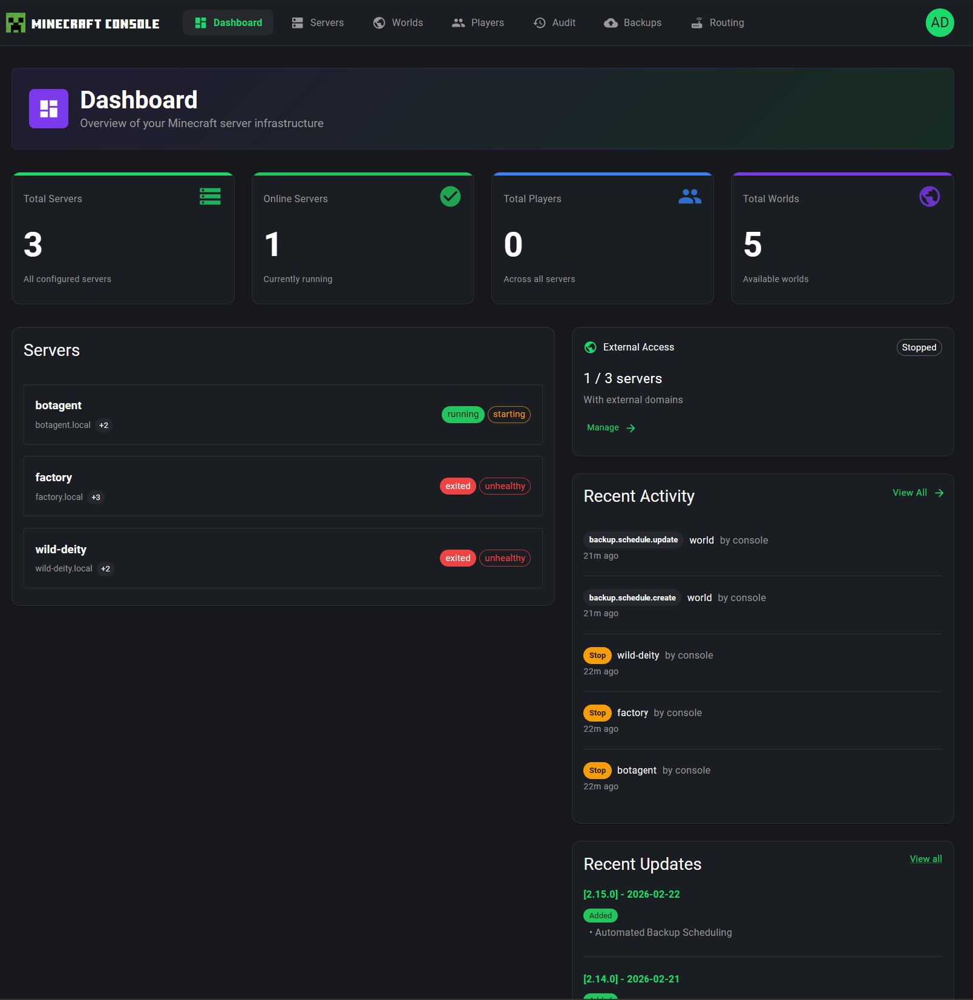
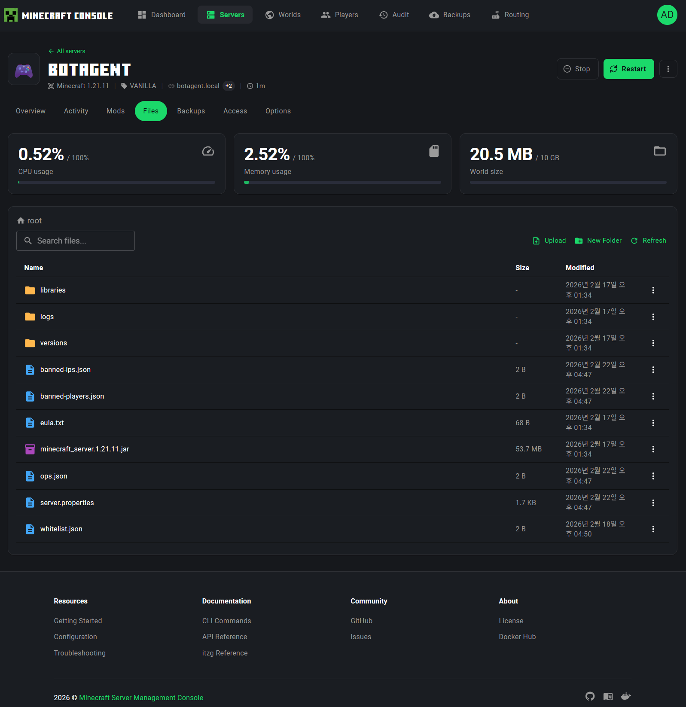
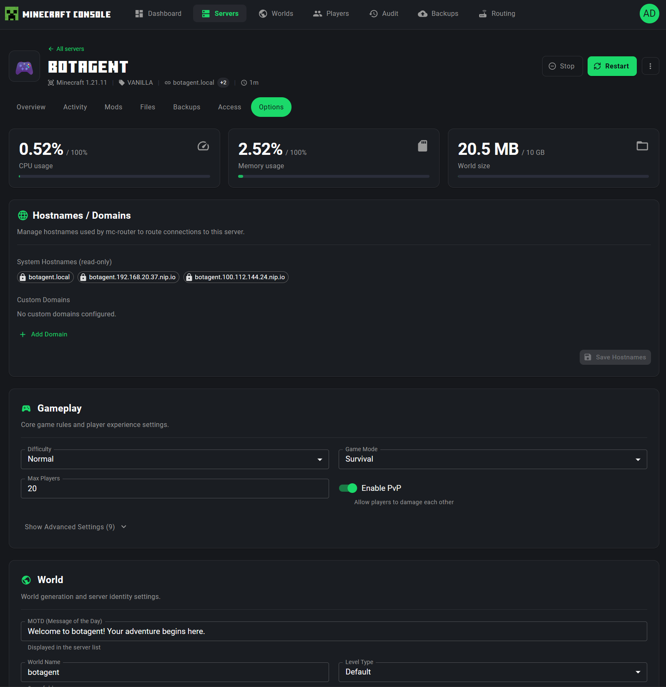
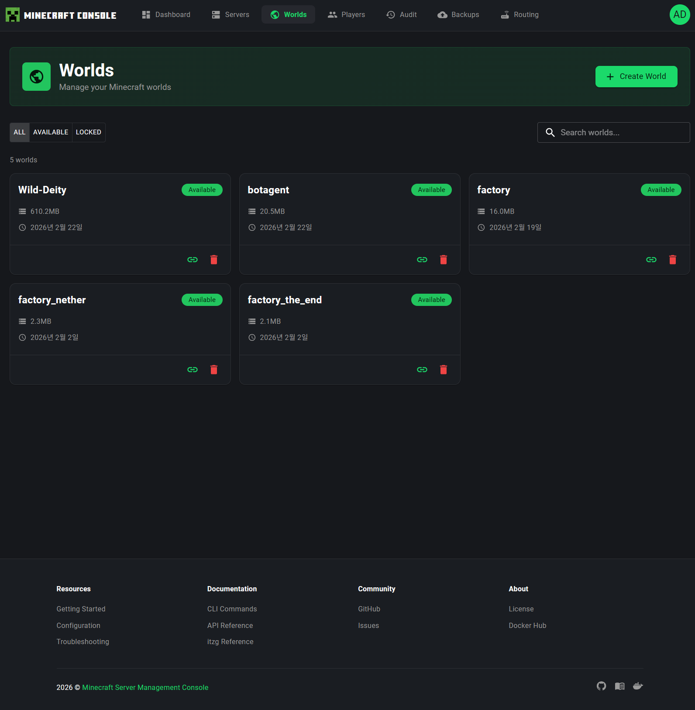
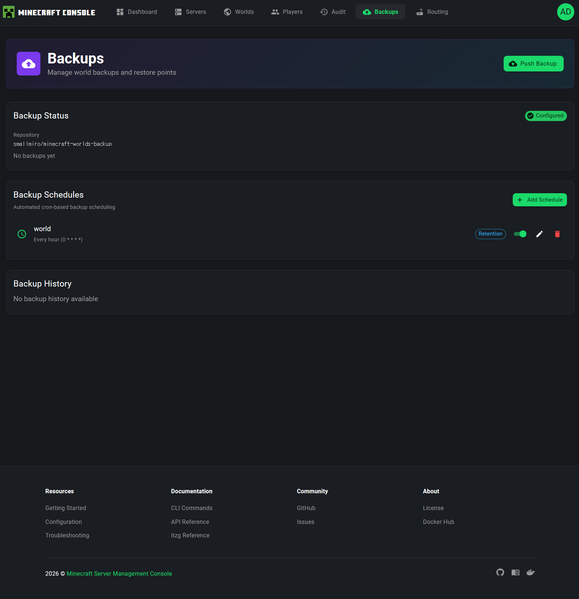
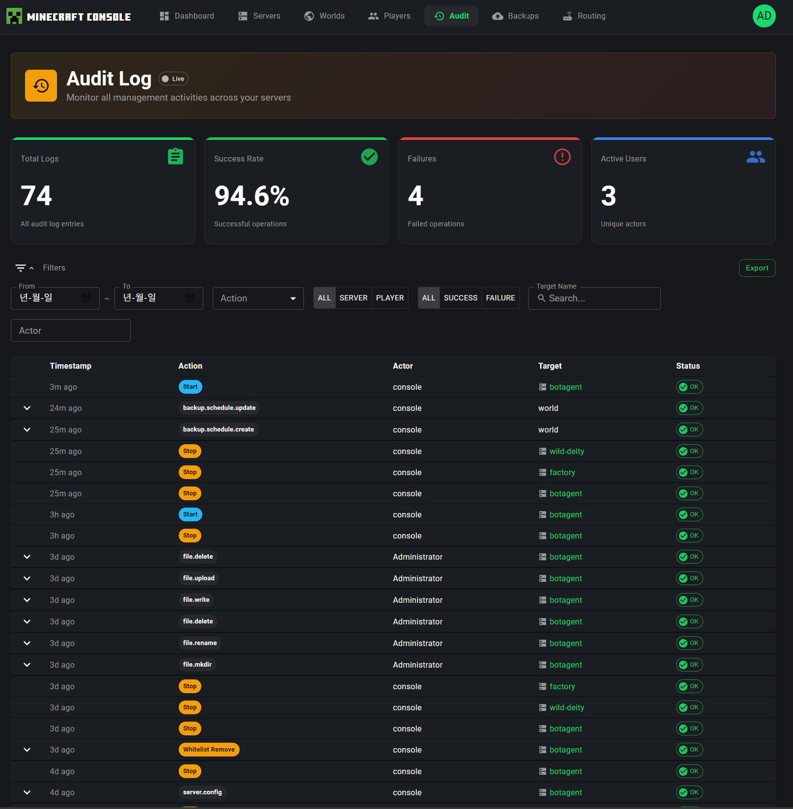
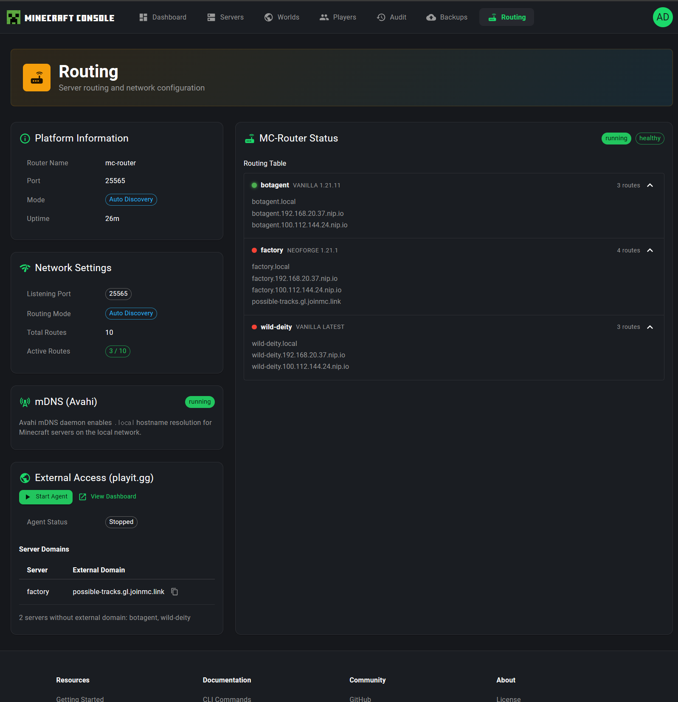

# Web Console Guide

Complete user guide for the **mcctl-console** web management interface -- a modern, full-featured dashboard for managing Docker Minecraft servers from your browser.

## Overview

The mcctl-console is a Next.js web application that provides a graphical interface to every aspect of your Minecraft server infrastructure. Instead of running CLI commands, you can manage servers, worlds, players, backups, audit logs, and routing through an intuitive dark-themed UI with real-time updates powered by Server-Sent Events (SSE).

**Default URL:** `http://localhost:5000`

## Architecture

mcctl-console uses a Backend-for-Frontend (BFF) proxy pattern for secure API communication:

```
+------------------+      +-------------------+      +---------------+
|   Web Browser    | ---> |   mcctl-console   | ---> |   mcctl-api   |
|   (React/Query)  |      |   (Next.js BFF)   |      |   (Fastify)   |
+------------------+      +-------------------+      +---------------+
       ^                          |
       |                   Session Auth +
       |                   X-API-Key forwarding
       |
   React Query
   (auto-refresh)
```

### Why BFF Proxy?

1. **Security**: API keys stay server-side, never exposed to the browser
2. **Session Management**: Better Auth handles user authentication with JWT tokens
3. **Type Safety**: Shared TypeScript interfaces between frontend and backend
4. **Caching**: React Query provides optimistic updates and intelligent caching

## Accessing the Console

### First Time Login

1. Start the Management Console services:
   ```bash
   mcctl console service start
   ```

2. Open your browser and navigate to `http://localhost:5000`

3. Enter your credentials:
   - **Username:** The admin username created during `mcctl console init`
   - **Password:** The admin password

4. Click **Sign In**

!!! tip "Session Persistence"
    Your session will persist for 24 hours by default. Refresh tokens are used to extend active sessions automatically. Click **Sign Out** in the user avatar menu (top-right corner) to end your session manually.

---

## Dashboard

The Dashboard is your command center -- it gives you an at-a-glance overview of your entire Minecraft server infrastructure.



### Statistics Cards

At the top of the Dashboard, four statistics cards provide key metrics:

| Card | Description |
|------|-------------|
| **Total Servers** | The total number of configured Minecraft servers across your platform |
| **Online Servers** | How many servers are currently in a `running` state (updated in real-time via SSE) |
| **Total Players** | The aggregate player count across all running servers |
| **Total Worlds** | The total number of available worlds in your world storage |

### Servers Panel

The left side of the Dashboard displays a **Servers** panel listing each server with:

- **Server name** and hostname (e.g., `botagent.local`)
- **Player count** badge showing how many players are connected
- **Status badges** -- color-coded tags such as `running`, `starting`, `exited`, `unhealthy`, or `stopped`

Click on any server name to navigate directly to its detail page.

### External Access Card

On the right side, the **External Access** card shows your playit.gg tunnel status:

- How many servers have external domains configured (e.g., "1 / 3 servers")
- Current agent status (`Running` or `Stopped`)
- A **Manage** link to navigate to the Routing page for detailed configuration

### Recent Activity Feed

The **Recent Activity** feed displays the latest management actions performed on your servers, such as:

- Server start/stop events
- Backup schedule changes
- Configuration modifications
- Player management actions

Each entry shows the action type (with a color-coded badge), the target server or resource, who performed the action, and how long ago it occurred. Click **View All** to navigate to the full Audit Log page.

### Recent Updates Feed

The **Recent Updates** section shows the latest version changelog entries for the mcctl platform itself, so you can quickly see what features have been added or bugs have been fixed in recent releases.

---

## Servers

The Servers page is where you manage all your Minecraft servers.


### Server List

The page displays all configured servers as cards in a grid layout. Each server card shows:

- **Server name** (e.g., `botagent`, `factory`, `wild-deity`)
- **Status badge** -- `Running` (green) or `Stopped` (red)
- **Hostname** with the number of configured hostnames (e.g., `botagent.local +2`)
- **Container name** (e.g., `mc-botagent`)
- **Quick action button** -- Play (start) or Stop button in the bottom-right corner

### Filtering and Search

At the top of the page, you can filter servers by status:

- **ALL** -- Show all servers
- **RUNNING** -- Show only running servers
- **STOPPED** -- Show only stopped servers

A **Search** box on the right allows you to filter servers by name in real time.

### Creating a New Server

Click the **+ Create Server** button in the page header to open the server creation dialog. The dialog guides you through:

1. **Server name** -- A unique identifier for your server
2. **Server type** -- PAPER, VANILLA, FORGE, NEOFORGE, FABRIC, etc.
3. **Minecraft version** -- Select the desired game version
4. **Memory allocation** -- How much RAM to assign
5. **Additional options** -- World name, seed, and other configuration

The creation process uses Server-Sent Events to show real-time progress as the server container is being set up.

### Server Detail Page

Click on any server card to open the detailed server management view. The detail page features:

#### Header Section

- Server name, type, version, and hostname information
- **Stop** and **Restart** buttons for server lifecycle control
- Status badge showing the current server state

#### Resource Monitoring

Three stat cards display real-time resource usage:

- **CPU Usage** -- Current CPU utilization percentage (with a circular progress indicator)
- **Memory Usage** -- Current RAM consumption as a percentage of allocated memory
- **World Size** -- The disk space used by the current world

#### Navigation Tabs

The server detail page is organized into seven tabs:

| Tab | Description |
|-----|-------------|
| **Overview** | Server console with live log output and RCON command input |
| **Activity** | Per-server audit history showing all actions performed on this server |
| **Mods** | Mod management -- search, install, and remove mods from Modrinth |
| **Files** | Full file manager for browsing, editing, uploading, and downloading server files |
| **Backups** | Server-specific backup information |
| **Access** | User permission management -- grant, modify, or revoke access per user |
| **Options** | Server configuration editor with hostname management and game settings |

---

## Server Files

The Files tab provides a full-featured file manager for your server's file system.



### File Browser

The file browser displays the contents of the server's data directory in a familiar list layout:

- **Breadcrumb navigation** at the top shows your current path (e.g., `root /`) and lets you click to jump to parent directories
- **Search box** to filter files by name within the current directory
- Each file entry shows the file name, size, and last modified date
- **Folders** are listed first, followed by files

### File Operations

The toolbar provides several actions:

| Action | Description |
|--------|-------------|
| **Upload** | Upload files to the current directory via a drag-and-drop dialog |
| **New Folder** | Create a new directory in the current path |
| **Refresh** | Reload the file listing |

Right-clicking or using the context menu on a file provides:

- **Rename** -- Change the file or folder name
- **Delete** -- Remove the file with a confirmation dialog
- **Download** -- Download the file to your local machine

### Smart File Editors

The file manager includes intelligent editors that adapt to the file type:

- **server.properties** -- Opens a specialized form-based editor with categorized settings (see Server Options section)
- **Player data files** (whitelist.json, ops.json, banned-players.json) -- Opens a dedicated player editor with Mojang API integration for username lookup
- **Text files** (.txt, .json, .yml, .yaml, .properties, .cfg, .conf, .log, .toml) -- Opens a code editor with syntax awareness
- **Other files** -- Available for download only

!!! tip "Editing server.properties"
    When you click on `server.properties` in the file browser, the system automatically opens the specialized properties editor with both a **FORM** mode (structured fields) and a **RAW** mode (plain text editing). This is the same editor available in the Options tab.

---

## Server Options

The Options tab provides a comprehensive configuration editor for your server.



### Hostnames / Domains

At the top of the Options tab, the **Hostnames / Domains** section shows all the hostnames configured for routing connections to this server:

- **System Hostnames** -- Automatically generated hostnames (e.g., `botagent.local`, `botagent.192.168.xx.xx.nip.io`)
- **Custom Domains** -- User-defined custom domain names
- **+ Add Domain** button to configure additional custom hostnames
- A **Sync Hostnames** button to synchronize hostname configuration with the mc-router

### Gameplay Settings

The **Gameplay** section lets you configure core game rules and player experience:

| Setting | Description |
|---------|-------------|
| **Difficulty** | Normal, Easy, Hard, or Peaceful |
| **Game Mode** | Survival, Creative, Adventure, or Spectator |
| **Max Players** | Maximum number of concurrent players |
| **Enable PvP** | Whether players can damage each other |

A **Show Advanced Settings** toggle reveals additional options like spawn protection radius, entity broadcasting range, and more.

### World Settings

The **World** section controls world generation and server identity:

| Setting | Description |
|---------|-------------|
| **MOTD (Message of the Day)** | The welcome message shown in the Minecraft server browser |
| **World Seed** | The seed used for world generation |
| **World Name** | The name of the world directory |
| **Level Type** | World generation type (Default, Flat, etc.) |

### Additional Setting Categories

Expanding the advanced settings reveals more configuration sections:

- **JVM / Performance** -- Memory allocation, Aikar's flags, JVM options
- **Network** -- Online mode, RCON settings, port configuration
- **Advanced** -- Auto-pause, auto-stop, timezone, UID/GID settings

### Save and Restart

When you modify settings:

1. A **sticky action bar** appears at the bottom of the page showing how many fields have changed
2. Click **Save** to apply the changes
3. If any changed setting requires a server restart (e.g., memory, online mode, world settings), a **Restart Confirmation Dialog** appears asking whether to restart now or later
4. Click **Reset** to discard unsaved changes

!!! warning "Restart Required"
    Some settings (like memory allocation, online mode, and world seed) require a server restart to take effect. The UI clearly indicates which settings need a restart after being changed.

---

## Player Management

The Players page provides comprehensive management of players across all your servers.


### Server Selector

At the top of the page, a **Server** dropdown lets you select which server to manage. The selected server determines which player data is displayed in all tabs below.

### Tabs

The Player Management page is organized into four tabs:

#### Online Players

Shows players currently connected to the selected server. When the server is running, this displays real-time player information.

#### Whitelist

Manage which players are allowed to join your server:

- **Whitelist toggle** -- Enable or disable the whitelist (shown as an ON/OFF switch)
- **Player input field** -- Enter a Minecraft username to add to the whitelist
- **Add button** -- Add a single player
- **Bulk button** -- Add multiple players at once
- **Player list** -- Shows all whitelisted players with their Minecraft avatar and a remove button

!!! info "Offline Server Data"
    When a server is offline, the Players page reads data directly from the server's JSON files (whitelist.json, ops.json, banned-players.json). An informational banner indicates: "Server is offline. Showing data from whitelist.json. Changes will apply on next server start."

#### Operators

Manage players with operator (admin) privileges:

- Add players as operators with configurable permission levels (1-4)
- **Level 1**: Can bypass spawn protection
- **Level 2**: Can use /clear, /gamemode, etc.
- **Level 3**: Can use /ban, /kick, /op, etc.
- **Level 4**: Can use /stop, full access

An information panel on the right explains each OP level in detail.

#### Ban List

Manage banned players:

- Ban players by username with an optional reason
- View all currently banned players
- Pardon (unban) players with a single click
- An information panel explains how bans work

---

## Worlds

The Worlds page lets you manage all Minecraft worlds stored in your platform.



### World List

Worlds are displayed as cards in a grid layout. Each world card shows:

- **World name** (e.g., `Wild-Deity`, `botagent`, `factory`)
- **Status badge** -- `Available` (green) for unlocked worlds, `Locked` for worlds currently assigned to a server
- **Size** -- Disk space used by the world (e.g., `610.2MB`, `20.5MB`)
- **Date** -- When the world was created or last modified
- **Action buttons**:
    - **Link icon** -- Assign the world to a server
    - **Delete icon** (red trash can) -- Delete the world

### Filtering and Search

At the top of the page:

- **ALL** -- Show all worlds
- **AVAILABLE** -- Show only available (unlocked) worlds
- **LOCKED** -- Show only worlds currently assigned to a server

A **Search** box lets you filter worlds by name.

### Creating a New World

Click **+ Create World** in the page header to open the creation dialog:

1. Enter a **World name**
2. Optionally specify a **Seed** for world generation
3. Click **Create**

### Assigning a World to a Server

Click the **link icon** on a world card to open the assignment dialog. Select a server from the list of available (non-running) servers and confirm the assignment. The world will be linked to that server and marked as `Locked`.

### Deleting a World

Click the **red trash can icon** on a world card. A confirmation dialog appears requiring you to type the exact world name to prevent accidental deletion. This action is irreversible.

!!! warning "Data Loss"
    Deleting a world permanently removes all world data including terrain, player builds, and entities. Always create a backup before deleting a world.

---

## Backups

The Backups page manages world backups and automated backup schedules.



### Backup Status

The top section shows the current backup configuration:

- **Repository** -- The configured Git repository for backup storage (e.g., `smallmiro/minecraft-worlds-backup`)
- **Status** -- Whether the backup system is `Configured` (green checkmark) or not
- **Backup count** -- Number of existing backups

### Push Backup

The **Push Backup** button in the page header triggers an immediate manual backup of all worlds to the configured Git repository.

### Backup Schedules

The **Backup Schedules** section manages automated cron-based backup scheduling:

- Each schedule shows the **world name**, **frequency** (e.g., "Every hour"), and the cron expression
- **Retention** badge -- indicates whether backup retention policies are configured
- **Toggle switch** -- Enable or disable individual schedules
- **Edit button** (pencil icon) -- Modify the schedule
- **Delete button** (trash icon) -- Remove the schedule
- **+ Add Schedule** button to create new automated backup schedules

### Backup History

The **Backup History** section (visible when the backup system is configured) shows a log of past backup operations, including timestamps, status, and any errors.

---

## Audit Log

The Audit Log page provides a comprehensive activity log for all management operations performed across your servers.



### Live Monitoring

The Audit Log features a **Live** indicator in the page header showing the real-time SSE connection status:

- **Green dot with "Live"** -- Connected and receiving real-time events
- **Gray dot with "Offline"** -- SSE connection lost (auto-reconnects)

When new audit events arrive while you are viewing the page, a notification banner appears: "X new logs available - Click to refresh."

### Statistics Overview

Four statistics cards at the top provide summary metrics:

| Card | Description |
|------|-------------|
| **Total Logs** | Total number of audit log entries |
| **Success Rate** | Percentage of successful operations |
| **Failures** | Count of failed operations |
| **Active Users** | Number of unique actors who performed actions |

### Filters

The Audit Log provides powerful filtering capabilities:

- **Date range picker** -- Filter by start and end dates
- **Action filter** -- Filter by specific action types (e.g., `server.start`, `server.stop`, `backup.schedule.create`)
- **Target type filter** -- Filter by target category: ALL, SERVER, PLAYER
- **Status filter** -- ALL, SUCCESS, FAILURE
- **Actor filter** -- Search by the name of the user who performed the action
- **Export** button -- Export filtered audit data

### Log Table

The main table displays audit entries with the following columns:

| Column | Description |
|--------|-------------|
| **Timestamp** | When the action was performed (relative time like "21m ago") |
| **Action** | The action type with a color-coded badge |
| **Actor** | Who performed the action (username) |
| **Target** | The server, world, or resource affected |
| **Status** | Success (green) or Failure (red) indicator |

Click on any row to open a **Detail Drawer** with full information about the audit entry, including request metadata, IP address, and the complete action payload.

### Export

Click the **Export** button to open the export dialog, which allows you to download audit data in various formats based on your current filter selection.

---

## Routing

The Routing page gives you full visibility and control over your network routing configuration.



### Platform Information

The left panel shows **Platform Information** about your mc-router setup:

| Field | Description |
|-------|-------------|
| **Router Name** | The mc-router container name |
| **Port** | The listening port (default: 25565) |
| **Mode** | Routing mode (e.g., `Auto Discovery`) |
| **Uptime** | How long the router has been running |

### Network Settings

The **Network Settings** card displays:

- **Listening Port** -- The port mc-router listens on
- **Routing Mode** -- How hostnames are resolved (e.g., `Auto Discovery`)
- **Active Routes** -- Number of active routing entries

### MC Router Status

The right panel shows the **MC Router Status** with a live routing table:

- **Healthy** / **Unhealthy** status indicators
- For each server, the routing table displays:
    - Server name with its Minecraft version
    - Number of configured routes
    - All hostname mappings (e.g., `botagent.local`, `botagent.192.168.xx.xx.nip.io`)

### mDNS (Avahi) Status

The **mDNS (Avahi)** card shows whether the Avahi mDNS daemon is active, enabling `.local` hostname resolution for Minecraft clients on the local network.

### External Access (playit.gg)

The **External Access** section manages playit.gg tunnel configuration for making your servers accessible from the internet without port forwarding:

- **Start Agent** / **Auto Dashboard** buttons for managing the playit agent
- **Agent Status** -- Running or Stopped
- **Server Domains** table showing which servers have external domains configured (e.g., `possible-tracks.gl.joinmc.link`)
- Status information for servers without external domains

---

## Navigation

The top navigation bar is consistent across all pages and includes:

| Item | Description |
|------|-------------|
| **MINECRAFT CONSOLE** logo | Click to return to the Dashboard |
| **Dashboard** | Infrastructure overview |
| **Servers** | Server management |
| **Worlds** | World management |
| **Players** | Player management |
| **Audit** | Activity audit logs |
| **Backups** | Backup management |
| **Routing** | Network routing configuration |
| **User avatar** (top-right) | Account settings, theme toggle, and sign out |

The currently active page is highlighted in the navigation bar.

---

## Best Practices

### Security

1. **Use Strong Passwords** -- Follow the password requirements during `mcctl console init`
2. **Limit Access** -- Use the Access tab to grant minimal permissions to each user
3. **Use HTTPS** -- Configure a reverse proxy with SSL for production deployments
4. **Review Audit Logs** -- Regularly check the Audit Log for unexpected activity

### Server Management

1. **Monitor the Dashboard** -- Check server health, player counts, and recent activity regularly
2. **Graceful Shutdowns** -- Always use the Stop button instead of force-killing containers
3. **Backup Before Changes** -- Push a backup before modifying server configuration or world data
4. **Use Scheduled Backups** -- Configure automated backup schedules for peace of mind

### Performance

1. **Avoid Simultaneous Operations** -- Don't start/stop multiple servers at once
2. **Monitor Resource Usage** -- Use the resource stat cards on the server detail page to track CPU and memory
3. **Clean Up Unused Worlds** -- Delete worlds that are no longer needed to free disk space

---

## Troubleshooting

### Can't Access the Console

1. **Check Service Status:**
   ```bash
   mcctl console service status
   ```

2. **Verify Port:**
   ```bash
   netstat -tlnp | grep 5000
   ```

3. **Check Logs:**
   ```bash
   pm2 logs mcctl-console --lines 100
   ```

### Login Fails

1. **Verify Credentials:**
   ```bash
   mcctl console user list
   ```

2. **Reset Password:**
   ```bash
   mcctl console user reset-password admin
   ```

### Server Status Not Updating

1. **Check API Health:**
   ```bash
   curl http://localhost:5001/health
   ```

2. **Verify Docker Socket:**
   Ensure Docker is running and the mcctl-api process has access to the Docker socket.

3. **Check Network:**
   Ensure mcctl-console can reach mcctl-api on port 5001.

### Commands Not Working

1. **Server Must Be Running** -- RCON commands only work when the server is in a `running` state
2. **RCON Must Be Enabled** -- Ensure RCON is enabled in the server configuration
3. **Check API Logs:**
   ```bash
   pm2 logs mcctl-api --lines 100
   ```

---

## Mobile Access

The web console uses a responsive Material UI layout that adapts to different screen sizes:

- **Phone** -- Simplified card layout with collapsible navigation
- **Tablet** -- Full dashboard with optimized touch controls
- **Desktop** -- Full feature set with side-by-side panels

!!! tip "Mobile Tips"
    - Use landscape mode for better command input in the console
    - The navigation collapses into a hamburger menu on small screens
    - All dialogs are full-screen on mobile for easier interaction
