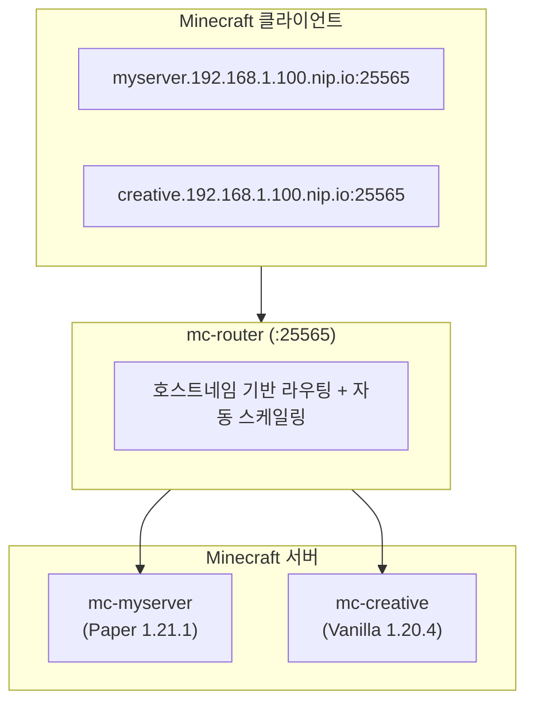

# 시작하기

Docker Minecraft Server 관리 플랫폼에 오신 것을 환영합니다. 이 가이드는 Docker를 사용하여 여러 Minecraft 서버를 설정하고 관리하는 방법을 안내합니다.

## mcctl이란?

**mcctl**은 Docker 기반 Minecraft 서버를 관리하기 위한 커맨드라인 도구입니다. 다음 기능을 제공합니다:

- **간편한 서버 생성** - 단일 명령으로 Paper, Forge, Fabric, Vanilla 서버 생성
- **멀티 서버 라우팅** - 호스트네임 기반 라우팅으로 단일 머신에서 여러 서버 운영
- **자동 스케일링** - 플레이어 접속 시 자동 시작, 유휴 상태에서 자동 중지
- **월드 관리** - 잠금 지원과 함께 서버 간 월드 공유 및 관리
- **GitHub 백업** - 월드 데이터를 비공개 GitHub 저장소에 자동 백업

## 아키텍처 개요



## 주요 기능

### nip.io를 통한 호스트네임 기반 라우팅

Magic DNS를 사용하여 클라이언트 설정 없이 서버에 접속할 수 있습니다:

```
myserver.192.168.1.100.nip.io:25565
```

nip.io는 호스트네임을 자동으로 서버의 IP 주소로 해석합니다.

### 대화형 CLI

mcctl은 대화형 모드와 CLI 모드를 모두 제공합니다:

=== "대화형 모드"
    ```bash
    mcctl create
    # 서버 이름, 타입, 버전 등을 프롬프트로 입력
    ```

=== "CLI 모드"
    ```bash
    mcctl create myserver -t PAPER -v 1.21.1
    ```

### 무중단 서버 관리

- 플레이어 접속 시 서버 자동 시작
- 설정 가능한 유휴 시간 후 서버 자동 중지
- 모든 서버가 유휴 상태일 때는 mc-router만 실행

## 빠른 링크

<div class="grid cards" markdown>

-   :material-download:{ .lg .middle } **설치**

    ---

    npm을 통해 mcctl을 설치하고 필수 요구사항 설정

    [:octicons-arrow-right-24: 설치 가이드](installation.ko.md)

-   :material-rocket-launch:{ .lg .middle } **빠른 시작**

    ---

    5분 만에 첫 번째 서버 생성

    [:octicons-arrow-right-24: 빠른 시작](quickstart.ko.md)

-   :material-console:{ .lg .middle } **CLI 레퍼런스**

    ---

    전체 명령어 레퍼런스

    [:octicons-arrow-right-24: CLI 명령어](../cli/commands.ko.md)

-   :material-cog:{ .lg .middle } **설정**

    ---

    환경 변수 및 서버 설정

    [:octicons-arrow-right-24: 설정](../configuration/index.ko.md)

</div>

## 시스템 요구사항

| 요구사항 | 최소 | 권장 |
|---------|------|------|
| OS | Linux, macOS | Linux (Ubuntu 22.04+) |
| Node.js | 18.0.0+ | 20.0.0+ |
| Docker | 20.10+ | 24.0+ |
| Docker Compose | v2.0+ | v2.20+ |
| RAM | 4GB + 서버당 2GB | 8GB+ |
| 스토리지 | 10GB | 50GB+ SSD |

!!! note "Windows 지원"
    Windows는 공식적으로 지원되지 않습니다. Windows 환경에서는 Ubuntu가 설치된 WSL2를 사용하세요.

## 다음 단계

1. **[mcctl 설치](installation.ko.md)** - CLI 도구 설정
2. **[첫 번째 서버 생성](quickstart.ko.md)** - 몇 분 만에 서버 실행
3. **[네트워킹 설정](../advanced/networking.ko.md)** - nip.io 및 mDNS 설정
