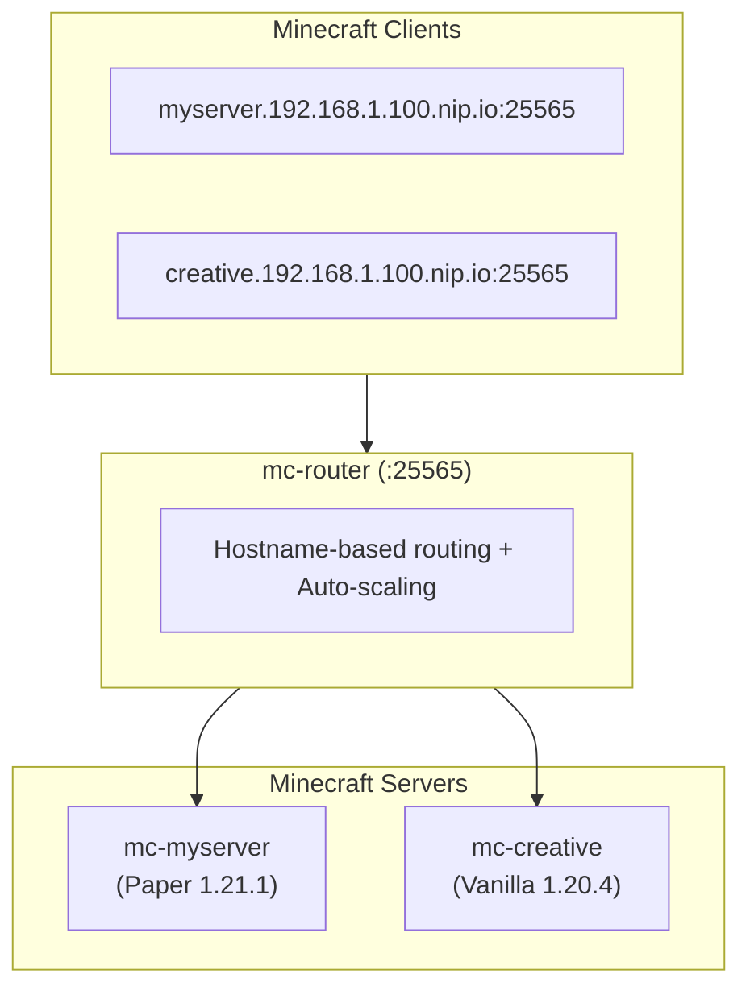

# Getting Started

Welcome to Docker Minecraft Server Management Platform. This guide will help you set up and manage multiple Minecraft servers using Docker.

## What is mcctl?

**mcctl** is a command-line tool for managing Docker-based Minecraft servers. It provides:

- **Easy server creation** - Create Paper, Forge, Fabric, or Vanilla servers with a single command
- **Multi-server routing** - Run multiple servers on a single machine with hostname-based routing
- **Auto-scaling** - Servers automatically start when players connect and stop when idle
- **World management** - Share and manage worlds across servers with locking support
- **GitHub backup** - Automatic backup of world data to a private GitHub repository

## Architecture Overview



## Key Features

### Hostname-based Routing with nip.io

Connect to any server using magic DNS - no client configuration required:

```
myserver.192.168.1.100.nip.io:25565
```

nip.io automatically resolves the hostname to your server's IP address.

### Interactive CLI

mcctl provides both interactive and CLI modes:

=== "Interactive Mode"
    ```bash
    mcctl create
    # Prompts for server name, type, version, etc.
    ```

=== "CLI Mode"
    ```bash
    mcctl create myserver -t PAPER -v 1.21.1
    ```

### Zero-downtime Server Management

- Servers start automatically when players connect
- Servers stop after configurable idle timeout
- Only mc-router runs when all servers are idle

### Complete Server Lifecycle

```bash
# Create a server
mcctl create myserver -t PAPER -v 1.21.1

# Configure the server
mcctl config myserver DIFFICULTY hard
mcctl config myserver MAX_PLAYERS 50
mcctl config myserver USE_AIKAR_FLAGS true

# Manage players
mcctl op myserver add Steve
mcctl whitelist myserver add Steve

# Monitor and control
mcctl status myserver
mcctl logs myserver -f
mcctl console myserver

# Backup and restore
mcctl backup push -m "Before upgrade"
mcctl backup restore
```

## Quick Links

<div class="grid cards" markdown>

-   :material-download:{ .lg .middle } **Installation**

    ---

    Install mcctl via npm and set up prerequisites

    [:octicons-arrow-right-24: Installation Guide](installation.md)

-   :material-rocket-launch:{ .lg .middle } **Quick Start**

    ---

    Create your first server in 5 minutes

    [:octicons-arrow-right-24: Quick Start](quickstart.md)

-   :material-console:{ .lg .middle } **CLI Reference**

    ---

    Complete command reference

    [:octicons-arrow-right-24: CLI Commands](../cli/commands.md)

-   :material-cog:{ .lg .middle } **Configuration**

    ---

    Environment variables and server settings

    [:octicons-arrow-right-24: Configuration](../configuration/index.md)

</div>

## System Requirements

| Requirement | Minimum | Recommended |
|-------------|---------|-------------|
| OS | Linux, macOS | Linux (Ubuntu 22.04+) |
| Node.js | 18.0.0+ | 20.0.0+ |
| Docker | 20.10+ | 24.0+ |
| Docker Compose | v2.0+ | v2.20+ |
| RAM | 4GB + 2GB per server | 8GB+ |
| Storage | 10GB | 50GB+ SSD |

!!! note "Windows Support"
    Windows is not officially supported. Use WSL2 with Ubuntu for Windows environments.

## Next Steps

1. **[Install mcctl](installation.md)** - Set up the CLI tool
2. **[Create your first server](quickstart.md)** - Get a server running in minutes
3. **[Configure networking](../advanced/networking.md)** - Set up nip.io and mDNS
