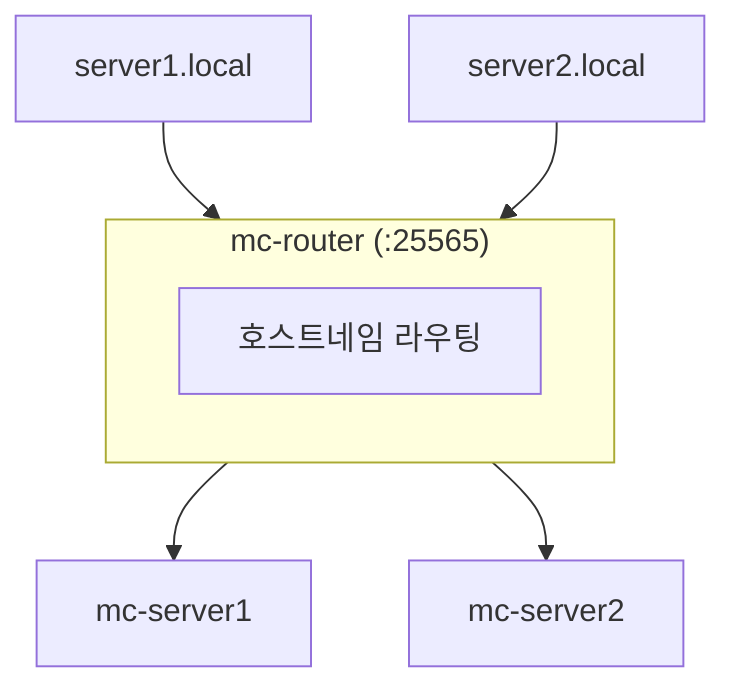

# Minecraft Docker Server Manager

Docker와 **mcctl** CLI를 사용하여 여러 Minecraft Java Edition 서버를 관리하는 DevOps 솔루션입니다.

## 주요 기능

- **멀티 서버 관리**: 단일 호스트에서 여러 Minecraft 서버 실행
- **호스트네임 기반 라우팅**: mc-router를 통해 `server.local:25565`로 접속
- **nip.io 매직 DNS**: `server.<ip>.nip.io`로 클라이언트 설정 없이 접속
- **오토 스케일링**: 접속 시 서버 시작, 유휴 시간 후 자동 종료
- **대화형 CLI**: @clack/prompts 기반의 아름다운 터미널 UI
- **월드 관리**: 서버 간 월드 할당, 잠금, 해제
- **플레이어 관리**: CLI를 통한 운영자, 화이트리스트, 밴, 킥
- **GitHub 백업**: 비공개 저장소에 자동 월드 백업

## 빠른 시작

```bash
# CLI 전역 설치
npm install -g @minecraft-docker/mcctl

# 플랫폼 초기화
mcctl init

# 서버 생성 (대화형 모드)
mcctl create

# 또는 인자와 함께
mcctl create myserver -t PAPER -v 1.21.1

# 서버 시작/중지
mcctl start myserver
mcctl stop myserver

# 상태 보기
mcctl status
```

## 주요 명령어

| 명령어 | 설명 |
|--------|------|
| `mcctl create` | 새 서버 생성 (대화형) |
| `mcctl start <name>` | 서버 시작 |
| `mcctl stop <name>` | 서버 중지 |
| `mcctl status` | 모든 서버 상태 표시 |
| `mcctl logs <name>` | 서버 로그 보기 |
| `mcctl console <name>` | RCON 콘솔 연결 |
| `mcctl config <name>` | 서버 설정 보기/편집 |

## 아키텍처



## 문서

- [설치](getting-started/installation.ko.md) - 플랫폼 설정
- [빠른 시작](getting-started/quickstart.ko.md) - 첫 서버 만들기
- [CLI 명령어](cli/commands.ko.md) - 전체 명령어 참조
- [설정](configuration/index.ko.md) - mcctl로 서버 설정

## 도움이 필요하신가요?

사용법이나 설정에 대해 궁금한 점이 있으신가요? **[AI 어시스턴트](https://notebooklm.google.com/notebook/e91b656e-0d95-45b4-a961-fb1610b13962)**에게 물어보세요 - 이 문서를 학습한 AI가 질문에 대화형으로 답변해 드립니다.

## 링크

- [GitHub 저장소](https://github.com/smallmiro/minecraft-server-manager)
- [itzg/minecraft-server 문서](https://docker-minecraft-server.readthedocs.io/)
