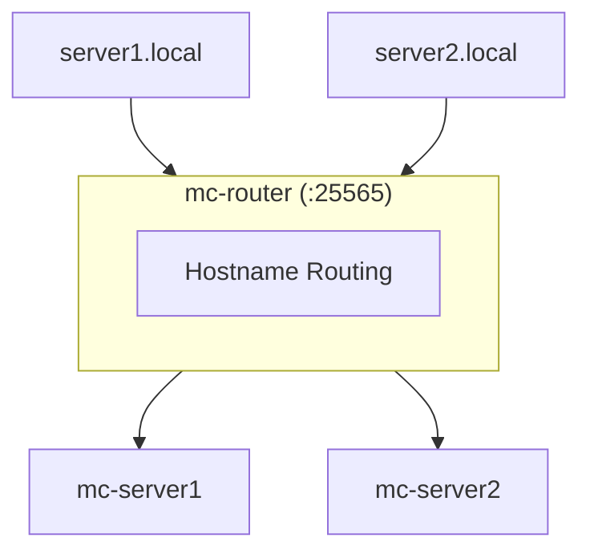

# Minecraft Docker Server Manager

A DevOps solution for managing multiple Minecraft Java Edition servers using Docker and the **mcctl** CLI.

!!! warning "Important: World Storage Bug in versions 1.6.8 ~ 1.6.11"
    If you created servers with mcctl versions 1.6.8 through 1.6.11, your world data may be stored in the wrong location, causing worlds to be recreated on server restart.

    **Quick Check:** Run `ls ~/minecraft-servers/servers/*/data/*/level.dat 2>/dev/null` - if this shows any output, you're affected.

    **Solution:** Update to 1.6.12+ and run `mcctl migrate worlds --all`

    See the [Troubleshooting Guide](troubleshooting/index.md#world-not-saving-to-worlds-directory) for detailed instructions.

## Features

- **Multi-Server Management**: Run multiple Minecraft servers on a single host
- **Hostname-Based Routing**: Connect via `server.local:25565` using mc-router
- **nip.io Magic DNS**: No client configuration needed with `server.<ip>.nip.io`
- **Auto-Scaling**: Servers start on connect, stop after idle timeout
- **Interactive CLI**: Beautiful terminal UI with @clack/prompts
- **World Management**: Assign, lock, and release worlds between servers
- **Player Management**: Operators, whitelist, bans, and kicks via CLI
- **GitHub Backup**: Automatic world backup to private repositories

## System Requirements

| Component | Minimum Version | Notes |
|-----------|-----------------|-------|
| Node.js | >= 18.0.0 | 20 LTS recommended |
| Docker Engine | >= 24.0.0 | |
| Docker Compose | >= 2.20.0 | `include` feature required |

## Quick Start

```bash
# Install CLI globally
npm install -g @minecraft-docker/mcctl

# Initialize platform
mcctl init

# Create a server (interactive mode)
mcctl create

# Or with arguments
mcctl create myserver -t PAPER -v 1.21.1

# Start/stop servers
mcctl start myserver
mcctl stop myserver

# View status
mcctl status
```

## Common Commands

| Command | Description |
|---------|-------------|
| `mcctl create` | Create a new server (interactive) |
| `mcctl start <name>` | Start a server |
| `mcctl stop <name>` | Stop a server |
| `mcctl status` | Show all server status |
| `mcctl logs <name>` | View server logs |
| `mcctl console <name>` | Connect to RCON console |
| `mcctl config <name>` | View/edit server configuration |

## Architecture



## Documentation

- [Installation](getting-started/installation.md) - Set up the platform
- [Quick Start](getting-started/quickstart.md) - Create your first server
- [CLI Commands](cli/commands.md) - Full command reference
- [Configuration](configuration/index.md) - Server configuration with mcctl

## Need Help?

Have questions about usage or configuration? Ask our **[AI Assistant](https://notebooklm.google.com/notebook/e91b656e-0d95-45b4-a961-fb1610b13962)** - it's trained on this documentation and can answer your questions interactively.

## Links

- [Troubleshooting](troubleshooting/index.md) - Common issues and solutions
- [GitHub Repository](https://github.com/smallmiro/minecraft-server-manager)
- [itzg/minecraft-server Documentation](https://docker-minecraft-server.readthedocs.io/)
