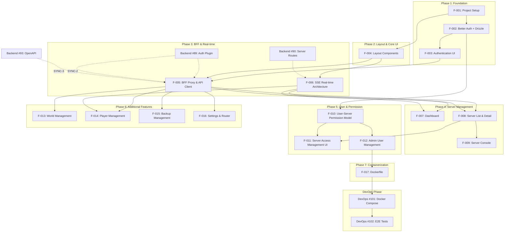

# Implementation Plan: mcctl-console - Web Management Console

## Parent Document
- [Project Plan](../../../plan.md) - Phase 8.4

## PRD Reference
- [mcctl-console PRD](./prd.md)

## Agent Assignment

| Role | Agent | Label |
|------|-------|-------|
| **Owner** | 🎨 Frontend Agent | `agent:frontend` |
| **Spec File** | [.claude/agents/frontend-agent.md](../../../.claude/agents/frontend-agent.md) | - |

## Overview

This document defines the implementation plan for `@minecraft-docker/mcctl-console`, the web-based management console for Minecraft server infrastructure.

### Business Context

The mcctl-console provides a modern web UI for managing Minecraft servers, offering:
- Real-time monitoring via SSE
- User authentication with role-based access control
- Server lifecycle management (create, start, stop, delete)
- World and player management
- Backup and restore functionality

### Architecture Summary

```
Browser (React + MUI + Tailwind)
        |
        | HTTP/SSE (Session Cookie)
        v
mcctl-console (BFF + UI)
  - Better Auth (user sessions)
  - Drizzle ORM (SQLite)
  - User-Server permissions
        |
        | HTTP (X-API-Key)
        v
mcctl-api (Fastify REST API)
  - Docker/RCON operations
  - SSE log streaming
```

---

## Task Relationship Diagram



---

## Phase Overview

| Phase | Name | Issues | Duration | Description |
|-------|------|--------|----------|-------------|
| 1 | Foundation | F-001, F-002, F-003 | 3-4 days | Project setup, auth infrastructure |
| 2 | Layout & Core UI | F-004 | 1-2 days | Layout components, responsive design |
| 3 | BFF & Real-time | F-005, F-006 | 2-3 days | API proxy, SSE integration |
| 4 | Server Management | F-007, F-008, F-009 | 3-4 days | Dashboard, server CRUD, console |
| 5 | User & Permission | F-010, F-011, F-012 | 3-4 days | RBAC, user management |
| 6 | Additional Features | F-013, F-014, F-015, F-016 | 4-5 days | Worlds, players, backups, settings |
| 7 | Containerization | F-017 | 1 day | Dockerfile for production |

**Total Estimated Duration**: 17-23 days

---

## Agent Responsibility Summary

| Agent | Role | Tasks |
|-------|------|-------|
| Frontend | Primary Owner | F-001 to F-017 |
| Backend | Collaborator | Provides API endpoints (SYNC-2, SYNC-3) |
| DevOps | Collaborator | Docker Compose integration (after F-017) |
| Core | Support | Shared types/interfaces if needed |

---

## Detailed Task Specifications

### Phase 1: Foundation

---

#### F-001: Project Setup

| Field | Value |
|-------|-------|
| **Issue** | [#174](https://github.com/smallmiro/minecraft-server-manager/issues/174) |
| **Issue Title** | Initialize Next.js 14 project with MUI + Tailwind |
| **Owner** | Frontend Agent |
| **Collaborators** | - |
| **Prerequisites** | None (can start immediately) |
| **Priority** | HIGH (blocks all other tasks) |

**Deliverables**:

| File | Description |
|------|-------------|
| `package.json` | Dependencies: Next.js 14, React 18, MUI 5, Tailwind 3, React Query 5 |
| `tsconfig.json` | TypeScript configuration with strict mode |
| `next.config.js` | Standalone output mode for Docker |
| `tailwind.config.js` | MUI integration (preflight: false, important: '#__next') |
| `src/theme/muiTheme.ts` | Dark theme with primary (#1bd96a), secondary (#7c3aed) |
| `src/theme/ThemeProvider.tsx` | MUI ThemeProvider + CssBaseline wrapper |
| `postcss.config.js` | PostCSS configuration for Tailwind |

**Test Criteria**:
- [ ] `pnpm dev` starts without errors
- [ ] MUI components render correctly with dark theme
- [ ] Tailwind utility classes work without conflicts
- [ ] TypeScript strict mode passes

---

#### F-002: Better Auth + Drizzle Setup

| Field | Value |
|-------|-------|
| **Issue** | [#178](https://github.com/smallmiro/minecraft-server-manager/issues/178) |
| **Issue Title** | Configure Better Auth with Drizzle ORM and SQLite |
| **Owner** | Frontend Agent |
| **Collaborators** | - |
| **Prerequisites** | F-001 |
| **Priority** | HIGH (blocks F-003, F-010) |

**Deliverables**:

| File | Description |
|------|-------------|
| `src/lib/db.ts` | Drizzle + better-sqlite3 connection |
| `src/lib/schema.ts` | Better Auth tables + user_servers junction table |
| `src/lib/auth.ts` | Better Auth server config with Admin Plugin |
| `src/lib/auth-client.ts` | Client with adminClient plugin |
| `src/lib/auth-utils.ts` | requireAuth, requireAdmin, requireServerPermission helpers |
| `src/app/api/auth/[...all]/route.ts` | Better Auth handler |
| `drizzle.config.ts` | Drizzle Kit configuration |
| `drizzle/` | Migration files directory |

**Schema Definition**:
```typescript
// user_servers junction table
export const userServers = sqliteTable('user_servers', {
  id: text('id').primaryKey(),
  userId: text('user_id').notNull(),
  serverName: text('server_name').notNull(),
  role: text('role', { enum: ['owner', 'operator', 'viewer'] }).notNull().default('viewer'),
  createdAt: integer('created_at', { mode: 'timestamp' }).notNull(),
});
```

**Test Criteria**:
- [ ] Database file created successfully
- [ ] Migrations run without errors
- [ ] User registration creates record in database
- [ ] Session persists across page refreshes
- [ ] Admin plugin provides role management

---

#### F-003: Authentication UI

| Field | Value |
|-------|-------|
| **Issue** | [#181](https://github.com/smallmiro/minecraft-server-manager/issues/181) |
| **Issue Title** | Implement login/signup forms and route protection |
| **Owner** | Frontend Agent |
| **Collaborators** | - |
| **Prerequisites** | F-002 |
| **Priority** | HIGH (blocks F-005) |

**Deliverables**:

| File | Description |
|------|-------------|
| `src/app/login/page.tsx` | Login page |
| `src/components/auth/LoginForm.tsx` | Email/password login form |
| `src/components/auth/SignUpForm.tsx` | Registration form (admin-only or first user) |
| `src/components/auth/UserMenu.tsx` | User dropdown in header |
| `src/middleware.ts` | Route protection + admin route check |

**UI Specifications**:
- Centered card layout on login page
- MUI TextField for inputs with validation
- Loading state during authentication
- Error messages for invalid credentials
- Remember me checkbox (optional)

**Test Criteria**:
- [ ] Login with valid credentials redirects to dashboard
- [ ] Invalid credentials show error message
- [ ] Protected routes redirect to login
- [ ] Admin routes redirect non-admin users
- [ ] Logout clears session and redirects to login

---

### Phase 2: Layout & Core UI

---

#### F-004: Layout Components

| Field | Value |
|-------|-------|
| **Issue** | [#184](https://github.com/smallmiro/minecraft-server-manager/issues/184) |
| **Issue Title** | Create responsive layout with sidebar and header |
| **Owner** | Frontend Agent |
| **Collaborators** | - |
| **Prerequisites** | F-001 |
| **Priority** | HIGH (blocks F-005, F-006) |

**Deliverables**:

| File | Description |
|------|-------------|
| `src/app/layout.tsx` | Root layout with ThemeProvider |
| `src/components/layout/MainLayout.tsx` | Sidebar + content wrapper |
| `src/components/layout/Sidebar.tsx` | Navigation sidebar with router status |
| `src/components/layout/Header.tsx` | Top header with user menu |
| `src/components/common/StatusBadge.tsx` | Server status indicator (running/stopped) |
| `src/components/common/ConfirmDialog.tsx` | Reusable confirmation dialog |
| `src/components/common/LoadingSpinner.tsx` | Loading indicator |

**Responsive Breakpoints**:
| Size | Width | Sidebar | Navigation |
|------|-------|---------|------------|
| Desktop | >= 1200px | Expanded | Sidebar |
| Tablet | 768-1199px | Collapsed (icons only) | Sidebar |
| Mobile | < 768px | Hidden | Bottom navigation |

**Test Criteria**:
- [ ] Sidebar navigation works correctly
- [ ] Responsive layout adapts to screen size
- [ ] Active route highlighted in navigation
- [ ] Router status indicator visible in sidebar

---

### Phase 3: BFF & Real-time

---

#### F-005: BFF Proxy & API Client

| Field | Value |
|-------|-------|
| **Issue** | [#188](https://github.com/smallmiro/minecraft-server-manager/issues/188) |
| **Issue Title** | Implement BFF proxy routes with API key authentication |
| **Owner** | Frontend Agent |
| **Collaborators** | Backend Agent (SYNC-2, SYNC-3) |
| **Prerequisites** | F-003, Backend #89 complete |
| **Priority** | HIGH (blocks F-007, F-008) |

**Sync Points**:
- **SYNC-2**: Receive auth specification from Backend Agent
- **SYNC-3**: Receive OpenAPI spec from Backend Agent

**Deliverables**:

| File | Description |
|------|-------------|
| `src/ports/out/IMcctlApiClient.ts` | API client interface |
| `src/adapters/McctlApiAdapter.ts` | API client with X-API-Key header |
| `src/app/api/servers/route.ts` | Server list/create proxy |
| `src/app/api/servers/[name]/route.ts` | Server detail proxy |
| `src/app/api/servers/[name]/[action]/route.ts` | Start/stop/restart proxy |
| `src/app/api/worlds/route.ts` | World management proxy |
| `src/hooks/useApi.ts` | React Query wrapper |
| `src/hooks/useMcctl.ts` | API client hook |

**API Client Pattern**:
```typescript
// adapters/McctlApiAdapter.ts
export class McctlApiAdapter implements IMcctlApiClient {
  private baseUrl: string;
  private apiKey: string;

  async fetch(endpoint: string, options?: RequestInit) {
    return fetch(`${this.baseUrl}${endpoint}`, {
      ...options,
      headers: {
        'Content-Type': 'application/json',
        'X-API-Key': this.apiKey,
        ...options?.headers,
      },
    });
  }
}
```

**Test Criteria**:
- [ ] BFF routes forward requests to mcctl-api
- [ ] API key is included in all requests
- [ ] Permission filtering applied before API calls
- [ ] Error responses properly formatted

---

#### F-006: SSE Real-time Architecture

| Field | Value |
|-------|-------|
| **Issue** | [#190](https://github.com/smallmiro/minecraft-server-manager/issues/190) |
| **Issue Title** | Implement SSE client for real-time updates |
| **Owner** | Frontend Agent |
| **Collaborators** | Backend Agent (SSE endpoints) |
| **Prerequisites** | F-004, Backend #90 complete |
| **Priority** | HIGH (blocks F-007) |

**Deliverables**:

| File | Description |
|------|-------------|
| `src/ports/out/ISSEClient.ts` | SSE client interface |
| `src/adapters/SSEAdapter.ts` | SSE connection adapter |
| `src/hooks/useSSE.ts` | Generic SSE hook with reconnection |
| `src/hooks/useServerStatus.ts` | Real-time server status |
| `src/hooks/useServerLogs.ts` | Real-time log streaming |
| `src/app/api/sse/[...path]/route.ts` | SSE proxy endpoint |
| `src/types/events.ts` | SSE event type definitions |

**SSE Hook Implementation**:
```typescript
export function useSSE<T>({ url, onMessage, reconnectInterval = 3000 }) {
  const [data, setData] = useState<T | null>(null);
  const [isConnected, setIsConnected] = useState(false);
  const [error, setError] = useState<Event | null>(null);

  useEffect(() => {
    const eventSource = new EventSource(url);

    eventSource.onopen = () => setIsConnected(true);
    eventSource.onmessage = (event) => {
      const parsed = JSON.parse(event.data);
      setData(parsed);
      onMessage?.(parsed);
    };
    eventSource.onerror = () => {
      setIsConnected(false);
      // Reconnect logic
    };

    return () => eventSource.close();
  }, [url]);

  return { data, isConnected, error };
}
```

**Test Criteria**:
- [ ] SSE connection established successfully
- [ ] Reconnects automatically on connection drop
- [ ] Heartbeat handled (no timeout)
- [ ] Log streaming updates UI in real-time

---

### Phase 4: Server Management

---

#### F-007: Dashboard

| Field | Value |
|-------|-------|
| **Issue** | [#177](https://github.com/smallmiro/minecraft-server-manager/issues/177) |
| **Issue Title** | Implement dashboard with real-time server overview |
| **Owner** | Frontend Agent |
| **Collaborators** | - |
| **Prerequisites** | F-005, F-006 |
| **Priority** | MEDIUM |

**Deliverables**:

| File | Description |
|------|-------------|
| `src/app/page.tsx` | Redirect to dashboard |
| `src/app/dashboard/page.tsx` | Dashboard page |
| `src/components/dashboard/StatCard.tsx` | Statistics card component |
| `src/components/dashboard/ServerOverview.tsx` | Server list overview |
| `src/components/dashboard/ActivityFeed.tsx` | Recent activity feed (SSE) |

**Dashboard Statistics**:
- Total servers count
- Online servers count
- Total players online
- Total worlds

**Test Criteria**:
- [ ] Statistics update in real-time
- [ ] Server overview shows current status
- [ ] Activity feed updates on events
- [ ] New Server button opens create dialog

---

#### F-008: Server List & Detail

| Field | Value |
|-------|-------|
| **Issue** | [#179](https://github.com/smallmiro/minecraft-server-manager/issues/179) |
| **Issue Title** | Implement server list with filtering and detail view |
| **Owner** | Frontend Agent |
| **Collaborators** | - |
| **Prerequisites** | F-005, F-006 |
| **Priority** | MEDIUM |

**Deliverables**:

| File | Description |
|------|-------------|
| `src/app/servers/page.tsx` | Server list with permission filter |
| `src/app/servers/[name]/page.tsx` | Server detail with tabs |
| `src/components/servers/ServerList.tsx` | Server list component |
| `src/components/servers/ServerCard.tsx` | Individual server card |
| `src/components/servers/ServerDetail.tsx` | Server detail tabs |
| `src/components/servers/CreateServerDialog.tsx` | Create server modal |

**Server List Features**:
- Filter by status (all/running/stopped)
- Search by name
- Quick actions (start/stop)
- Permission-based filtering

**Server Detail Tabs**:
- Overview (status, resources, players)
- Console
- Config
- Players
- Logs
- Backups

**Test Criteria**:
- [ ] Only accessible servers shown (permission filter)
- [ ] Create server opens dialog
- [ ] Start/stop buttons work correctly
- [ ] Detail tabs load appropriate content

---

#### F-009: Server Console

| Field | Value |
|-------|-------|
| **Issue** | [#182](https://github.com/smallmiro/minecraft-server-manager/issues/182) |
| **Issue Title** | Implement RCON console with live log streaming |
| **Owner** | Frontend Agent |
| **Collaborators** | - |
| **Prerequisites** | F-008 |
| **Priority** | MEDIUM |

**Deliverables**:

| File | Description |
|------|-------------|
| `src/app/servers/[name]/console/page.tsx` | Console page |
| `src/components/servers/ServerConsole.tsx` | Console component |

**Console Features**:
- Real-time log streaming (SSE)
- Command input with history
- Quick command buttons (say, give, tp, gamemode, etc.)
- Log level filtering (INFO/WARN/ERROR)
- Clear logs button
- Auto-scroll toggle
- Connection status indicator

**Test Criteria**:
- [ ] Logs stream in real-time
- [ ] Commands execute and show feedback
- [ ] Quick commands work correctly
- [ ] Disconnection shows reconnecting state

---

### Phase 5: User & Permission Management

---

#### F-010: User-Server Permission Model

| Field | Value |
|-------|-------|
| **Issue** | [#185](https://github.com/smallmiro/minecraft-server-manager/issues/185) |
| **Issue Title** | Implement user-server permission system |
| **Owner** | Frontend Agent |
| **Collaborators** | - |
| **Prerequisites** | F-002 |
| **Priority** | HIGH |

**Deliverables**:

| File | Description |
|------|-------------|
| `src/services/UserServerService.ts` | Permission management use cases |
| `src/ports/out/IUserServerRepository.ts` | Repository interface |
| `src/adapters/UserServerRepository.ts` | Drizzle implementation |

**Permission Roles**:
| Role | Description | Permissions |
|------|-------------|-------------|
| owner | Server owner | Full control (config, delete, assign users) |
| operator | Server operator | Start/stop, console, player management |
| viewer | Read-only | View status and logs only |

**Authorization Flow**:
1. Get user session
2. Check if user is admin (full access)
3. Query user_servers for server access
4. Verify role meets required permission level

**Test Criteria**:
- [ ] Server creator becomes owner
- [ ] Permission check blocks unauthorized access
- [ ] Role hierarchy enforced (owner > operator > viewer)
- [ ] Admin bypasses permission check

---

#### F-011: Server Access Management UI

| Field | Value |
|-------|-------|
| **Issue** | [#186](https://github.com/smallmiro/minecraft-server-manager/issues/186) |
| **Issue Title** | UI for managing user access to servers |
| **Owner** | Frontend Agent |
| **Collaborators** | - |
| **Prerequisites** | F-008, F-010 |
| **Priority** | MEDIUM |

**Deliverables**:

| File | Description |
|------|-------------|
| `src/app/servers/[name]/access/page.tsx` | Access management page |
| `src/components/users/ServerAccessDialog.tsx` | Add user dialog |
| `src/components/users/PermissionBadge.tsx` | Role badge component |

**Features**:
- List users with access to server
- Add user with role selection
- Edit user role
- Remove user access
- Owner cannot remove themselves (at least one owner required)

**Test Criteria**:
- [ ] Only owners and admins can access this page
- [ ] Adding user creates user_server record
- [ ] Removing user immediately revokes access
- [ ] Cannot remove last owner

---

#### F-012: Admin User Management

| Field | Value |
|-------|-------|
| **Issue** | [#189](https://github.com/smallmiro/minecraft-server-manager/issues/189) |
| **Issue Title** | Admin dashboard for user management |
| **Owner** | Frontend Agent |
| **Collaborators** | - |
| **Prerequisites** | F-010 |
| **Priority** | MEDIUM |

**Deliverables**:

| File | Description |
|------|-------------|
| `src/app/admin/page.tsx` | Admin dashboard |
| `src/app/admin/users/page.tsx` | User management page |
| `src/components/users/UserList.tsx` | User list with actions |

**Features**:
- List all users with their roles
- Create new user (admin only)
- Update user role (admin/user)
- Ban/unban user
- View user's server assignments
- Manage server assignments from user detail

**Test Criteria**:
- [ ] Only admins can access /admin routes
- [ ] Create user uses Better Auth Admin API
- [ ] Ban immediately invalidates sessions
- [ ] Server assignments viewable and editable

---

### Phase 6: Additional Features

---

#### F-013: World Management

| Field | Value |
|-------|-------|
| **Issue** | [#175](https://github.com/smallmiro/minecraft-server-manager/issues/175) |
| **Issue Title** | World list and assignment management |
| **Owner** | Frontend Agent |
| **Collaborators** | - |
| **Prerequisites** | F-005 |
| **Priority** | MEDIUM |

**Deliverables**:

| File | Description |
|------|-------------|
| `src/app/worlds/page.tsx` | World list page |
| `src/components/worlds/WorldList.tsx` | World list component |
| `src/components/worlds/WorldAssignDialog.tsx` | World assignment dialog |

**Features**:
- List all worlds with status (assigned/unassigned)
- Show assigned server
- Assign world to server (server must be stopped)
- Release world from server
- World metadata (size, created date)

**Test Criteria**:
- [ ] Worlds list correctly
- [ ] Assignment blocked if server is running
- [ ] Release updates lock status
- [ ] Only owners can assign/release

---

#### F-014: Player Management

| Field | Value |
|-------|-------|
| **Issue** | [#176](https://github.com/smallmiro/minecraft-server-manager/issues/176) |
| **Issue Title** | Player management across all servers |
| **Owner** | Frontend Agent |
| **Collaborators** | - |
| **Prerequisites** | F-005, F-006 |
| **Priority** | MEDIUM |

**Deliverables**:

| File | Description |
|------|-------------|
| `src/app/players/page.tsx` | Player management page |
| `src/components/players/PlayerList.tsx` | Online players (SSE) |
| `src/components/players/OpManager.tsx` | OP management |
| `src/components/players/WhitelistManager.tsx` | Whitelist management |
| `src/components/players/BanManager.tsx` | Ban management |

**Features**:
- Online players by server (real-time)
- OP list with add/remove
- Whitelist with add/remove
- Ban list with add/remove (reason optional)
- Kick player

**Test Criteria**:
- [ ] Online players update in real-time
- [ ] OP/whitelist/ban operations work
- [ ] Kick shows confirmation
- [ ] Cannot ban/kick yourself

---

#### F-015: Backup Management

| Field | Value |
|-------|-------|
| **Issue** | [#180](https://github.com/smallmiro/minecraft-server-manager/issues/180) |
| **Issue Title** | Backup list and restore functionality |
| **Owner** | Frontend Agent |
| **Collaborators** | - |
| **Prerequisites** | F-005 |
| **Priority** | LOW |

**Deliverables**:

| File | Description |
|------|-------------|
| `src/app/backups/page.tsx` | Backup management page |
| `src/components/backups/BackupList.tsx` | Backup list per server |
| `src/components/backups/GitHubSync.tsx` | GitHub sync status |
| `src/components/backups/RestoreDialog.tsx` | Restore confirmation |

**Features**:
- Server backup list with dates
- Create new backup
- Restore from backup (server must be stopped)
- GitHub sync status and push
- Delete old backups

**Test Criteria**:
- [ ] Backup list shows correctly
- [ ] Create backup triggers API
- [ ] Restore blocked if server running
- [ ] GitHub push shows progress

---

#### F-016: Settings & Router

| Field | Value |
|-------|-------|
| **Issue** | [#183](https://github.com/smallmiro/minecraft-server-manager/issues/183) |
| **Issue Title** | Platform settings and router status |
| **Owner** | Frontend Agent |
| **Collaborators** | - |
| **Prerequisites** | F-005 |
| **Priority** | LOW |

**Deliverables**:

| File | Description |
|------|-------------|
| `src/app/settings/page.tsx` | Settings page |
| `src/components/router/RouterStatus.tsx` | Router status component |

**Settings Sections**:
- Network settings (Host IP, domain, port)
- mDNS configuration
- Data paths (read-only display)
- About (version, links)

**Router Status**:
- Running/stopped status
- Uptime
- Routing table (hostname to container mapping)
- Restart/stop buttons

**Test Criteria**:
- [ ] Settings display correctly
- [ ] Router status updates (SSE)
- [ ] Router restart works

---

### Phase 7: Containerization

---

#### F-017: Dockerfile

| Field | Value |
|-------|-------|
| **Issue** | [#187](https://github.com/smallmiro/minecraft-server-manager/issues/187) |
| **Issue Title** | Create production Dockerfile |
| **Owner** | Frontend Agent |
| **Collaborators** | DevOps Agent |
| **Prerequisites** | F-001 through F-012 |
| **Priority** | HIGH (for deployment) |

**Deliverables**:

| File | Description |
|------|-------------|
| `Dockerfile` | Multi-stage production build |
| `.dockerignore` | Exclude dev files |

**Dockerfile Stages**:
1. **deps**: Install dependencies
2. **builder**: Build Next.js
3. **runner**: Production runtime

**Requirements**:
- Base image: node:18-alpine
- Output: standalone mode
- Image size: < 200MB
- Non-root user
- Health check: `/api/health`

**Test Criteria**:
- [ ] Build completes successfully
- [ ] Image size under 200MB
- [ ] Container starts and serves pages
- [ ] Health check endpoint works
- [ ] Environment variables applied

---

## Sync Points

| ID | Trigger | From | To | Artifact |
|----|---------|------|----|----------|
| SYNC-2 | Backend #89 complete | Backend | Frontend | Auth specification (API key header, error responses) |
| SYNC-3 | Backend #93 complete | Backend | Frontend | OpenAPI spec at /docs |
| SYNC-4 | F-017 + #94 complete | Frontend + Backend | DevOps | Docker images ready |
| SYNC-5 | Backend #90 complete | Backend | Frontend | SSE streaming endpoints |

---

## Parallel Execution Groups

| Group | Tasks | Prerequisites | Notes |
|-------|-------|---------------|-------|
| P1 | F-001 | None | Start immediately |
| P2 | F-002, F-004 | F-001 | Auth and layout in parallel |
| P3 | F-003, F-005, F-006 | P2 | Auth UI, BFF, SSE |
| P4 | F-007, F-008, F-010 | P3 | Dashboard, servers, permissions |
| P5 | F-009, F-011, F-012, F-013, F-014 | P4 | Console, access UI, admin, worlds, players |
| P6 | F-015, F-016 | F-005 | Backups, settings |
| P7 | F-017 | P5 complete | Dockerfile |

---

## Dependency Graph

```
External Dependencies:
  Backend #89 ─────┬──→ F-005 (Auth spec needed for BFF)
  Backend #90 ─────┴──→ F-006 (SSE endpoints needed)
  Backend #93 ─────────→ F-005 (OpenAPI spec reference)

Internal Dependencies:
  F-001 ──┬──→ F-002 ──→ F-003 ──→ F-005 ──┬──→ F-007
          │                                 │
          └──→ F-004 ──→ F-006 ────────────┘
                            │
                            └──→ F-008 ──→ F-009
                                   │
                                   └──→ F-011

  F-002 ──→ F-010 ──┬──→ F-011
                    └──→ F-012 ──→ F-017

  F-005 ──┬──→ F-013
          ├──→ F-014
          ├──→ F-015
          └──→ F-016
```

---

## Environment Variables

| Variable | Required | Default | Description |
|----------|----------|---------|-------------|
| `MCCTL_API_URL` | Yes | `http://localhost:5001` | mcctl-api internal URL |
| `MCCTL_API_KEY` | Yes | - | API key for mcctl-api |
| `NEXT_PUBLIC_APP_URL` | Yes | `http://localhost:5000` | Public app URL |
| `DATABASE_PATH` | No | `mcctl-console.db` | SQLite database path |
| `BETTER_AUTH_SECRET` | Yes | - | Auth encryption key (32+ chars) |
| `PORT` | No | `5000` | Console port |

---

## Testing Strategy

| Test Type | Tool | Coverage Target | Focus Areas |
|-----------|------|-----------------|-------------|
| Unit | Vitest | 80%+ | Services, hooks, utilities |
| Component | React Testing Library | 70%+ | Form components, dialogs |
| Integration | Vitest + MSW | 70%+ | API routes, SSE |
| E2E | Playwright | Critical paths | Auth, server lifecycle |

---

## Progress Tracking

| Task | Issue | Status | Started | Completed | Notes |
|------|-------|--------|---------|-----------|-------|
| F-001 | [#174](https://github.com/smallmiro/minecraft-server-manager/issues/174) | Pending | - | - | - |
| F-002 | [#178](https://github.com/smallmiro/minecraft-server-manager/issues/178) | Pending | - | - | - |
| F-003 | [#181](https://github.com/smallmiro/minecraft-server-manager/issues/181) | Pending | - | - | - |
| F-004 | [#184](https://github.com/smallmiro/minecraft-server-manager/issues/184) | Pending | - | - | - |
| F-005 | [#188](https://github.com/smallmiro/minecraft-server-manager/issues/188) | Pending | - | - | Blocked by Backend #89 |
| F-006 | [#190](https://github.com/smallmiro/minecraft-server-manager/issues/190) | Pending | - | - | Blocked by Backend #90 |
| F-007 | [#177](https://github.com/smallmiro/minecraft-server-manager/issues/177) | Pending | - | - | - |
| F-008 | [#179](https://github.com/smallmiro/minecraft-server-manager/issues/179) | Pending | - | - | - |
| F-009 | [#182](https://github.com/smallmiro/minecraft-server-manager/issues/182) | Pending | - | - | - |
| F-010 | [#185](https://github.com/smallmiro/minecraft-server-manager/issues/185) | Pending | - | - | - |
| F-011 | [#186](https://github.com/smallmiro/minecraft-server-manager/issues/186) | Pending | - | - | - |
| F-012 | [#189](https://github.com/smallmiro/minecraft-server-manager/issues/189) | Pending | - | - | - |
| F-013 | [#175](https://github.com/smallmiro/minecraft-server-manager/issues/175) | Pending | - | - | - |
| F-014 | [#176](https://github.com/smallmiro/minecraft-server-manager/issues/176) | Pending | - | - | - |
| F-015 | [#180](https://github.com/smallmiro/minecraft-server-manager/issues/180) | Pending | - | - | - |
| F-016 | [#183](https://github.com/smallmiro/minecraft-server-manager/issues/183) | Pending | - | - | - |
| F-017 | [#187](https://github.com/smallmiro/minecraft-server-manager/issues/187) | Pending | - | - | - |

---

## Revision History

| Version | Date | Author | Changes |
|---------|------|--------|---------|
| 1.0.0 | 2026-01-31 | Orchestrator Agent | Initial plan creation |
| 1.1.0 | 2026-01-31 | Orchestrator Agent | Add Parent Document, PRD Reference, Agent Assignment sections |
| 1.2.0 | 2026-01-31 | Orchestrator Agent | Create GitHub issues #174-#190 and link to Progress Tracking |
