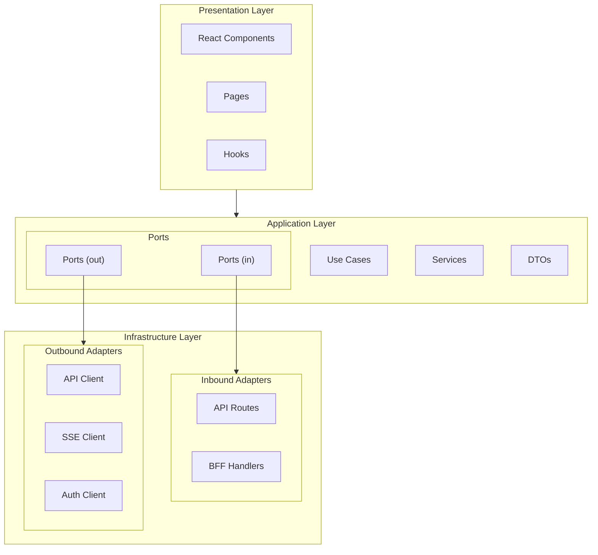
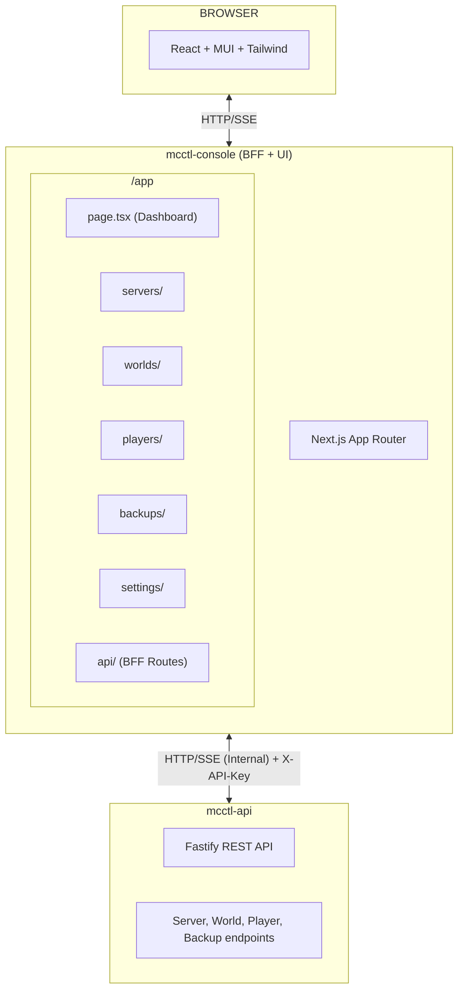
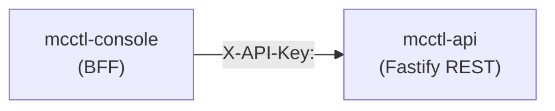
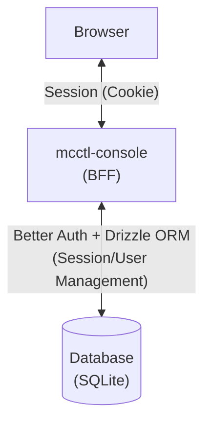
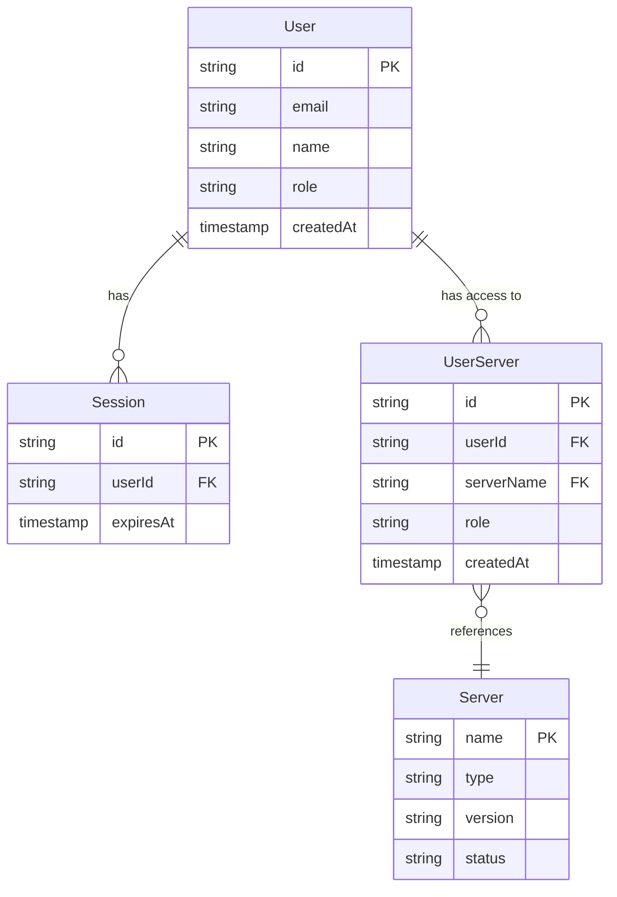
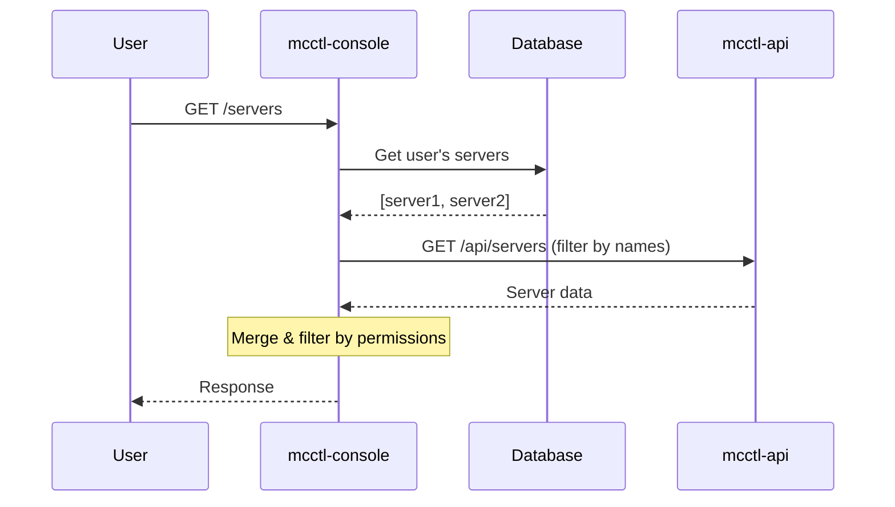
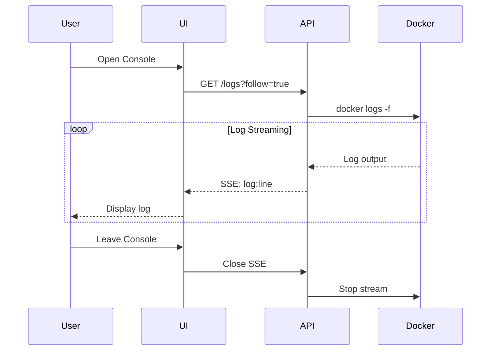
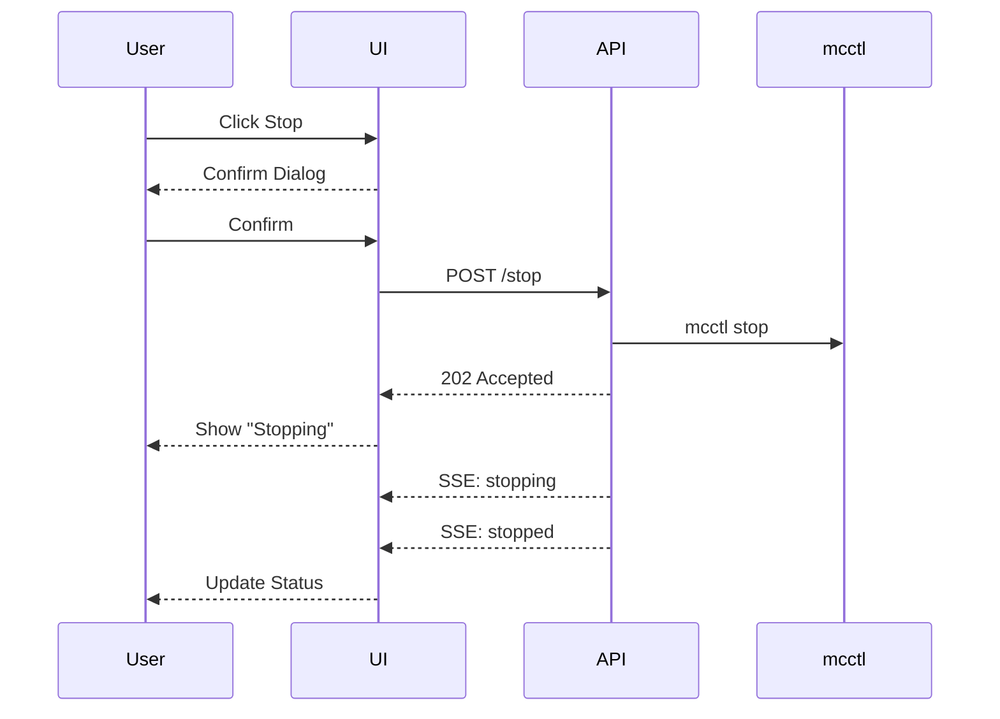
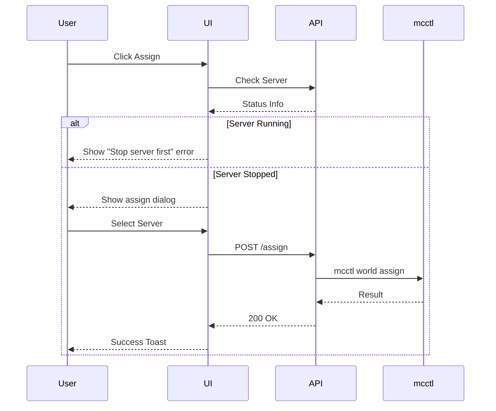
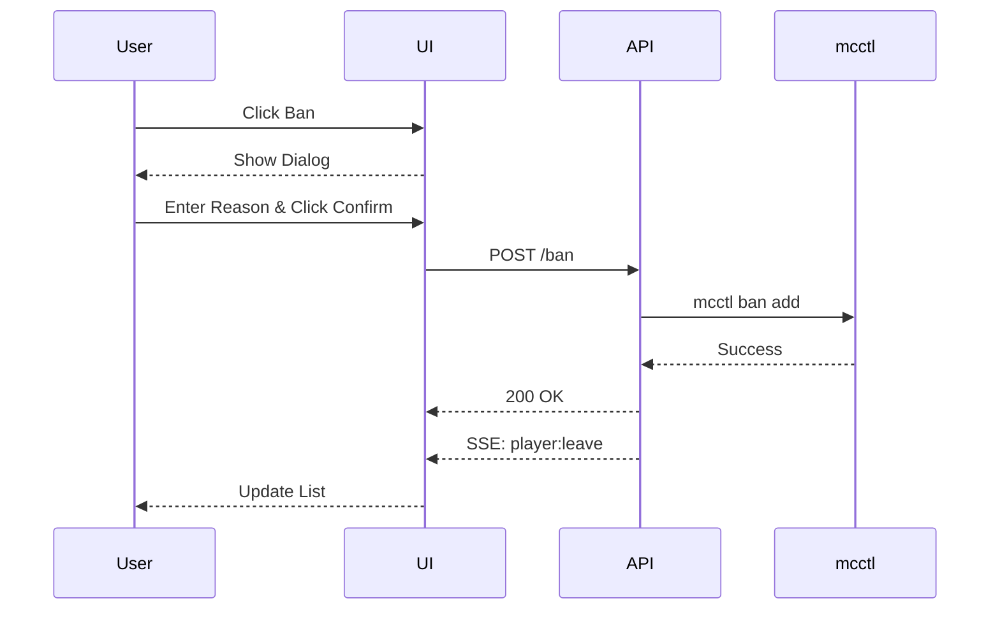

# PRD: mcctl-console - Web Management Console

## Parent Document
- [Project PRD](../../../prd.md) - Section 10

## Agent Assignment

| Role | Agent | Label |
|------|-------|-------|
| **Owner** | 🎨 Frontend Agent | `agent:frontend` |
| **Spec File** | [.claude/agents/frontend-agent.md](../../../.claude/agents/frontend-agent.md) | - |

**Responsibilities**:
- Next.js App Router + React implementation
- MUI + Tailwind CSS UI components
- SSE client for real-time updates
- Dashboard and server management UI
- BFF (Backend for Frontend) API routes

**Collaboration**:
- Imports Use Cases and Ports from `@minecraft-docker/shared`
- Consumes REST API from mcctl-api
- Depends on Backend Agent for API endpoints and SSE streams

## 1. Overview

### 1.1 Purpose
Web-based management console for Minecraft server infrastructure. Provides real-time monitoring, server management, and administrative functions through a modern UI.

### 1.2 Scope
- Dashboard with real-time server status (SSE)
- Server lifecycle management (create, start, stop, delete)
- Console/RCON interface with live log streaming (SSE)
- World management (list, assign, release)
- Player management (whitelist, ban, kick, OP)
- Backup management (server backup, GitHub sync)
- Platform settings and router status

### 1.3 Non-Goals
- Direct Docker/RCON access (handled by mcctl-api)
- CLI functionality (handled by mcctl CLI)

### 1.4 Related Documents
- [Implementation Plan](./plan.md)

## 2. Tech Stack

| Component | Technology | Version |
|-----------|------------|---------|
| Runtime | Node.js | 18+ |
| Framework | Next.js (App Router) | 14.x |
| Language | TypeScript | 5.x |
| UI Library | MUI (Material-UI) | 5.x |
| Styling | Tailwind CSS | 3.x |
| State | React Query (TanStack) | 5.x |
| Real-time | EventSource (SSE) | Native |
| **Authentication** | **Better Auth** | **1.x** |
| **ORM** | **Drizzle ORM** | **0.x** |
| **Database** | **SQLite** (expandable to PostgreSQL) | **better-sqlite3** |
| Shared | @minecraft-docker/shared | workspace |

### 2.1 MUI + Tailwind CSS Integration

```javascript
// tailwind.config.js
module.exports = {
  important: '#__next',  // Prevent MUI conflicts
  corePlugins: {
    preflight: false,    // Preserve MUI base styles
  },
  theme: {
    extend: {
      colors: {
        primary: '#1bd96a',      // Modrinth-style mint green
        secondary: '#7c3aed',    // Purple accent
        background: {
          DEFAULT: '#111111',    // Main background
          paper: '#1a1a1a',      // Card background
        },
      },
    },
  },
}
```

**Usage Pattern**:
- MUI: Complex components (Dialog, DataGrid, Autocomplete, Forms)
- Tailwind: Layout, spacing, quick styling, utilities

## 3. Development Methodology

> **Reference**: [CLAUDE.md](../../../CLAUDE.md) - See Development Philosophy section
>
> Project-wide development methodology:
> - **XP (Extreme Programming)** based
> - **TDD**: Red → Green → Refactor
> - **Tidy First**: Separate structural and behavioral changes
> - **CI/CD**: lint, type-check, test, build

### Testing Strategy (mcctl-console specific)

| Test Type | Tool | Target |
|-----------|------|--------|
| Unit | Vitest | Services, Hooks, Utils |
| Component | React Testing Library | Components |
| Integration | Vitest + MSW | API Routes, SSE |
| E2E | Playwright | User Flows |

**Test Coverage Target**: 80% or higher

## 4. Architecture

mcctl-console uses an extended **Hexagonal Architecture (Ports & Adapters)** pattern.

### 4.1 Hexagonal Architecture

An extension of the MVC pattern, Hexagonal Architecture separates business logic from external dependencies.



**Layer Structure**:

| Layer | Role | Examples |
|-------|------|----------|
| **Presentation** | UI rendering, user interaction | React Components, Pages, Hooks |
| **Application** | Business logic, use cases | ServerService, AuthService |
| **Ports (in)** | Inbound request interfaces | IServerAPI, IAuthAPI |
| **Ports (out)** | Outbound request interfaces | IMcctlApiClient, ISSEClient |
| **Adapters** | Port implementations | McctlApiAdapter, SSEAdapter |

**Directory Mapping**:
```
src/
├── app/                    # Presentation (Pages)
├── components/             # Presentation (UI Components)
├── hooks/                  # Presentation (Custom Hooks)
├── services/               # Application (Use Cases)
├── ports/                  # Application (Interfaces)
├── adapters/               # Infrastructure (Implementations)
├── lib/                    # Infrastructure (Utilities)
└── types/                  # Shared Types
```

**Benefits**:
- Testability: Mock testing through dependency injection via ports
- Flexibility: Change external services by simply swapping adapters
- Separation of Concerns: Clear separation of UI, business logic, and infrastructure

### 4.2 System Architecture



### 4.3 BFF-API Authentication

Communication between mcctl-console (BFF) and mcctl-api uses **API Key authentication**.



**Authentication Method**:
- Header: `X-API-Key`
- Requires `AUTH_MODE=api-key` configuration in mcctl-api
- BFF uses API Key only server-side (not exposed to client)

**API Client Implementation**:
```typescript
// lib/api-client.ts
const apiClient = {
  async fetch(endpoint: string, options?: RequestInit) {
    const response = await fetch(`${process.env.MCCTL_API_URL}${endpoint}`, {
      ...options,
      headers: {
        'Content-Type': 'application/json',
        'X-API-Key': process.env.MCCTL_API_KEY!,
        ...options?.headers,
      },
    });
    return response;
  },
};
```

### 4.4 User Authentication (Better Auth)

User authentication between browser and mcctl-console (BFF) uses **Better Auth**.



**Why Better Auth**:
- TypeScript-first design with complete type safety
- Self-hosted for data ownership
- Clean API and quick setup
- Excellent monorepo compatibility

**Authentication Method**:
- Email/Password based login
- Session-based authentication (Secure Cookie)
- Built-in CSRF protection

**Server Configuration**:
```typescript
// lib/auth.ts
import { betterAuth } from 'better-auth';
import { drizzleAdapter } from 'better-auth/adapters/drizzle';
import { admin } from 'better-auth/plugins';
import { db } from './db';

export const auth = betterAuth({
  database: drizzleAdapter(db, {
    provider: 'sqlite',  // Change to 'pg' for PostgreSQL
  }),
  emailAndPassword: {
    enabled: true,
  },
  session: {
    cookieCache: {
      enabled: true,
      maxAge: 60 * 60 * 24, // 24 hours
    },
  },
  plugins: [
    admin({
      defaultRole: 'user',
      adminRole: 'admin',
    }),
  ],
});
```

**Admin Plugin Features**:
- Automatic `role` field on user table
- Admin API endpoints for user management
- Role-based middleware helpers
- First registered user can be auto-promoted to admin

**Database Configuration (Drizzle ORM)**:
```typescript
// lib/db.ts
import { drizzle } from 'drizzle-orm/better-sqlite3';
import Database from 'better-sqlite3';
import * as schema from './schema';

const sqlite = new Database(process.env.DATABASE_PATH ?? 'mcctl-console.db');
export const db = drizzle(sqlite, { schema });

// Future PostgreSQL migration:
// import { drizzle } from 'drizzle-orm/node-postgres';
// import { Pool } from 'pg';
// const pool = new Pool({ connectionString: process.env.DATABASE_URL });
// export const db = drizzle(pool, { schema });
```

### 4.6 Data Model

#### 4.6.1 Entity Relationship Diagram



> **Note**: Server data is managed by mcctl-api (filesystem). Only the User-Server mapping is stored in SQLite.

#### 4.6.2 User Roles

| Role | Description | Permissions |
|------|-------------|-------------|
| `admin` | System administrator | Full access to all servers |
| `user` | Regular user | Access only to assigned servers |

#### 4.6.3 UserServer Roles

| Role | Description | Server Permissions |
|------|-------------|-------------------|
| `owner` | Server owner | Full control (start, stop, delete, config) |
| `operator` | Server operator | Operate (start, stop, console) |
| `viewer` | Read-only access | View only (status, logs) |

#### 4.6.4 Drizzle Schema

```typescript
// lib/schema.ts
import { sqliteTable, text, integer } from 'drizzle-orm/sqlite-core';
import { relations } from 'drizzle-orm';

// Better Auth manages these tables automatically:
// - user
// - session
// - account
// - verification

// User-Server mapping (custom table)
export const userServers = sqliteTable('user_servers', {
  id: text('id').primaryKey(),
  userId: text('user_id').notNull(),
  serverName: text('server_name').notNull(),
  role: text('role', { enum: ['owner', 'operator', 'viewer'] }).notNull().default('viewer'),
  createdAt: integer('created_at', { mode: 'timestamp' }).notNull(),
});

// Relations
export const userServersRelations = relations(userServers, ({ one }) => ({
  user: one(users, {
    fields: [userServers.userId],
    references: [users.id],
  }),
}));

// Indexes
// CREATE UNIQUE INDEX idx_user_server ON user_servers(user_id, server_name);
```

#### 4.6.5 Authorization Flow



#### 4.6.6 Permission Matrix

| Action | Admin | Owner | Operator | Viewer |
|--------|-------|-------|----------|--------|
| View server list | ✅ All | ✅ Own | ✅ Own | ✅ Own |
| View server detail | ✅ | ✅ | ✅ | ✅ |
| View logs | ✅ | ✅ | ✅ | ✅ |
| Start/Stop server | ✅ | ✅ | ✅ | ❌ |
| Execute RCON | ✅ | ✅ | ✅ | ❌ |
| Modify config | ✅ | ✅ | ❌ | ❌ |
| Create server | ✅ | ✅ | ❌ | ❌ |
| Delete server | ✅ | ✅ | ❌ | ❌ |
| Manage players | ✅ | ✅ | ✅ | ❌ |
| Assign world | ✅ | ✅ | ❌ | ❌ |
| Manage backups | ✅ | ✅ | ❌ | ❌ |
| Assign users | ✅ | ✅ | ❌ | ❌ |

**Client Configuration**:
```typescript
// lib/auth-client.ts
import { createAuthClient } from 'better-auth/react';
import { adminClient } from 'better-auth/client/plugins';

export const authClient = createAuthClient({
  baseURL: process.env.NEXT_PUBLIC_APP_URL,
  plugins: [adminClient()],
});

export const { signIn, signUp, signOut, useSession, admin } = authClient;

// Admin functions available:
// admin.listUsers()
// admin.createUser({ email, password, role })
// admin.updateUser({ userId, role })
// admin.deleteUser({ userId })
// admin.banUser({ userId })
// admin.unbanUser({ userId })
```

**Protected Routes**:
```typescript
// middleware.ts
import { auth } from '@/lib/auth';
import { NextRequest, NextResponse } from 'next/server';

export async function middleware(request: NextRequest) {
  const session = await auth.api.getSession({
    headers: request.headers,
  });

  if (!session) {
    return NextResponse.redirect(new URL('/login', request.url));
  }

  // Admin-only routes protection
  if (request.nextUrl.pathname.startsWith('/admin')) {
    if (session.user.role !== 'admin') {
      return NextResponse.redirect(new URL('/', request.url));
    }
  }

  return NextResponse.next();
}

export const config = {
  matcher: ['/((?!api/auth|login|_next/static|favicon.ico).*)'],
};
```

**Role Check Helper**:
```typescript
// lib/auth-utils.ts
import { auth } from './auth';
import { headers } from 'next/headers';

export async function requireAdmin() {
  const session = await auth.api.getSession({
    headers: headers(),
  });

  if (!session || session.user.role !== 'admin') {
    throw new Error('Admin access required');
  }

  return session;
}

export async function requireAuth() {
  const session = await auth.api.getSession({
    headers: headers(),
  });

  if (!session) {
    throw new Error('Authentication required');
  }

  return session;
}
```

### 4.5 Directory Structure

```
platform/services/mcctl-console/
├── prd.md                      # This document
├── plan.md                     # Implementation plan
├── package.json                # @minecraft-docker/mcctl-console
├── tsconfig.json
├── tailwind.config.js
├── next.config.js
├── src/
│   ├── middleware.ts           # Auth middleware (route protection)
│   ├── app/                    # Next.js App Router
│   │   ├── layout.tsx          # Root layout (MUI ThemeProvider)
│   │   ├── page.tsx            # Dashboard
│   │   ├── login/
│   │   │   └── page.tsx        # Login page
│   │   ├── servers/
│   │   │   ├── page.tsx        # Server list
│   │   │   └── [name]/
│   │   │       ├── page.tsx    # Server detail (tabs)
│   │   │       ├── console/    # Console tab
│   │   │       ├── config/     # Config tab
│   │   │       ├── players/    # Players tab
│   │   │       ├── logs/       # Logs tab
│   │   │       └── backups/    # Backups tab
│   │   ├── worlds/
│   │   │   └── page.tsx        # World management
│   │   ├── players/
│   │   │   └── page.tsx        # Global player management
│   │   ├── backups/
│   │   │   └── page.tsx        # Backup management
│   │   ├── settings/
│   │   │   └── page.tsx        # Platform settings
│   │   ├── admin/              # Admin-only pages
│   │   │   ├── page.tsx        # Admin dashboard
│   │   │   └── users/
│   │   │       └── page.tsx    # User management
│   │   └── api/                # BFF API routes
│   │       ├── auth/
│   │       │   └── [...all]/
│   │       │       └── route.ts # Better Auth handler
│   │       ├── servers/
│   │       ├── worlds/
│   │       ├── players/
│   │       └── sse/            # SSE proxy endpoints
│   │
│   ├── components/
│   │   ├── layout/
│   │   │   ├── Sidebar.tsx
│   │   │   ├── Header.tsx
│   │   │   └── MainLayout.tsx
│   │   ├── dashboard/
│   │   │   ├── StatCard.tsx
│   │   │   ├── ServerOverview.tsx
│   │   │   └── ActivityFeed.tsx
│   │   ├── servers/
│   │   │   ├── ServerList.tsx
│   │   │   ├── ServerCard.tsx
│   │   │   ├── ServerDetail.tsx
│   │   │   ├── ServerConsole.tsx
│   │   │   ├── ServerConfig.tsx
│   │   │   └── CreateServerDialog.tsx
│   │   ├── players/
│   │   │   ├── PlayerList.tsx
│   │   │   ├── OpManager.tsx
│   │   │   ├── WhitelistManager.tsx
│   │   │   └── BanManager.tsx
│   │   ├── worlds/
│   │   │   ├── WorldList.tsx
│   │   │   └── WorldAssignDialog.tsx
│   │   ├── backups/
│   │   │   ├── BackupList.tsx
│   │   │   ├── GitHubSync.tsx
│   │   │   └── RestoreDialog.tsx
│   │   ├── router/
│   │   │   └── RouterStatus.tsx
│   │   ├── auth/
│   │   │   ├── LoginForm.tsx       # Login form component
│   │   │   ├── SignUpForm.tsx      # Sign up form component
│   │   │   └── UserMenu.tsx        # User dropdown menu
│   │   ├── users/
│   │   │   ├── UserList.tsx        # User management list (admin)
│   │   │   ├── ServerAccessDialog.tsx # Assign server access dialog
│   │   │   └── PermissionBadge.tsx # Role/permission badge
│   │   └── common/
│   │       ├── StatusBadge.tsx
│   │       ├── ConfirmDialog.tsx
│   │       └── LoadingSpinner.tsx
│   │
│   ├── hooks/
│   │   ├── useSSE.ts           # SSE connection hook
│   │   ├── useServerStatus.ts  # Real-time server status
│   │   ├── useServerLogs.ts    # Real-time log streaming
│   │   ├── useApi.ts           # React Query wrapper
│   │   └── useMcctl.ts         # API client hook
│   │
│   ├── services/               # Application Layer (Use Cases)
│   │   ├── ServerService.ts    # Server management use cases
│   │   ├── WorldService.ts     # World management use cases
│   │   ├── PlayerService.ts    # Player management use cases
│   │   ├── BackupService.ts    # Backup management use cases
│   │   ├── AuthService.ts      # Authentication use cases
│   │   └── UserServerService.ts # User-Server permission management
│   │
│   ├── ports/                  # Application Layer (Interfaces)
│   │   ├── in/                 # Inbound ports
│   │   │   ├── IServerAPI.ts
│   │   │   ├── IWorldAPI.ts
│   │   │   └── IPlayerAPI.ts
│   │   └── out/                # Outbound ports
│   │       ├── IMcctlApiClient.ts
│   │       ├── ISSEClient.ts
│   │       ├── IAuthClient.ts
│   │       └── IUserServerRepository.ts  # User-Server mapping repository
│   │
│   ├── adapters/               # Infrastructure Layer (Implementations)
│   │   ├── McctlApiAdapter.ts  # mcctl-api HTTP client
│   │   ├── SSEAdapter.ts       # SSE connection adapter
│   │   ├── AuthAdapter.ts      # Better Auth adapter
│   │   └── UserServerRepository.ts # Drizzle User-Server repository
│   │
│   ├── lib/
│   │   ├── auth.ts             # Better Auth server config
│   │   ├── auth-client.ts      # Better Auth client
│   │   ├── db.ts               # Database connection (Drizzle + SQLite)
│   │   ├── schema.ts           # Drizzle schema definitions
│   │   ├── api-client.ts       # mcctl-api client (deprecated, use adapters)
│   │   ├── sse-client.ts       # SSE connection manager (deprecated, use adapters)
│   │   └── utils.ts            # Utility functions
│   │
│   ├── theme/
│   │   ├── muiTheme.ts         # MUI dark theme
│   │   └── ThemeProvider.tsx   # Theme context
│   │
│   └── types/
│       ├── server.ts
│       ├── world.ts
│       ├── player.ts
│       └── events.ts           # SSE event types
│
├── public/
│   └── icons/
│
└── Dockerfile
```

## 5. Real-time Architecture (SSE)

### 5.1 SSE Endpoints (via mcctl-api)

| Endpoint | Data | Purpose |
|----------|------|---------|
| `/api/sse/status` | All server status | Dashboard, Server List |
| `/api/sse/server/:name` | Specific server details | Server Detail Page |
| `/api/sse/logs/:name` | Real-time logs | Console Tab |
| `/api/sse/players` | All players | Player Management |

### 5.2 SSE Event Types

```typescript
// types/events.ts

// Server status event
interface ServerStatusEvent {
  type: 'server:status';
  data: {
    servers: Array<{
      name: string;
      status: 'running' | 'stopped' | 'starting' | 'stopping';
      type: string;        // PAPER, VANILLA, FORGE...
      version: string;
      players: {
        online: number;
        max: number;
        list: string[];
      };
      resources: {
        memoryUsage: string;  // "2.1GB"
        cpuPercent: number;
      };
      uptime: number;         // seconds
      address: string;        // survival.192.168.1.10.nip.io
    }>;
    router: {
      status: 'running' | 'stopped';
    };
    timestamp: number;
  };
}

// Log event
interface LogEvent {
  type: 'log:line';
  data: {
    server: string;
    timestamp: string;
    level: 'INFO' | 'WARN' | 'ERROR';
    message: string;
    raw: string;
  };
}

// Player event
interface PlayerEvent {
  type: 'player:join' | 'player:leave' | 'player:chat';
  data: {
    server: string;
    player: string;
    message?: string;
    timestamp: number;
  };
}
```

### 5.3 SSE Client Hook

```typescript
// hooks/useSSE.ts
interface UseSSEOptions<T> {
  url: string;
  onMessage?: (data: T) => void;
  onError?: (error: Event) => void;
  reconnectInterval?: number;
}

export function useSSE<T>({
  url,
  onMessage,
  onError,
  reconnectInterval = 3000
}: UseSSEOptions<T>) {
  const [data, setData] = useState<T | null>(null);
  const [isConnected, setIsConnected] = useState(false);
  const [error, setError] = useState<Event | null>(null);

  // ... implementation

  return { data, isConnected, error };
}
```

### 5.4 Server Status Hook

```typescript
// hooks/useServerStatus.ts
export function useServerStatus() {
  const { data, isConnected, error } = useSSE<ServerStatusEvent['data']>({
    url: '/api/sse/status',
  });

  return {
    servers: data?.servers ?? [],
    router: data?.router,
    isConnected,
    error,
    lastUpdate: data?.timestamp ? new Date(data.timestamp) : null,
  };
}
```

### 5.5 Log Stream Hook

```typescript
// hooks/useServerLogs.ts
export function useServerLogs(serverName: string, maxLines = 500) {
  const [logs, setLogs] = useState<LogLine[]>([]);

  const handleLog = useCallback((log: LogLine) => {
    setLogs(prev => {
      const updated = [...prev, log];
      return updated.slice(-maxLines);  // Limit max lines
    });
  }, [maxLines]);

  const { isConnected, error } = useSSE<LogLine>({
    url: `/api/sse/logs/${serverName}`,
    onMessage: handleLog,
  });

  const clearLogs = useCallback(() => setLogs([]), []);

  return { logs, isConnected, error, clearLogs };
}
```

## 6. UI Screens

### 6.1 Screen Overview

| Screen | Route | mcctl Mapping | Description |
|--------|-------|--------------|-------------|
| Dashboard | `/` | `status`, `player online --all` | Overall server status, statistics |
| Servers | `/servers` | `status` | Server list (filtered by user access) |
| Server Detail | `/servers/[name]` | `status`, `config`, `logs` | Server details (tabs) |
| Server Access | `/servers/[name]/access` | - | User access management (owner+) |
| Console | `/servers/[name]/console` | `console`, `exec` | RCON console |
| Worlds | `/worlds` | `world list`, `assign`, `release` | World management |
| Players | `/players` | `op`, `whitelist`, `ban`, `kick` | Player management |
| Backups | `/backups` | `backup`, `server-backup` | Backup management |
| Settings | `/settings` | `init`, `router` | Platform settings |
| **Admin: Users** | `/admin/users` | - | User management (admin only) |

### 6.2 Layout Structure

```
┌─────────────────────────────────────────────────────────────────┐
│  🎮 Minecraft Server Manager                    [👤 User] [⚙️]  │
├────────────┬────────────────────────────────────────────────────┤
│            │                                                    │
│  Dashboard │   Main Content Area                                │
│  ─────────│                                                    │
│  Servers   │                                                    │
│  Worlds    │                                                    │
│  Players   │                                                    │
│  Backups   │                                                    │
│  Settings  │                                                    │
│            │                                                    │
│  ─────────│                                                    │
│  Router ●  │                                                    │
│            │                                                    │
└────────────┴────────────────────────────────────────────────────┘
```

### 6.3 Dashboard

```
┌─────────────────────────────────────────────────────────────────┐
│  📊 Dashboard                                                   │
├─────────────────────────────────────────────────────────────────┤
│                                                                 │
│  ┌──────────┐ ┌──────────┐ ┌──────────┐ ┌──────────┐           │
│  │ Servers  │ │ Online   │ │ Players  │ │ Worlds   │           │
│  │    3     │ │    2     │ │   12     │ │    5     │           │
│  │ running  │ │ servers  │ │ online   │ │ total    │           │
│  └──────────┘ └──────────┘ └──────────┘ └──────────┘           │
│                                                                 │
│  Server Status Overview                      [+ New Server]     │
│  ┌─────────────────────────────────────────────────────────┐   │
│  │ 🟢 survival    Paper 1.21   5 players   RAM: 2.1GB      │   │
│  │ 🟢 creative    Paper 1.21   3 players   RAM: 1.8GB      │   │
│  │ 🔴 modded      Forge 1.20   stopped     --              │   │
│  └─────────────────────────────────────────────────────────┘   │
│                                                                 │
│  Recent Activity (Real-time SSE)                                │
│  • Player "Steve" joined survival (2 min ago)                   │
│  • Server "creative" auto-started (5 min ago)                   │
│  • Backup completed (1 hour ago)                                │
└─────────────────────────────────────────────────────────────────┘
```

### 6.4 Server List

```
┌─────────────────────────────────────────────────────────────────┐
│  Servers                                        [+ New Server]  │
├─────────────────────────────────────────────────────────────────┤
│  Filter: [All ▼] [Running ▼]    Search: [________________🔍]   │
├─────────────────────────────────────────────────────────────────┤
│                                                                 │
│  ┌─────────────────────────────────────────────────────────┐   │
│  │ 🟢 survival                                              │   │
│  │    Paper 1.21.1 • 5/20 players • 2.1GB RAM              │   │
│  │    survival.192.168.1.10.nip.io                         │   │
│  │                          [Console] [Config] [⋮ More]    │   │
│  └─────────────────────────────────────────────────────────┘   │
│                                                                 │
│  ┌─────────────────────────────────────────────────────────┐   │
│  │ 🟢 creative                                              │   │
│  │    Paper 1.21.1 • 3/20 players • 1.8GB RAM              │   │
│  │    creative.192.168.1.10.nip.io                         │   │
│  │                          [Console] [Config] [⋮ More]    │   │
│  └─────────────────────────────────────────────────────────┘   │
│                                                                 │
│  ┌─────────────────────────────────────────────────────────┐   │
│  │ 🔴 modded                                     [▶ Start]  │   │
│  │    Forge 1.20.1 • stopped • --                          │   │
│  │    modded.192.168.1.10.nip.io                           │   │
│  │                          [Console] [Config] [⋮ More]    │   │
│  └─────────────────────────────────────────────────────────┘   │
│                                                                 │
└─────────────────────────────────────────────────────────────────┘
```

### 6.5 Server Detail - Overview Tab

```
┌─────────────────────────────────────────────────────────────────┐
│  ← Back    survival                      [▶ Start] [⏹ Stop]   │
├─────────────────────────────────────────────────────────────────┤
│  [Overview] [Console] [Config] [Players] [Logs] [Backups]      │
├─────────────────────────────────────────────────────────────────┤
│                                                                 │
│  Server Information                Quick Actions                │
│  ┌─────────────────────────┐      ┌─────────────────────────┐  │
│  │ Status    🟢 Running    │      │ [🔄 Restart]            │  │
│  │ Type      PAPER         │      │ [📋 Copy Address]       │  │
│  │ Version   1.21.1        │      │ [💾 Create Backup]      │  │
│  │ World     survival_w    │      │ [🗑️ Delete Server]      │  │
│  │ Address   survival...   │      └─────────────────────────┘  │
│  │ RCON      Enabled       │                                   │
│  │ Uptime    3h 24m 15s    │      Connection                   │
│  └─────────────────────────┘      ┌─────────────────────────┐  │
│                                   │ survival.192.168.1...   │  │
│  Performance (Real-time SSE)  ─────────────────────────────────  │
│  ┌─────────────────────────────────────────────────────────┐  │
│  │  Memory                         CPU                      │  │
│  │  ████████████░░░░ 2.1/4GB      ███████░░░░░░░░░ 45%     │  │
│  └─────────────────────────────────────────────────────────┘  │
│                                                                 │
│  Online Players (5/20) (Real-time SSE)                          │
│  ┌─────────────────────────────────────────────────────────┐  │
│  │ 👑 Steve (OP)    │ 👑 Alex (OP)     │ 👤 Player1       │  │
│  │ 👤 Player2       │ 👤 Player3       │                   │  │
│  └─────────────────────────────────────────────────────────┘  │
└─────────────────────────────────────────────────────────────────┘
```

### 6.6 Server Detail - Console Tab (SSE Real-time Logs)

```
┌─────────────────────────────────────────────────────────────────┐
│  Console - survival                   🟢 Connected     [Clear]  │
├─────────────────────────────────────────────────────────────────┤
│  ┌─────────────────────────────────────────────────────────┐   │
│  │ [14:23:01 INFO] Server started on port 25565            │   │
│  │ [14:23:15 INFO] Steve[/192.168.1.5:54321] logged in     │   │
│  │ [14:24:02 INFO] <Steve> Hello everyone!                 │   │
│  │ [14:25:33 INFO] Alex[/192.168.1.6:54322] logged in      │   │
│  │ [14:26:01 INFO] [Rcon] say Welcome!                     │   │
│  │ [14:26:01 INFO] [Server] Welcome!                       │   │
│  │ [14:27:45 WARN] Can't keep up! Is the server overloaded?│   │
│  │ █                                                       │   │
│  └─────────────────────────────────────────────────────────┘   │
│                                                                 │
│  ┌───────────────────────────────────────────────────┐ [Send]  │
│  │ say Hello World!                                  │         │
│  └───────────────────────────────────────────────────┘         │
│                                                                 │
│  Quick: [say] [give] [tp] [gamemode] [weather] [time] [kill]   │
└─────────────────────────────────────────────────────────────────┘
```

### 6.7 Server Detail - Config Tab

```
┌─────────────────────────────────────────────────────────────────┐
│  Server Configuration                    [Reset] [Save Changes] │
├─────────────────────────────────────────────────────────────────┤
│                                                                 │
│  General                                                        │
│  ┌─────────────────────────────────────────────────────────┐   │
│  │ MOTD              [A Minecraft Server____________]      │   │
│  │ Max Players       [20_____] ▼                           │   │
│  │ Difficulty        [Normal_] ▼                           │   │
│  │ Game Mode         [Survival] ▼                          │   │
│  │ Hardcore          [ ] Enable                            │   │
│  └─────────────────────────────────────────────────────────┘   │
│                                                                 │
│  Gameplay                                                       │
│  ┌─────────────────────────────────────────────────────────┐   │
│  │ PvP               [✓] Enable                            │   │
│  │ Allow Flight      [ ] Enable                            │   │
│  │ Command Blocks    [ ] Enable                            │   │
│  │ Allow Cheats      [ ] Enable                            │   │
│  └─────────────────────────────────────────────────────────┘   │
│                                                                 │
│  Performance                                                    │
│  ┌─────────────────────────────────────────────────────────┐   │
│  │ Memory (GB)       [4_______]                            │   │
│  │ View Distance     [10______] chunks                     │   │
│  │ Simulation Dist.  [10______] chunks                     │   │
│  └─────────────────────────────────────────────────────────┘   │
│                                                                 │
│  ⚠️ Changes require server restart to take effect              │
└─────────────────────────────────────────────────────────────────┘
```

### 6.8 Worlds

```
┌─────────────────────────────────────────────────────────────────┐
│  Worlds                                         [+ Import World]│
├─────────────────────────────────────────────────────────────────┤
│  Filter: [All ▼]    Search: [______________________🔍]         │
├─────────────────────────────────────────────────────────────────┤
│                                                                 │
│  ┌─────────────────────────────────────────────────────────┐   │
│  │ 🌍 survival_world                                        │   │
│  │    Size: 2.3GB • Created: 2024-01-15                    │   │
│  │    🔒 Assigned to: survival                              │   │
│  │                                      [View] [⋮ More]    │   │
│  └─────────────────────────────────────────────────────────┘   │
│                                                                 │
│  ┌─────────────────────────────────────────────────────────┐   │
│  │ 🌍 creative_flat                                         │   │
│  │    Size: 156MB • Created: 2024-02-20                    │   │
│  │    🔒 Assigned to: creative                              │   │
│  │                                      [View] [⋮ More]    │   │
│  └─────────────────────────────────────────────────────────┘   │
│                                                                 │
│  ┌─────────────────────────────────────────────────────────┐   │
│  │ 🌍 backup_world                                          │   │
│  │    Size: 1.8GB • Created: 2024-03-01                    │   │
│  │    🔓 Unassigned                        [Assign Server] │   │
│  │                                      [View] [⋮ More]    │   │
│  └─────────────────────────────────────────────────────────┘   │
│                                                                 │
└─────────────────────────────────────────────────────────────────┘
```

### 6.9 Players

```
┌─────────────────────────────────────────────────────────────────┐
│  Players                                           [Refresh]    │
├─────────────────────────────────────────────────────────────────┤
│                                                                 │
│  ┌──────────┐  ┌──────────┐  ┌──────────┐  ┌──────────┐       │
│  │ Online   │  │ Total OP │  │Whitelisted│ │ Banned   │       │
│  │   12     │  │    5     │  │    25    │  │    8     │       │
│  └──────────┘  └──────────┘  └──────────┘  └──────────┘       │
│                                                                 │
│  [Online Players] [Operators] [Whitelist] [Ban List]           │
├─────────────────────────────────────────────────────────────────┤
│                                                                 │
│  Online Players (12) (Real-time SSE)                            │
│                                                                 │
│  survival (5 players)                                           │
│  ┌─────────────────────────────────────────────────────────┐   │
│  │ 👑 Steve      OP   │ 👑 Alex       OP   │ 👤 Player1    │   │
│  │ 👤 Player2         │ 👤 Player3         │               │   │
│  └─────────────────────────────────────────────────────────┘   │
│                                                                 │
│  creative (4 players)                                           │
│  ┌─────────────────────────────────────────────────────────┐   │
│  │ 👑 Builder1   OP   │ 👤 Artist1         │ 👤 Guest1     │   │
│  │ 👤 Guest2          │                    │               │   │
│  └─────────────────────────────────────────────────────────┘   │
│                                                                 │
└─────────────────────────────────────────────────────────────────┘
```

### 6.10 Backups

```
┌─────────────────────────────────────────────────────────────────┐
│  Backups                                                        │
├─────────────────────────────────────────────────────────────────┤
│                                                                 │
│  ┌──────────────┐  ┌──────────────┐  ┌──────────────┐          │
│  │ Server       │  │ Last Backup  │  │ GitHub Sync  │          │
│  │ Backups: 24  │  │ 2 hours ago  │  │ 🟢 Connected │          │
│  └──────────────┘  └──────────────┘  └──────────────┘          │
│                                                                 │
│  [Server Backups] [GitHub Sync]                                 │
├─────────────────────────────────────────────────────────────────┤
│                                                                 │
│  Server Backups                              [+ Create Backup]  │
│  Server: [survival ▼]                                           │
│                                                                 │
│  ┌─────────────────────────────────────────────────────────┐   │
│  │ ID         │ Date              │ Message     │ Actions  │   │
│  ├────────────┼───────────────────┼─────────────┼──────────┤   │
│  │ bk-001     │ 2024-03-15 14:30  │ Before mod  │[Restore] │   │
│  │            │                   │ update      │[Delete]  │   │
│  ├────────────┼───────────────────┼─────────────┼──────────┤   │
│  │ bk-002     │ 2024-03-14 09:00  │ Daily       │[Restore] │   │
│  │            │                   │ backup      │[Delete]  │   │
│  └─────────────────────────────────────────────────────────┘   │
│                                                                 │
└─────────────────────────────────────────────────────────────────┘
```

### 6.11 Server Access Management (Owner/Admin Only)

```
┌─────────────────────────────────────────────────────────────────┐
│  Server Access - survival                      [+ Add User]     │
├─────────────────────────────────────────────────────────────────┤
│                                                                 │
│  Users with access to this server                               │
│                                                                 │
│  ┌─────────────────────────────────────────────────────────┐   │
│  │ User              │ Role      │ Since       │ Actions   │   │
│  ├───────────────────┼───────────┼─────────────┼───────────┤   │
│  │ 👑 admin@mc.io    │ Owner     │ 2024-01-15  │ --        │   │
│  │ 👤 steve@mc.io    │ Operator  │ 2024-02-20  │ [Edit][🗑]│   │
│  │ 👤 alex@mc.io     │ Viewer    │ 2024-03-01  │ [Edit][🗑]│   │
│  └─────────────────────────────────────────────────────────┘   │
│                                                                 │
│  Role Permissions:                                              │
│  • Owner: Full control (config, delete, assign users)           │
│  • Operator: Start/stop, console, player management             │
│  • Viewer: View status and logs only                            │
│                                                                 │
└─────────────────────────────────────────────────────────────────┘
```

**Add User Dialog:**
```
┌─────────────────────────────────────────┐
│  Add User to Server                     │
├─────────────────────────────────────────┤
│                                         │
│  User Email                             │
│  ┌─────────────────────────────────┐   │
│  │ user@example.com            🔍  │   │
│  └─────────────────────────────────┘   │
│                                         │
│  Role                                   │
│  ○ Owner - Full control                 │
│  ● Operator - Start/stop, console       │
│  ○ Viewer - Read-only                   │
│                                         │
│              [Cancel] [Add User]        │
└─────────────────────────────────────────┘
```

### 6.12 User Management (Admin Only)

```
┌─────────────────────────────────────────────────────────────────┐
│  User Management                                   [+ Add User]  │
├─────────────────────────────────────────────────────────────────┤
│  Filter: [All ▼] [Active ▼]    Search: [________________🔍]     │
├─────────────────────────────────────────────────────────────────┤
│                                                                 │
│  ┌─────────────────────────────────────────────────────────┐   │
│  │ User              │ Role   │ Servers │ Status │ Actions │   │
│  ├───────────────────┼────────┼─────────┼────────┼─────────┤   │
│  │ 👑 admin@mc.io    │ Admin  │ All     │ Active │ [⋮]     │   │
│  │ 👤 steve@mc.io    │ User   │ 3       │ Active │ [⋮]     │   │
│  │ 👤 alex@mc.io     │ User   │ 2       │ Active │ [⋮]     │   │
│  │ 🚫 banned@mc.io   │ User   │ 0       │ Banned │ [⋮]     │   │
│  └─────────────────────────────────────────────────────────┘   │
│                                                                 │
│  Actions Menu: [View] [Edit Role] [Manage Servers] [Ban/Unban]  │
│                                                                 │
└─────────────────────────────────────────────────────────────────┘
```

**Create User Dialog (Admin):**
```
┌─────────────────────────────────────────┐
│  Create New User                        │
├─────────────────────────────────────────┤
│                                         │
│  Email *                                │
│  ┌─────────────────────────────────┐   │
│  │ newuser@example.com             │   │
│  └─────────────────────────────────┘   │
│                                         │
│  Name                                   │
│  ┌─────────────────────────────────┐   │
│  │ New User                        │   │
│  └─────────────────────────────────┘   │
│                                         │
│  Password *                             │
│  ┌─────────────────────────────────┐   │
│  │ ••••••••••••                    │   │
│  └─────────────────────────────────┘   │
│                                         │
│  Role                                   │
│  ○ Admin - Full system access           │
│  ● User - Access assigned servers only  │
│                                         │
│              [Cancel] [Create User]     │
└─────────────────────────────────────────┘
```

### 6.13 Settings

```
┌─────────────────────────────────────────────────────────────────┐
│  Settings                                                       │
├─────────────────────────────────────────────────────────────────┤
│                                                                 │
│  [Platform] [Defaults] [GitHub] [About]                        │
├─────────────────────────────────────────────────────────────────┤
│                                                                 │
│  Platform Settings                                    [Save]    │
│                                                                 │
│  Network                                                        │
│  ┌─────────────────────────────────────────────────────────┐   │
│  │ Host IP            [192.168.1.10____]  [Auto Detect]    │   │
│  │ Base Domain        [nip.io___________]                  │   │
│  │ Main Port          [25565____________]                  │   │
│  └─────────────────────────────────────────────────────────┘   │
│                                                                 │
│  mDNS (Bonjour)                                                 │
│  ┌─────────────────────────────────────────────────────────┐   │
│  │ Enable mDNS        [✓] Enable .local domain discovery   │   │
│  └─────────────────────────────────────────────────────────┘   │
│                                                                 │
│  Data Paths                                                     │
│  ┌─────────────────────────────────────────────────────────┐   │
│  │ Servers Path       ~/minecraft-servers/servers          │   │
│  │ Worlds Path        ~/minecraft-servers/worlds           │   │
│  │ Backups Path       ~/minecraft-servers/backups          │   │
│  └─────────────────────────────────────────────────────────┘   │
│                                                                 │
└─────────────────────────────────────────────────────────────────┘
```

### 6.14 Router Status (Sidebar)

```
┌────────────────┐
│  ─────────     │
│  Router        │
│  🟢 Running    │
│  [Details]     │
└────────────────┘

┌─────────────────────────────────────────────────────────────────┐
│  MC-Router                              [🔄 Restart] [⏹ Stop]  │
├─────────────────────────────────────────────────────────────────┤
│                                                                 │
│  Status                                                         │
│  ┌─────────────────────────────────────────────────────────┐   │
│  │ Status          🟢 Running                               │   │
│  │ Uptime          5d 12h 34m                              │   │
│  │ Port            25565                                   │   │
│  └─────────────────────────────────────────────────────────┘   │
│                                                                 │
│  Routing Table                                                  │
│  ┌─────────────────────────────────────────────────────────┐   │
│  │ Hostname                    │ Target      │ Status      │   │
│  ├─────────────────────────────┼─────────────┼─────────────┤   │
│  │ survival.192.168.1.10.nip.io│ mc-survival │ 🟢 Active   │   │
│  │ creative.192.168.1.10.nip.io│ mc-creative │ 🟢 Active   │   │
│  │ modded.192.168.1.10.nip.io  │ mc-modded   │ 🔴 Inactive │   │
│  └─────────────────────────────────────────────────────────┘   │
│                                                                 │
└─────────────────────────────────────────────────────────────────┘
```

## 7. API Mapping (mcctl-api)

### 7.1 Server Management

| UI Action | API Endpoint | mcctl Command |
|-----------|--------------|---------------|
| List servers | GET `/api/servers` | `mcctl status` |
| Server details | GET `/api/servers/:name` | `mcctl status [name]` |
| Create server | POST `/api/servers` | `mcctl create` |
| Delete server | DELETE `/api/servers/:name` | `mcctl delete` |
| Start server | POST `/api/servers/:name/start` | `mcctl start` |
| Stop server | POST `/api/servers/:name/stop` | `mcctl stop` |
| Restart server | POST `/api/servers/:name/restart` | - |
| Get logs (SSE) | GET `/api/servers/:name/logs?follow=true` | `mcctl logs -f` |
| Execute command | POST `/api/servers/:name/exec` | `mcctl exec` |
| Get config | GET `/api/servers/:name/config` | `mcctl config` |
| Update config | PUT `/api/servers/:name/config` | `mcctl config [key] [value]` |

### 7.2 World Management

| UI Action | API Endpoint | mcctl Command |
|-----------|--------------|---------------|
| List worlds | GET `/api/worlds` | `mcctl world list` |
| World details | GET `/api/worlds/:name` | - |
| Create world | POST `/api/worlds` | `mcctl world new` |
| Delete world | DELETE `/api/worlds/:name` | - |
| Assign world | POST `/api/worlds/:name/assign` | `mcctl world assign` |
| Release world | POST `/api/worlds/:name/release` | `mcctl world release` |

### 7.3 Player Management

| UI Action | API Endpoint | mcctl Command |
|-----------|--------------|---------------|
| Online players | GET `/api/servers/:name/players` | `mcctl player online` |
| OP list | GET `/api/servers/:name/ops` | `mcctl op list` |
| Add OP | POST `/api/servers/:name/ops` | `mcctl op add` |
| Remove OP | DELETE `/api/servers/:name/ops/:player` | `mcctl op remove` |
| Whitelist | GET `/api/servers/:name/whitelist` | `mcctl whitelist list` |
| Add whitelist | POST `/api/servers/:name/whitelist` | `mcctl whitelist add` |
| Remove whitelist | DELETE `/api/servers/:name/whitelist/:player` | `mcctl whitelist remove` |
| Ban list | GET `/api/servers/:name/bans` | `mcctl ban list` |
| Ban player | POST `/api/servers/:name/bans` | `mcctl ban add` |
| Unban player | DELETE `/api/servers/:name/bans/:player` | `mcctl ban remove` |
| Kick player | POST `/api/servers/:name/kick` | `mcctl kick` |

### 7.4 Backup Management

| UI Action | API Endpoint | mcctl Command |
|-----------|--------------|---------------|
| Backup status | GET `/api/backup/status` | `mcctl backup status` |
| Push backup | POST `/api/backup/push` | `mcctl backup push` |
| Backup history | GET `/api/backup/history` | `mcctl backup history` |
| Restore backup | POST `/api/backup/restore` | `mcctl backup restore` |
| Server backup | POST `/api/servers/:name/backup` | `mcctl server-backup` |
| Server restore | POST `/api/servers/:name/restore` | `mcctl server-restore` |

### 7.5 System

| UI Action | API Endpoint | mcctl Command |
|-----------|--------------|---------------|
| Health check | GET `/api/health` | - |
| Router status | GET `/api/router/status` | `mcctl router status` |
| Router restart | POST `/api/router/restart` | `mcctl router restart` |

### 7.6 User-Server Access (BFF Internal)

| UI Action | API Endpoint | Storage |
|-----------|--------------|---------|
| List user's servers | GET `/api/user/servers` | SQLite |
| Get server users | GET `/api/servers/:name/users` | SQLite |
| Add user to server | POST `/api/servers/:name/users` | SQLite |
| Update user role | PUT `/api/servers/:name/users/:userId` | SQLite |
| Remove user from server | DELETE `/api/servers/:name/users/:userId` | SQLite |
| Check permission | GET `/api/servers/:name/permission` | SQLite |

> Note: These endpoints are internal to mcctl-console BFF and do not call mcctl-api.

### 7.7 User Management (Better Auth Admin Plugin)

| UI Action | API Endpoint | Permission |
|-----------|--------------|------------|
| List all users | GET `/api/auth/admin/list-users` | Admin only |
| Create user | POST `/api/auth/admin/create-user` | Admin only |
| Update user role | POST `/api/auth/admin/set-role` | Admin only |
| Ban user | POST `/api/auth/admin/ban-user` | Admin only |
| Unban user | POST `/api/auth/admin/unban-user` | Admin only |
| Delete user | POST `/api/auth/admin/remove-user` | Admin only |

> Note: These endpoints are provided by Better Auth Admin Plugin automatically.

## 8. User Flows & Sequences

### 8.1 Server Creation Flow

```mermaid
sequenceDiagram
    participant User
    participant UI
    participant API
    participant mcctl

    User->>UI: Click +New
    UI-->>User: Show Dialog
    User->>UI: Fill Form
    UI->>UI: Validate
    UI->>API: POST /servers
    API->>mcctl: mcctl create
    mcctl-->>API: Result
    API-->>UI: 201 Created
    UI<-->API: SSE: status
    UI-->>User: Update List
```

### 8.2 Real-time Log Streaming Flow



### 8.3 Server Stop Flow



### 8.4 World Assignment Flow



### 8.5 Player Ban Flow



## 9. Policies

### 9.1 Server Policies

| Policy | Rule |
|--------|------|
| Server Name | Lowercase letters, numbers, hyphens only. 3-20 characters |
| Delete Confirmation | Server name input + confirmation dialog required |
| Running Server Delete | Not allowed - must stop first |
| Concurrent Start | Unlimited within resource limits |
| Config Change | Some settings require restart (indicated) |
| Console Permission | All RCON commands allowed |

### 9.2 World Policies

| Policy | Rule |
|--------|------|
| World Lock | One world can only be assigned to one server |
| Assignment Change | Only possible when server is stopped |
| Force Release | Possible via manual lock file deletion (dangerous) |
| World Delete | Only deletable after unassignment |
| Name Rule | Lowercase letters, numbers, underscores. 3-30 characters |

### 9.3 Player Policies

| Policy | Rule |
|--------|------|
| OP Permission | Managed independently per server |
| Whitelist | All players can connect when OFF |
| Ban Reason | Not required, recommended |
| Self Ban | Not allowed (disabled in UI) |
| Player Name | Validated via Mojang API |

### 9.4 Backup Policies

| Policy | Rule |
|--------|------|
| Backup Retention | Maximum 10 per server (configurable) |
| Auto Backup | Optional (cron configuration) |
| Restore Condition | Server must be stopped |
| GitHub Size | Time varies based on world size |
| Backup Content | docker-compose.yml, config.env, server.properties, etc. |

### 9.5 Router Policies

| Policy | Rule |
|--------|------|
| Router Dependency | Router must be running for server connections |
| Auto Start | Router auto-starts when server starts |
| Router Stop | Warning displayed: all server connections unavailable |
| Auto-Start (mc-router) | Server auto-starts on client connection |
| Auto-Stop (mc-router) | Server auto-stops after 10 minutes idle |

### 9.6 User Access Policies

| Policy | Rule |
|--------|------|
| Server Creator | Automatically assigned as Owner |
| Admin Access | Admin role has access to all servers |
| Role Inheritance | Owner > Operator > Viewer permissions |
| Self Removal | Users cannot remove their own access |
| Owner Transfer | At least one Owner required per server |
| Access Revocation | Immediate effect on next request |

## 10. Responsive Layout

### 10.1 Breakpoints

| Size | Width | Layout |
|------|-------|--------|
| Desktop | ≥1200px | Sidebar expanded + wide content |
| Tablet | 768-1199px | Sidebar collapsed + medium content |
| Mobile | <768px | Bottom navigation + full-width content |

### 10.2 Mobile Layout

```
┌─────────────────────────────┐
│  🎮 MC Manager      [☰]    │
├─────────────────────────────┤
│                             │
│     Main Content Area       │
│                             │
│                             │
│                             │
│                             │
├─────────────────────────────┤
│ [🏠] [📦] [🌍] [👤] [⚙️]   │
│ Home Servers Worlds Players │
└─────────────────────────────┘
```

## 11. Theme Configuration

### 11.1 MUI Dark Theme

```typescript
// theme/muiTheme.ts
import { createTheme } from '@mui/material/styles';

export const darkTheme = createTheme({
  palette: {
    mode: 'dark',
    primary: {
      main: '#1bd96a',      // Mint green (Modrinth style)
      light: '#4de38a',
      dark: '#15a852',
    },
    secondary: {
      main: '#7c3aed',      // Purple accent
      light: '#9f67f0',
      dark: '#5b21b6',
    },
    background: {
      default: '#111111',   // Main background
      paper: '#1a1a1a',     // Card background
    },
    success: {
      main: '#22c55e',      // Online/Running
    },
    error: {
      main: '#ef4444',      // Offline/Error
    },
    warning: {
      main: '#f59e0b',      // Starting/Warning
    },
    text: {
      primary: '#ffffff',
      secondary: '#a1a1aa',
    },
  },
  typography: {
    fontFamily: '"Inter", "Roboto", "Helvetica", "Arial", sans-serif',
  },
  components: {
    MuiCard: {
      styleOverrides: {
        root: {
          backgroundColor: '#1a1a1a',
          borderRadius: '12px',
        },
      },
    },
    MuiButton: {
      styleOverrides: {
        root: {
          borderRadius: '8px',
          textTransform: 'none',
        },
      },
    },
  },
});
```

## 12. Dependencies

### 12.1 Internal Dependencies

```json
{
  "dependencies": {
    "@minecraft-docker/shared": "workspace:*"
  }
}
```

### 12.2 External Dependencies

```json
{
  "dependencies": {
    "next": "^14.x",
    "react": "^18.x",
    "react-dom": "^18.x",
    "@mui/material": "^5.x",
    "@mui/icons-material": "^5.x",
    "@emotion/react": "^11.x",
    "@emotion/styled": "^11.x",
    "@tanstack/react-query": "^5.x",
    "tailwindcss": "^3.x",
    "better-auth": "^1.x",
    "drizzle-orm": "^0.x",
    "better-sqlite3": "^11.x"
  },
  "devDependencies": {
    "drizzle-kit": "^0.x"
  }
}
```

## 13. Environment Variables

| Variable | Description | Default |
|----------|-------------|---------|
| `MCCTL_API_URL` | mcctl-api internal URL | `http://localhost:5001` |
| `MCCTL_API_KEY` | API Key for mcctl-api authentication | (required) |
| `NEXT_PUBLIC_API_URL` | Client API URL | `/api` |
| `NEXT_PUBLIC_APP_URL` | App base URL (Better Auth) | `http://localhost:5000` |
| `DATABASE_PATH` | SQLite database file path | `mcctl-console.db` |
| `BETTER_AUTH_SECRET` | Better Auth encryption key | (required) |
| `PORT` | Console port | `5000` |

### 13.1 API Key Configuration

Both mcctl-console and mcctl-api must be configured with the same API Key for authentication.

**mcctl-console (.env)**:
```bash
MCCTL_API_URL=http://localhost:5001
MCCTL_API_KEY=your-secure-api-key-here
```

**mcctl-api (.env)**:
```bash
AUTH_MODE=api-key
AUTH_API_KEY=your-secure-api-key-here
```

> ⚠️ **Security Warning**: Use a sufficiently long and random value for the API Key. Example: `openssl rand -base64 32`

### 13.2 Better Auth + Drizzle Configuration

Better Auth configuration with Drizzle ORM and SQLite.

**mcctl-console (.env)**:
```bash
# Database (SQLite)
DATABASE_PATH=./data/mcctl-console.db

# Better Auth
BETTER_AUTH_SECRET=your-super-secret-key-here
NEXT_PUBLIC_APP_URL=http://localhost:5000
```

**Drizzle Configuration (drizzle.config.ts)**:
```typescript
import { defineConfig } from 'drizzle-kit';

export default defineConfig({
  schema: './src/lib/schema.ts',
  out: './drizzle',
  dialect: 'sqlite',  // Change to 'postgresql' for future migration
  dbCredentials: {
    url: process.env.DATABASE_PATH ?? 'mcctl-console.db',
  },
});
```

**Migration to PostgreSQL** (Future):
```bash
# 1. Update drizzle.config.ts dialect to 'postgresql'
# 2. Change DATABASE_PATH to DATABASE_URL
# 3. Update lib/db.ts to use node-postgres driver
# 4. Run: pnpm drizzle-kit generate && pnpm drizzle-kit migrate
```

> ⚠️ **Security Warning**:
> - Use a random string of at least 32 characters for `BETTER_AUTH_SECRET`: `openssl rand -base64 32`
> - Always use HTTPS in production

## 14. Test Plan

### 14.1 Unit Tests
- Component rendering tests
- Hook tests (useSSE, useServerStatus)
- Utility function tests

### 14.2 Integration Tests
- Page navigation tests
- API integration tests
- SSE connection tests

### 14.3 E2E Tests
- Server lifecycle (create → start → stop → delete)
- Console command execution
- World assignment flow
- Player management flow

## 15. Revision History

| Version | Date | Author | Changes |
|---------|------|--------|---------|
| 1.0.0 | 2025-01-30 | - | Initial PRD with full UX specification |
| 1.1.0 | 2026-01-31 | - | Add BFF-API authentication (API Key) |
| 1.2.0 | 2026-01-31 | - | Add Better Auth for user authentication |
| 1.3.0 | 2026-01-31 | - | Add Hexagonal Architecture pattern |
| 1.4.0 | 2026-01-31 | - | Refactor: Move XP methodology to CLAUDE.md (project common) |
| 1.5.0 | 2026-01-31 | - | Translate entire PRD to English |
| 1.6.0 | 2026-01-31 | - | Change database from PostgreSQL to SQLite with Drizzle ORM |
| 1.7.0 | 2026-01-31 | - | Add User-Server relationship model and permission system |
| 1.8.0 | 2026-01-31 | - | Add Better Auth Admin Plugin for user role management |
| 1.9.0 | 2026-01-31 | - | Convert ASCII diagrams to Mermaid format |
